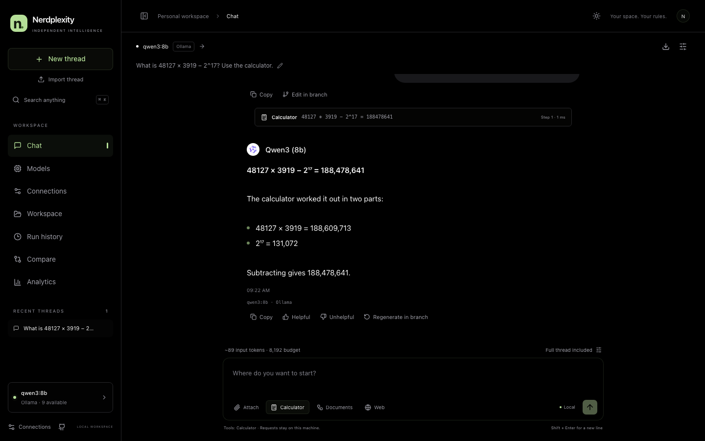
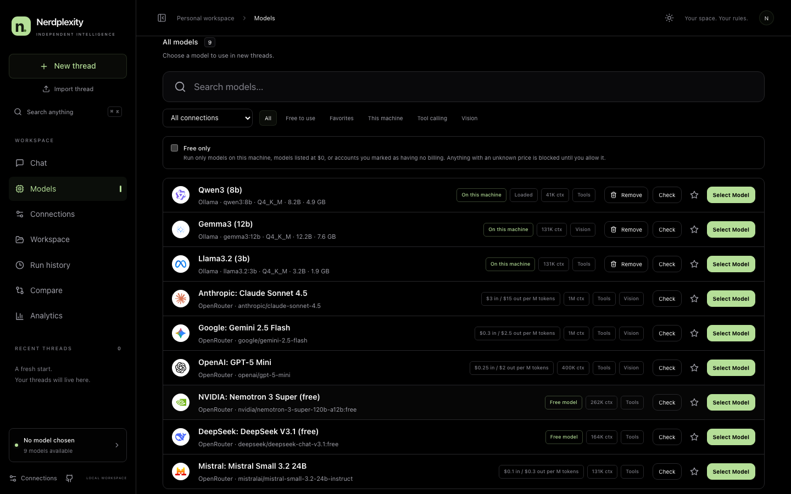
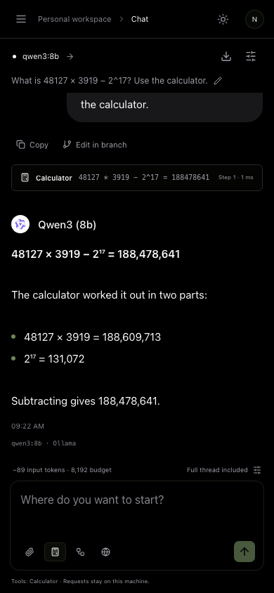
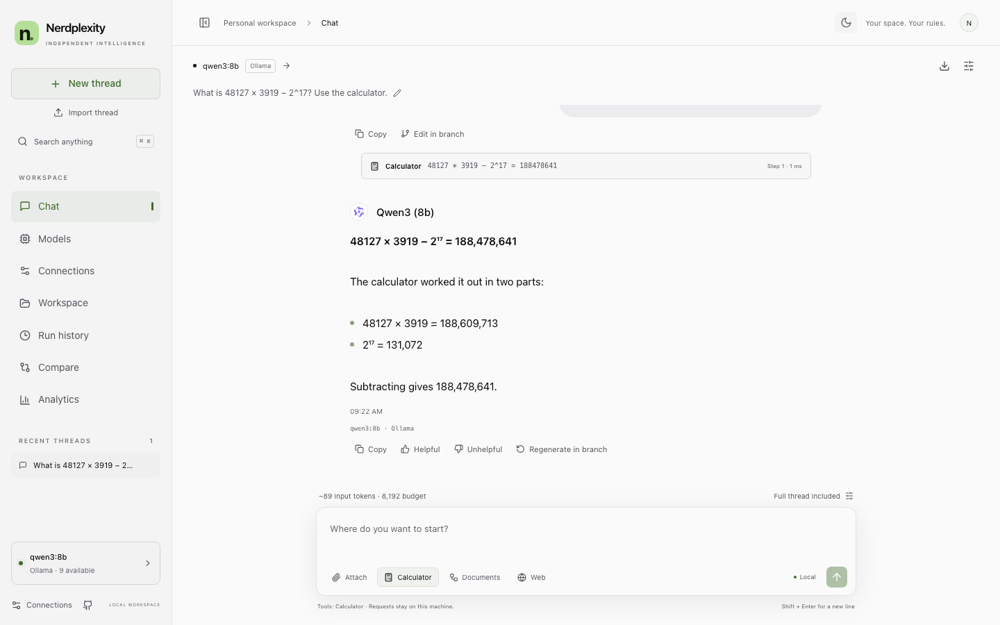

<div align="center">

<picture>
  <source media="(prefers-color-scheme: dark)" srcset="logo/svg/nerdplexity-lockup-on-dark.svg">
  
</picture>

### Your models. Your keys. One local workbench.

Chat with models on your machine and with online providers using your own API keys.<br>
Switch and compare models, give them bounded tools, and see exactly what every run did.

[](https://github.com/sanketmuchhala/Nerdplexity/actions/workflows/ci.yml)
[](LICENSE)


</div>

<p align="center">
  
</p>

## Why Nerdplexity

- **Local first.** Threads, settings, files, and run history live in your browser. Local models never leave your machine.
- **Bring your own keys.** Ollama, LM Studio, llama.cpp, OpenAI, Anthropic, Gemini, DeepSeek, OpenRouter, Groq, Cerebras, Mistral, SambaNova, Hugging Face, or any OpenAI-compatible server, all in one catalog.
- **Free Router.** Choose it like a model: each message goes to the best free model you have, and to the next one when a model is rate limited.
- **Bench.** Graded questions from published datasets (code, math, instructions, tool calls, reading) run on your free models, paced for free limits. The Free Router ranks models with your results.
- **Honest about cost.** Every model says whether it runs on your machine, is listed at $0, or may be billed. **Free only** blocks anything it cannot confirm is free.
- **Nothing hidden.** Each answer shows the model that wrote it, every tool call with its exact input and result, and measured timing and token usage.

## Features

| | |
| --- | --- |
| **Models** | One searchable catalog with brand logos, favorites, filters (free, on this machine, tools, vision), price and context info, and a one-prompt **Check**. Install and remove Ollama models with live download progress. |
| **Chat** | Streaming answers from every provider, **Stop**, **Retry**, switching models mid-thread, edit-and-regenerate branches, presets, per-thread system instructions, explicit context budgets with a request preview, reasoning shown separately, export and import. |
| **Attachments** | Text, Markdown, and code files (100 KB each), and images for models that accept them, shown and removable before you send. |
| **Tools** | Off by default, on per thread: **Calculator** (computed by the app), **Documents** (search and read your Workspace notes, models on this machine only), **Web** (Exa search with your own key). |
| **Compare** | Send one frozen context to two models and see both answers with measured timing and usage, then continue either one in chat. |
| **Run history** | Every run records queue time, time to first text, tokens, errors, tool calls, and its exact input snapshot for inspection or export. |
| **Look** | Black and green, with a light theme, keyboard-accessible dialogs, and layouts for phone, tablet, and desktop. |

<table>
  <tr>
    <td width="60%"></td>
    <td width="40%"></td>
  </tr>
  <tr>
    <td colspan="2"></td>
  </tr>
</table>

<sub>Screenshots use scripted demo data (catalogs and responses served by <code>scripts/capture-readme.mjs</code>); prices shown are examples.</sub>

## Quick start

You need Node.js 22.12 or newer and pnpm 9.0.0. Ollama is optional. No database to install: the server keeps your data in `backend/data` with PGlite, a Postgres that runs inside it.

```sh
pnpm install --frozen-lockfile
pnpm dev
```

Open **http://127.0.0.1:5173/app**, go to **Models**, and pick a model:

- **On this machine:** start [Ollama](https://ollama.com) or LM Studio; both are preconfigured (`http://127.0.0.1:11434` and `http://127.0.0.1:1234/v1`). You can also install Ollama models from the Models page.
- **Online:** click **Add Provider**, choose the provider, paste your API key, and click **Save Connection**.

No pnpm? Run it through npm: `npm exec --yes --package=pnpm@9.0.0 -- pnpm install --frozen-lockfile`, then the same prefix before `pnpm dev`.

The backend runs on `http://127.0.0.1:5174` (health check at `/health`). Both services listen only on this machine. The first time you open the app after upgrading, threads saved in this browser by earlier versions are copied to the server automatically; the browser's copy is left as it was. Use `pnpm dev:ollama` to start an installed Ollama, and `WEB_PORT=5273 PORT=5274 pnpm dev` to run a second copy beside another.

## Connecting models

| Connection | What you need | Notes |
| --- | --- | --- |
| Ollama | Ollama running locally | Install and remove models in the app. Runs stay on your machine. |
| LM Studio, llama.cpp | A local OpenAI-compatible server | Preconfigured at `127.0.0.1:1234/v1`. |
| OpenAI, Anthropic, Gemini, DeepSeek | Your API key | Pinned to each provider's official endpoint. |
| OpenRouter | Your API key | Lists $0 models as **Free model** and shows per-token prices. Shared free routes can be rate limited even though usage is $0; `openrouter/free` chooses a compatible free model with capacity. |
| Groq | Your API key | Free plan limits per model; rate limits are shown. |
| Cerebras, SambaNova | Your API key | Fast open models with small free tiers (Cerebras about 5 requests per minute; SambaNova 20 per day). |
| Mistral | Your API key | Mistral's models; a free plan needs no card. |
| Hugging Face | A fine-grained token | Many hosted providers behind one token, paid from small monthly credits. |
| Custom endpoint | Address, optional key | Any OpenAI-compatible server. Must use https unless it is on this machine. |

Each connection says whether it is offline, rejected the key, has the wrong address, or lists no models. Listing models does not prove one runs: use **Check** on a model to send one short prompt.

## Free use

Models are labelled **On this machine** (no hosted fee), **Free model** (listed at $0), **Free plan** (you marked the account as having no billing), a catalog price, or **Price unknown**. Nerdplexity cannot see your billing settings; the billing choice on a connection is your statement.

With **Free only** on, anything else, including a model ID typed by hand, is blocked before it is sent; you can pick a free model or allow charges for that one thread. When a free model you chose hits its limit, Nerdplexity explains whether shared upstream capacity or the account limit caused it and suggests `openrouter/free` and other free models. It never switches a model you chose on its own.

Provider notes: OpenRouter free models have per-minute and per-day limits, and a negative balance blocks them. On Gemini's free tier, Google may use your prompts to improve its products.

## Free Router and Bench

**Free Router** is Nerdplexity's own router and the default model once you connect a provider with free models (it never replaces a model you picked). It sits at the top of the model picker with the Nerdplexity logo. Each message goes to the best free model across all your connections: it reads what the message needs (code, math, writing, images, tools, length), leaves out models that cannot take it or are rate limited, ranks the rest, and tries the next one if a model fails before answering. It only uses models known to be free, never splices two models into one answer, and shows every model it tried and why. It is not OpenRouter's `openrouter/free`, which picks among OpenRouter's models on OpenRouter's side; the Free Router uses that only as a last resort.

**Bench** runs graded questions from published datasets (CRUXEval, GSM8K, IFEval, BFCL, SQuAD) on the free models you pick, paced to stay under free limits, and saves the results. The Free Router then ranks models by how they actually did on your connections instead of by their names.

Full details: [Free Router](backend/docs/free-router.md) and [Bench](backend/docs/bench.md).

## Tools

Turn tools on from the message box; the choice is saved with the thread and in presets.

- **Calculator:** exact arithmetic computed by the app, on any model.
- **Documents:** search and read the notes in **Workspace**. Only for models on this machine; documents are never sent online.
- **Web:** web search through [Exa](https://exa.ai) with your own key, added under **Connections**. Your search queries go to Exa, even when the model is local. Results are shown with their links.

A run may use at most 6 model steps and 12 tool calls. Each call appears above the answer with its exact input, result, and time, and is kept in Run history. Tool results are treated as data, not instructions, and no tool changes anything outside the app.

## How runs work

Sending a message starts a run on the local backend, which streams the answer to the browser. If the page reloads, it reattaches and shows the rest. **Stop** cancels the request to the model. A run that fails, stops, or is lost keeps its partial answer, clearly labelled. **Retry** starts a new attempt without repeating your message. Nerdplexity resends on its own only when the model never started (a short rate-limit wait, at most twice, or a model that rejects the temperature setting), and says so in the chat.

Run history records queue time, time to first text, total and model time, reported token usage, finish reason, errors, reasoning, tool calls, context utilization, and cost estimates where a catalog price was known before the run. Missing data stays marked as not measured.

## Data and privacy

- **Saved by the Nerdplexity server:** threads, messages, attachments, documents, run history, comparisons, presets, connections (without keys), and settings. On your computer the server keeps them in `backend/data` (PGlite; change it with `NERDPLEXITY_DATA_DIR`). A hosted server keeps them in Postgres, under each person's account. Nothing is sent to a telemetry service.
- **API keys never reach the database.** They stay in your browser: for the current tab unless you tick **Remember this key on this device**, which stores them unencrypted in that browser profile. **Forget key** removes one. Keys travel to the backend in request bodies for each request, never in URLs, and are left out of every export and every saved record.
- **Accounts (hosted only):** email and password. The session token is kept in the browser and sent as a bearer header. A server on your own computer needs no sign-in.
- **What leaves your machine:** only what an online model or tool needs. Messages to an online model go through the backend to that provider; web search sends search queries to Exa; documents are only ever read by models on this machine.

Do not commit keys, `backend/data`, or personal conversation exports.

## Deploying

Nerdplexity is built to run on your own computer. You can also put it online: the server and its database on **Railway**, and optionally the web app on **Vercel**.

**Server and database on Railway.** [`railway.json`](railway.json) holds the build and start commands and the health check.

1. Create a Railway project and add **Postgres** from the **pgvector** template (ready for the memory features planned next).
2. Add a service from this GitHub repository. Leave the Root Directory at `/`.
3. In the service's **Variables**, set:

| Variable | Value |
| --- | --- |
| `DATABASE_URL` | `${{Postgres.DATABASE_URL}}` (Railway fills it in from the Postgres service) |
| `NERDPLEXITY_HOSTED` | `1`: accounts required; local and private-network model addresses refused; Ollama model management off |
| `BETTER_AUTH_SECRET` | A random value of at least 32 characters: `openssl rand -base64 32`. The server will not start without it. |
| `BETTER_AUTH_URL` | The service's public address, for example `https://nerdplexity-production.up.railway.app` |
| `ALLOWED_ORIGINS` | Your web app's address if it runs elsewhere, for example `https://nerdplexity.vercel.app` (comma-separated, exact) |
| `NERDPLEXITY_SIGNUPS` | Leave unset: only the first account can be created (yours). `open` lets anyone sign up; `closed` allows none. |

4. Under **Settings → Networking**, generate a domain, then open it and create your account. The server also serves the web app, so this address alone is a complete deployment. Tables are created automatically on start.

**Copy your local data to Railway (optional).** Stop the local server, copy the Postgres service's `DATABASE_PUBLIC_URL`, then run:

```sh
COPY_TO_DATABASE_URL='postgresql://...' pnpm --filter @app/server db:copy -- --as you@example.com
```

It copies everything from `backend/data` into your hosted account and skips anything already there, so it is safe to run twice. Without an email provider, the owner resets a password with `DATABASE_URL='postgresql://...' NEW_PASSWORD='...' pnpm --filter @app/server user:password -- --email you@example.com`.

**Web app on Vercel (optional).** Set **Root Directory** to `frontend`; [`frontend/vercel.json`](frontend/vercel.json) builds only the web app as a static site and sets the public `VITE_API_URL` used by this deployment. If you use a different Railway service, update that URL. Add the Vercel address to `ALLOWED_ORIGINS` on Railway, then redeploy both. If the server is unreachable, or does not list the site in `ALLOWED_ORIGINS`, the site says so.

Render and other hosts work the same way: a long-running Node service (not serverless: runs stream from memory), `pnpm install --frozen-lockfile && pnpm build`, `pnpm start`, and the variables above.

Before you deploy, know that:

- **Keys and messages pass through your server.** They still go only to the providers you choose, and are never logged or stored on the server.
- **Models on your computer are unavailable from a hosted server.** Ollama and LM Studio need the local setup, and document tools need a model on this machine.
- **Only signed-in accounts can use a hosted server.** Chat, model lists, and saved data all require a session; sign-in attempts are rate-limited.

## Development

| Command | Purpose |
| --- | --- |
| `pnpm dev` | Start the backend and the web app |
| `pnpm dev:server` / `pnpm dev:web` | Start one of them |
| `pnpm typecheck` | Type-check all packages |
| `pnpm build` then `pnpm start` | Build, then serve the production build on port 5174 |
| `pnpm -r test` | Unit tests (Vitest) for the server and web app |
| `pnpm test` | Browser tests (Playwright) |
| `pnpm test:split` | End-to-end tests of the deployed shape: the web app on its own origin calling a separate backend, locally and hosted with accounts |
| `pnpm --filter @app/server db:generate` | Generate a database migration after changing `backend/src/db/schema.ts` |
| `pnpm --filter @app/server bench:sample` | Rebuild the Bench questions from their datasets (`backend/bench/`) |
| `pnpm lint` | Source policy check |

Browser tests start their own backend (with an in-memory database, and a separate user per test), web app, and a fake OpenAI-compatible provider (`tests/fixtures/fake-provider.mjs`), so no keys or models are needed. Backend tests use in-memory PGlite; set `TEST_DATABASE_URL` to run them against a Postgres server, as CI does. Install Chromium once with `pnpm exec playwright install chromium`, or use an installed Chrome with `PLAYWRIGHT_CHANNEL=chrome pnpm test`. Tests never reuse servers already running unless you set `PW_REUSE=1`.

To refresh the README screenshots, run `pnpm dev` and then `node scripts/capture-readme.mjs`.

New to the server or planning harness work? Start with the [beginner-friendly backend guide](backend/docs/README.md). It documents the architecture, run lifecycle and replay protocol, provider adapters, model discovery, tools, complete HTTP API, security boundaries, and development workflow with editable Mermaid diagrams.

```text
frontend/         React + Vite web app (Zustand)  -> @app/web
backend/          Express server: run engine, provider adapters, tools, accounts, data API  -> @app/server
backend/drizzle   Database migrations (Drizzle), applied on start
shared/           TypeScript contracts used by both  -> @app/types
tests/browser     Playwright tests
logo/             Logo kit: SVG and PNG marks, favicon, brand tokens
plan/             Implementation plan, open items, release evidence
```

## Project status

Nerdplexity is built to run locally; see [Deploying](#deploying) for putting it online. Provider adapters are tested against recorded provider formats and a local fake server. Live checks so far cover OpenRouter (chat, calculator, and Exa web search on a free model); native Anthropic, Gemini, Ollama, and other providers are verified with fixtures only. See the [implementation plan](plan/implementation-plan.md), [open items](plan/pending.md), and [release verification](plan/release-verification.md).

## Brand

The logo kit in [`logo/`](logo) has the `n.` mark, full and compact lockups for dark and light backgrounds, PNG exports, the favicon, and the brand colors (`#b5df98` tile, `#141c10` letter, `#487130` dot). It is built reproducibly from Inter; see [logo/README.md](logo/README.md).

## License

[MIT](LICENSE)
