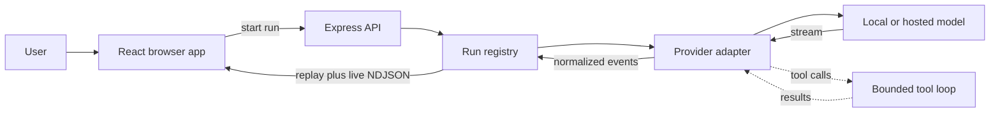

# Nerdplexity backend documentation

Status: **implemented** · verified against `9d0b33e` plus the everyday-chat v1 changes on 2026-09-14. Files under `docs/plans/` are proposals and are not implemented behavior.

This documentation explains the current Nerdplexity backend from first principles. It is written for someone who can read basic TypeScript but has not worked on a model harness before.

The most important idea is that Nerdplexity is **not an AI model**. It is a harness around models. The harness validates a request, chooses the correct provider protocol, streams model output, optionally runs a small set of tools, records ordered events, and lets the browser reconnect or cancel.

## Start here

Read these pages in order if the backend is new to you:

1. [Architecture](architecture.md) — processes, modules, dependencies, and deployment shapes.
2. [Run harness](run-harness.md) — the core execution lifecycle, streaming, replay, queueing, and cancellation.
3. [Providers and model discovery](providers-and-models.md) — how one internal request becomes Ollama, OpenAI, Anthropic, Gemini, DeepSeek, OpenRouter, Groq, Cerebras, Mistral, SambaNova, or Hugging Face traffic.
4. [Free Router](free-router.md) — how Nerdplexity picks the best free model for each message, falls back when one is busy, and how it differs from OpenRouter's `openrouter/free`.
5. [Free Agent](free-agent.md) — the default model and multi-model assistant: specialists per kind of task, drafts checked and combined by the strongest model, multi-part plans, and settings for which model does what. Its [architecture](free-agent-architecture.md) covers the components, the flow of one message, state, events, concurrency, failures, and how to extend it. [Deep Research](deep-research.md) is its research mode: a plan, web searches, sources read by several models with quotes checked against the page, and a cited report.
6. [Bench](bench.md) — graded questions from published datasets, how answers are checked, how jobs are paced, and how results rank models.
7. [Tools](tools.md) — the bounded agent loop, calculator, document retrieval, and Exa web search.
8. [API reference](api-reference.md) — every active HTTP endpoint and event payload.
9. [Security and data](security-and-data.md) — keys, documents, origin checks, destination restrictions, and known limits.
10. [Development and testing](development.md) — setup, debugging paths, tests, and safe extension points.

## The 30-second mental model



The browser sends a model choice explicitly, or chooses the [Free Router](free-router.md), which lets the server pick among free models the browser lists. The backend never guesses a provider from a model name. A run receives a UUID, emits numbered events, and ends exactly once as completed, failed, or canceled.

## Beginner glossary

| Term | Meaning in Nerdplexity |
| --- | --- |
| **Backend** | The Express process in `backend/`. It accepts HTTP requests and talks to model services. |
| **Harness** | The orchestration layer around a model: lifecycle, transport, tools, limits, errors, replay, and cancellation. |
| **Provider** | A service or runtime that performs inference, such as Ollama, OpenAI, or Anthropic. |
| **Connection** | A user-configured route to a provider. It contains a kind, optional base URL, and optional key. |
| **Target** | The per-request connection data after the backend validates and resolves it. |
| **Adapter** | Code that converts Nerdplexity's common request/events into one provider's wire format and back. |
| **Run** | One attempt to get an answer from one model using one immutable request snapshot. |
| **Run registry** | The in-memory owner of active/recent runs, ordered events, cancellation, and replay. |
| **NDJSON** | Newline-delimited JSON: one complete JSON object per line. Nerdplexity uses it for browser event streams. |
| **SSE** | Server-Sent Events. Several providers stream records prefixed with `data:`; the backend parses them but exposes NDJSON to its own browser client. |
| **Delta** | A small piece of generated answer text. Deltas are appended to form the answer. |
| **Tool loop** | A bounded conversation in which a model asks the application to run an allowed function and receives the result. |
| **Idempotency key** | A client-generated key that makes a retried start request return the existing run instead of starting a duplicate. |
| **Replay** | Sending events the browser missed, beginning after its last sequence number. |
| **Free Router** | Nerdplexity's own router: one routed run tries up to four free models in ranked order, falling back only before any output. |
| **Free Agent** | Nerdplexity's multi-model assistant and the default model: for harder messages, specialists draft or answer parts and the strongest model checks them and writes the answer. Users can choose its behavior and the model for each role. |
| **Bench** | Graded questions run on your free models; the results rank models for the Free Router. |
| **Cooldown** | A period after a rate limit or failure during which the router leaves a model (or a whole account) out. |

## Source map

```text
backend/
├── env.sample                  # Example server environment
├── package.json                # Backend scripts and dependencies
└── src/
    ├── server.ts               # Loads environment and starts listening
    ├── app.ts                  # Builds and wires the Express application
    ├── middleware/
    │   ├── origins.ts          # Browser-origin policy
    │   └── errors.ts           # Last-resort safe error responses
    ├── auth.ts                 # Accounts on a hosted server (Better Auth)
    ├── db/                     # Drizzle schema and client (PGlite locally, Postgres when DATABASE_URL is set)
    ├── store/                  # Per-user data access: threads, records, Bench results
    ├── bench/                  # Bench: suite loading, graders, IFEval checks, job runner
    ├── scripts/                # db:copy, user:password, bench:sample
    ├── routes/
    │   ├── runs.ts             # Start (one model or a route), follow, and cancel runs
    │   ├── bench.ts            # Bench suite, jobs, and results
    │   ├── data.ts             # Saved threads, documents, run history, settings
    │   └── models.ts           # Ollama pull and delete routes
    ├── queue/
    │   └── localQueue.ts       # One-at-a-time execution for local models
    └── runtime/
        ├── runs.ts             # Run state machine, event buffer, replay
        ├── router.ts           # Free Router: task profile, ranking, health, fallback (tryInOrder)
        ├── agent.ts            # Free Agent: specialists, strategy, drafts, plans, writer, settings
        ├── adapters.ts         # All live streaming provider adapters
        ├── discovery.ts        # Provider-specific model catalog discovery
        ├── destinations.ts     # URL, key, and local/remote policy
        ├── toolLoop.ts         # Multi-step model/tool orchestration
        ├── tools.ts            # Built-in tool registry and execution limits
        ├── webSearch.ts        # Exa search client and result normalization
        ├── streams.ts          # Chunk-safe line decoder
        └── local.ts            # Older non-streaming local compatibility helper

backend/bench/                  # Bench questions (suite.json) and their sources and licenses
backend/drizzle/                # Database migrations, applied on start

shared/src/
├── backend.ts                  # Health response contract
├── connections.ts              # Connection and model catalog contracts
├── data.ts                     # Saved-data contracts
├── bench.ts                    # Bench requests, results, scores
└── runs.ts                     # Run requests, routes, events, errors, tools, timing
```

Every production backend module has a focused test beside it except `server.ts`, `queue/localQueue.ts`, and the retained `runtime/local.ts` compatibility helper. Higher-level run tests exercise queue integration.

## What is authoritative

Use the following order when documentation and code appear to disagree:

1. Shared contracts in `shared/src/` define the browser/server boundary.
2. Validation and behavior in `backend/src/` define what actually runs.
3. Tests beside those modules capture expected edge cases.
4. This guide explains that implementation.
5. Files in `plan/` include history and future ideas; they are not necessarily implemented behavior.

## Current boundaries

The current backend deliberately separates durable data from live execution:

- It stores conversations, messages, attachments, documents, run history, connections without keys, presets, comparisons, Bench results, and settings in PGlite locally or Postgres when `DATABASE_URL` is set. API keys are never stored on the server; they stay in the browser.
- It keeps active and recently finished run events, and Free Router health, only in process memory. A backend restart loses in-flight generation, replay, and router health, but not saved user records.
- Local mode assigns requests to the built-in local owner. Hosted mode requires Better Auth accounts and scopes every data record and run to the authenticated user.
- It has no distributed run workers; use one executor process unless shared run ownership/replay is added.
- It can run four read-only tools: calculator, document search, document read, and Exa web search.
- It cannot execute shell commands, write files, open arbitrary URLs, or use MCP.
- It serializes local model runs to reduce memory contention. Remote runs execute concurrently.
- A hosted backend refuses local/private runtime targets and disables Ollama installation/removal.

These are design facts, not accidental omissions. Read [Security and data](security-and-data.md) before expanding any of them.
