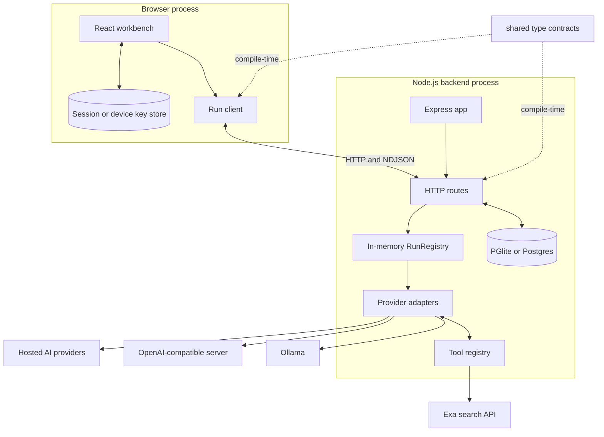
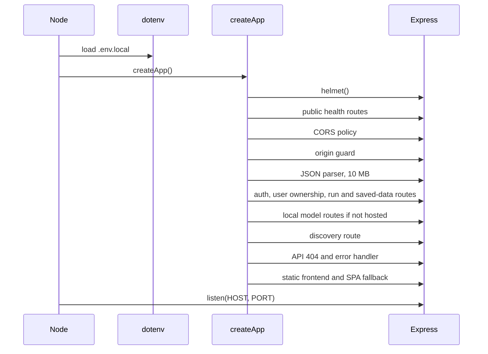
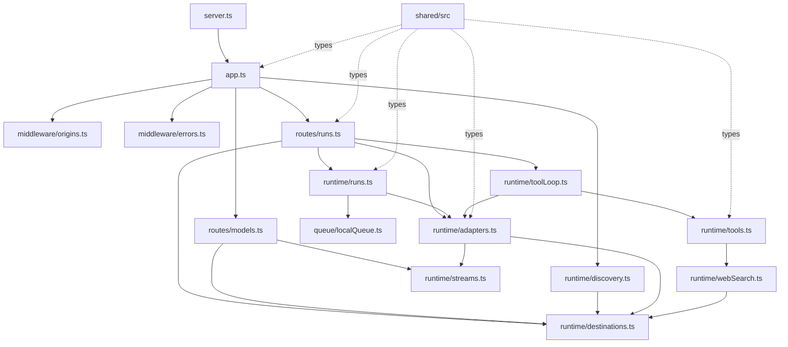
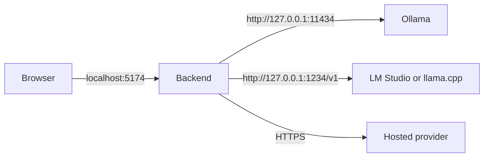
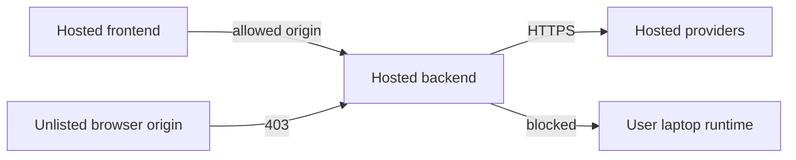

# Backend architecture

[Back to the backend documentation index](README.md)

## 1. System context

Nerdplexity is a pnpm workspace with three code packages:

- `frontend/`: React UI, browser credential storage, context construction, and the run client.
- `backend/`: Express API, database, accounts, run harness, providers, discovery, tools, and local model management.
- `shared/`: type-only contracts imported by both sides as `@app/types`.

The backend database owns durable user data. The browser owns provider credentials. The backend also owns temporary execution state and provider communication.

### Why durable data and live execution are separate

The server database saves threads, documents, connection metadata, input snapshots, partial/final output, and finished run history. API keys remain in browser session memory or optional device storage and are supplied only for the request that needs them. `RunRegistry` remains in-process: after a restart saved data survives, but an in-flight generation cannot resume.

## 2. Startup and middleware order

`backend/src/server.ts` is the process entry point. It loads `.env.local` before importing application modules because hosted mode and origin configuration read environment variables. It then calls `createApp()` and listens on the configured address.

Middleware order matters:

1. Helmet adds defensive HTTP headers.
2. `/health` and `/v1/health` are intentionally readable cross-origin so a separate frontend can diagnose an origin-policy failure.
3. CORS headers are added only for loopback or configured browser origins.
4. `originGuard` returns `403` before an untrusted browser page can reach a runtime or provider.
5. Hosted account routes and authenticated ownership are applied; local mode uses the built-in local owner.
6. Route-specific JSON limits are applied (50 MB import, 25 MB saved data, 10 MB runs, 1 MB discovery/Bench/model management).
7. API routes run.
8. Unknown `/v1/*` routes return JSON `404` instead of the React app.
9. The safe error handler avoids logging raw bodies that may contain API keys.
10. Production static files and the React Router fallback are last.

## 3. Internal module dependency map

### Responsibilities by layer

| Layer | Owns | Must not own |
| --- | --- | --- |
| App/middleware | HTTP hardening, origin policy, body parsing, route order, static serving | Provider-specific payloads |
| Routes | HTTP validation and translating requests into domain calls | Provider streaming details |
| Run registry | Lifecycle, sequence numbers, replay, timeout, queue, terminal state | HTTP response objects or provider JSON |
| Adapters | Provider request/response formats, streaming, usage, safe provider errors | Browser persistence or run ownership |
| Tool loop | Model → tool → model iteration and aggregate usage | Tool implementation details |
| Tool registry | Allowed functions, argument checks, timeouts, bounded output | Arbitrary model-selected code or destinations |
| Discovery | Model listing and descriptor normalization | Proving that a listed model will successfully run |
| Destination policy | Fixed provider endpoints and local/remote URL rules | Saving connections or keys |
| Shared package | Type contracts | Runtime logic |

## 4. The two execution shapes

### Local mode

Local mode is the default when `NERDPLEXITY_HOSTED` is unset. The server binds to `127.0.0.1` unless `HOST` overrides it. Ollama and loopback OpenAI-compatible endpoints may use HTTP. Local runs are serialized through one queue.

The runtime must be reachable from the machine running the backend. A browser's `localhost` and a remote server's `localhost` are not the same machine.

### Hosted mode

Set `NERDPLEXITY_HOSTED=1` for a remotely reachable backend. Its default bind address becomes `0.0.0.0`. Hosted mode:

- refuses loopback, literal private/reserved IPs, IPv6 literals, `.local`, and `.internal` custom targets;
- disables Ollama pull/delete endpoints;
- still allows official hosted providers and public HTTPS OpenAI-compatible endpoints;
- requires the deployed frontend origin in `ALLOWED_ORIGINS`.

Hosted mode includes both a network safety policy and required Better Auth accounts. See [Security and data](security-and-data.md).

## 5. State ownership and lifetime

| Data | Owner | Lifetime |
| --- | --- | --- |
| Threads and messages | Server database, scoped to owner | Durable |
| Connections without keys | Server database, scoped to owner | Durable |
| API keys | Browser session memory or optional device storage | Depends on user choice |
| Documents and attachments | Server database, scoped to owner | Durable |
| Run input/output/history | Server database, scoped to owner | Durable |
| Active run controller | Backend `RunRegistry` | Until terminal state or process restart |
| Ordered event replay buffer | Backend `RunRegistry` | In memory; bounded and temporary |
| Provider request/key | Active backend call closure | One discovery or run request |
| Local queue | Backend singleton | Process lifetime |

There is no worker process or shared live-event store. Horizontal scaling would break reconnect semantics unless run ownership and event storage were externalized or requests were pinned to one process.

## 6. Shared contracts

The `shared/src` files are the seam between frontend and backend:

- `connections.ts` defines connection kinds, targets, discovery results, model capabilities, pricing, and quota snapshots.
- `runs.ts` defines start requests, content parts, states, errors, timing, tools, and event envelopes.
- `backend.ts` defines health/capability reporting.

They are TypeScript-only. Runtime validation still happens in the route because a network client can send anything regardless of TypeScript.

## 7. Active versus retained compatibility code

`runtime/adapters.ts` is the production streaming path for all supported providers. `runtime/local.ts` is an older non-streaming helper retained in the tree, but no production backend module imports it. Do not build new harness work on `runtime/local.ts`; extend `adapters.ts`, the run engine, and their tests.

Similarly, planning documents may describe proposed routes or states that are not active. The endpoint list in [API reference](api-reference.md) is generated from the current Express wiring.
