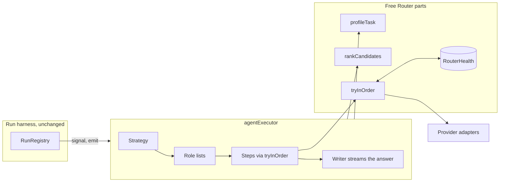
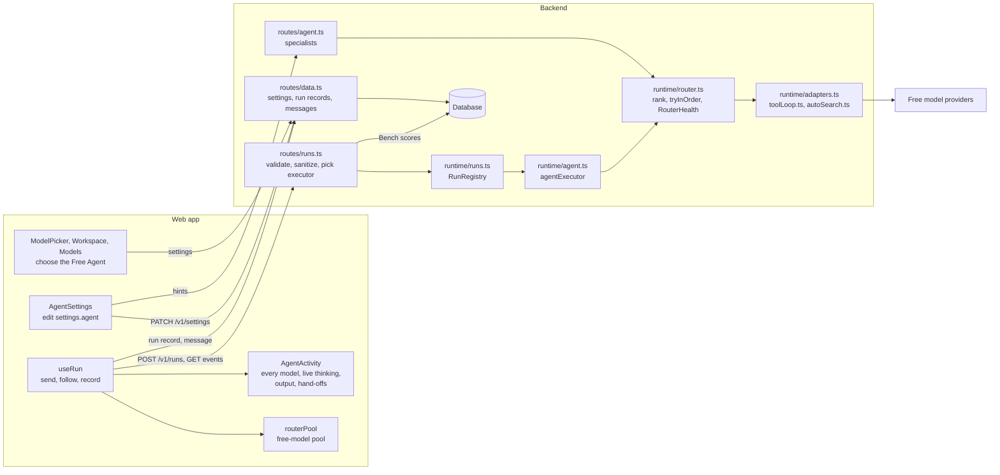
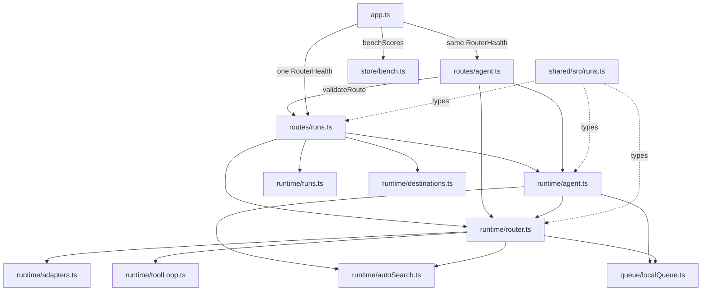
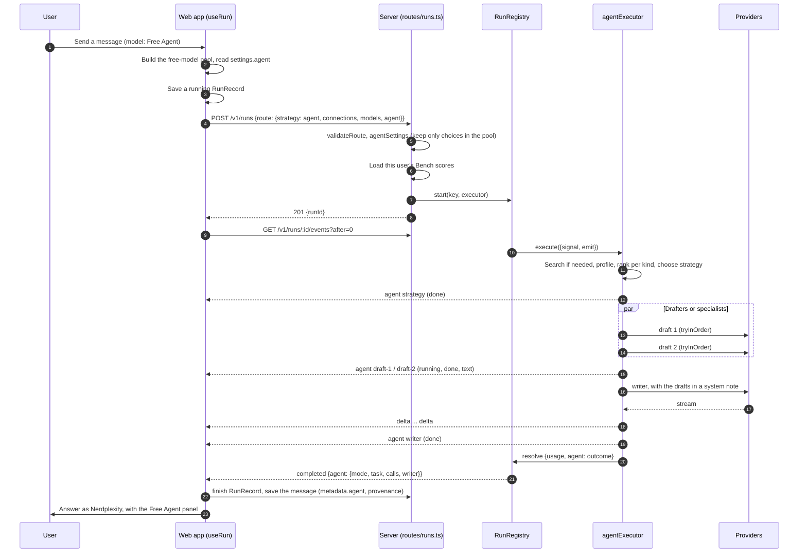
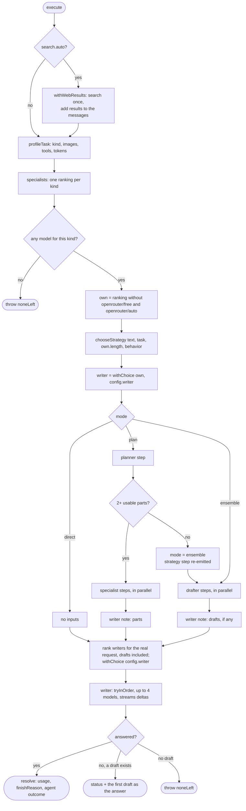
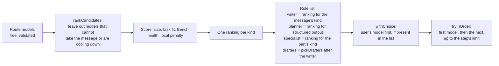
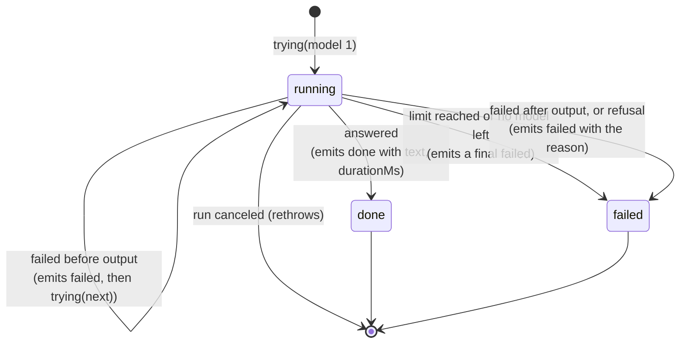
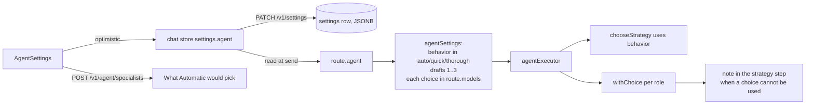

# Free Agent architecture

[Back to the backend documentation index](README.md) · [Free Agent: behavior and use](free-agent.md)

This page explains how the Free Agent is built: the parts, how a message flows through them, what state exists and for how long, the event protocol, concurrency, failure handling, trust boundaries, and how to extend it. [Free Agent](free-agent.md) covers what it does for the user: strategies, prompts, settings, and limits. Where the two overlap, this page points there instead of repeating it.

Verified against the code on 2026-09-15 (`backend/src/runtime/agent.ts`, `router.ts`, `runs.ts`, `routes/runs.ts`, `routes/agent.ts`, and the web app files named below).

## Contents

1. [Overview](#1-overview)
2. [Design principles](#2-design-principles)
3. [Components](#3-components)
4. [Module dependencies](#4-module-dependencies)
5. [One message, end to end](#5-one-message-end-to-end)
6. [Inside the executor](#6-inside-the-executor)
7. [The step runner](#7-the-step-runner)
8. [Concurrency, queueing, and cancellation](#8-concurrency-queueing-and-cancellation)
9. [State and lifetimes](#9-state-and-lifetimes)
10. [Event protocol](#10-event-protocol)
11. [Web app architecture](#11-web-app-architecture)
12. [The settings pipeline](#12-the-settings-pipeline)
13. [Failure model and invariants](#13-failure-model-and-invariants)
14. [Trust boundaries and privacy](#14-trust-boundaries-and-privacy)
15. [Extending the agent](#15-extending-the-agent)
16. [How it is tested](#16-how-it-is-tested)
17. [Known architectural limits](#17-known-architectural-limits)

---

## 1. Overview

The Free Agent is **a run executor**: a function that the run harness ([Run harness](run-harness.md)) calls with an abort signal and an `emit` callback, and that resolves with the run's usage and outcome. It adds no server process, queue, database table, or background job. Everything it needs arrives with the run request, apart from two things the server already has: the in-memory **health** of each model (shared with the Free Router) and the user's **Bench scores** (read from the database when the run starts).

It is built from the [Free Router](free-router.md)'s parts:

| From the Free Router | Used by the agent for |
| --- | --- |
| The free-model pool the web app sends (`route`) | The only models any step can use |
| `profileTask` | The message's kind, and what a model must support to take it |
| `rankCandidates` | Every role list: writer, drafters, planner, specialists |
| `RouterHealth` | Skipping models that are cooling down; recording each attempt's result |
| `tryInOrder` | Every step: send to the first model, and to the next when one fails before answering |
| `noneLeft` | The error when no model can answer |

What the agent adds on top: a **strategy** per message (direct, ensemble, plan), **roles** (planner, drafter, specialist, writer), **user settings** that can pin a model to a role, per-step **attempt limits**, and an **`agent` event** per step so the user can see the work.



## 2. Design principles

Each principle is a rule the code enforces, with where it is enforced.

| # | Principle | Where |
| --- | --- | --- |
| 1 | **One answer, from one model.** The user's answer is only ever the writer's stream. Drafts and part answers are inputs and are shown as steps, never streamed as the answer. The single exception, when no writer can answer at all, shows one whole draft with a status line. | `agentExecutor`: only the writer's hooks forward `delta` events |
| 2 | **Never splice or shop.** A model that fails after it started answering is not replaced, and a refusal is never retried on another model. | `tryInOrder` (the commit point), shared with the Free Router |
| 3 | **Free models only.** Every step draws from the route's models, which the web app lists only when verified as free. | `validateRoute`; `routerPool` in the web app |
| 4 | **Ranked, explainable choices.** Every model is chosen by the same scoring as the Free Router, and every choice carries its reasons. | `rankCandidates` → `why`; `describe()` |
| 5 | **The user can overrule the ranking, safely.** A chosen model goes first in its role, but only if it can take the message; otherwise the ranking stands and the strategy step says why. Choices are checked against the pool on the server. | `agentSettings`, `withChoice` |
| 6 | **Bounded work per step.** Each step tries a limited number of models, so a failing provider cannot cause unbounded requests. | `AGENT_LIMITS.attempts` |
| 7 | **Fail forward.** A lost draft, part, or plan degrades the answer (fewer drafts, the writer answers the part, ensemble instead of plan) instead of failing the run. Only the writer can fail the run. | `runStep` returns `undefined` on failure; section 13 |
| 8 | **Stateless per message.** Nothing about one message carries to the next, except shared health (cooldowns, success rates). | Section 9 |
| 9 | **Everything visible, live.** Every step is an event, and each model's output and reasoning stream while it works. The panel shows every model, its role, and the hand-offs, in the chat and in Run history. The answer itself is credited to Nerdplexity. | `agent` and `agent_output` events; `AgentActivity` |
| 10 | **More than one model.** Automatic never answers with one model when two can be used: a simple message gets a draft and a check. | `chooseStrategy` |

## 3. Components



| Component | File | Responsibility | Does not |
| --- | --- | --- | --- |
| Agent identity | `frontend/src/lib/router.ts` | The Free Agent is chosen like a model: connection `nerdplexity-router`, model `agent` (the Free Router is model `free`). `isAgent`, `routeStrategy`, `chooseAgentByDefault`. | Exist as a real connection; it has no key or address |
| Free-model pool | `frontend/src/lib/router.ts` (`routerPool`), `state/connections.ts` (`currentRouterPool`) | Build `route.connections` and `route.models` from enabled connections with keys, keeping only models verified as free | Store keys in the run record |
| Default selection | `workspace/Workspace.tsx`, `workspace/Models.tsx` | Choose the Free Agent when no model is chosen; move the earlier automatic Free Router default once | Replace a model a person picked |
| Settings UI | `workspace/AgentSettings.tsx` | Edit `AgentConfig`, save optimistically, show what Automatic would pick | Validate choices (the server does) |
| Run client | `workspace/useRun.ts` | Send the run with the pool and settings, follow events, keep the steps, save the run record and the message | Decide anything about models |
| Panels | `workspace/AgentActivity.tsx` | The live panel: flow line, a card per step with model, thinking, output, and hand-offs; open while live | Fetch anything |
| Run route | `backend/src/routes/runs.ts` | Validate the request and route (`validateRoute`), sanitize settings (`agentSettings`), load Bench scores, pick the executor | Rank or call models |
| Specialists route | `backend/src/routes/agent.ts` | `POST /v1/agent/specialists`: the top three per kind, for the settings hints and the Bench page | Start runs |
| Run harness | `backend/src/runtime/runs.ts` | Lifecycle, sequence numbers, replay, timeout, orphan cancel, one terminal event | Know about roles or models |
| Agent executor | `backend/src/runtime/agent.ts` | Strategy, roles, steps, writer, fallback draft, outcome; `stepRunner`, which Deep Research shares | Talk to providers directly |
| Deep Research executor | `backend/src/runtime/research.ts` | Plan, search, read with quote checks, outline, report, citation check ([Deep Research](deep-research.md)) | Talk to providers directly |
| Router parts | `backend/src/runtime/router.ts` | Task profile, ranking, health, `tryInOrder` | Know about roles |
| Automatic web search | `backend/src/runtime/autoSearch.ts` | Search once before any step when the message needs current information | Run per step |
| Adapters and tool loop | `backend/src/runtime/adapters.ts`, `toolLoop.ts` | Provider protocols, streaming, tool calls (writer only, direct mode) | Choose models |
| Contracts | `shared/src/runs.ts` | `RouteRequest`, `AgentConfig`, `ModelChoice`, `AgentStep`, `AgentOutcome`, `SpecialistEntry`, the `agent` event | Runtime logic |

## 4. Module dependencies



Rules this map keeps:

- `agent.ts` depends on `router.ts`, never the other way. The Free Router works without the agent.
- `agent.ts` does not import adapters. Every provider request goes through `tryInOrder`, so fallback, health, and the commit point cannot drift between the router and the agent.
- `app.ts` creates **one** `RouterHealth` and passes it to both the runs route and the specialists route, so the settings hints and real runs see the same cooldowns.

## 5. One message, end to end



Step by step:

1. **Send** (`useRun.prepareAndSend` → `execute`). The web app builds the context (`buildContext`), saves the user message, and creates a `RunRecord` with status `running` before contacting the server, so a reload can find it.
2. **Pool and settings at send time.** `currentRouterPool` reads the current connections, catalogs, and keys; `settings.agent` is read from the chat store. Neither is saved in the run record, so keys never enter saved data.
3. **Request.** `route: { ...pool.route, strategy: 'agent', agent }` replaces `target` and `model`. With automatic web search on, `search: { provider: 'exa', apiKey, auto: true }` is added.
4. **Validation** (`validateRunRequest`). Every connection passes the destination policy (`resolveTarget`); every model must name one of them; limits are 12 connections and 200 models. `agentSettings(body.route.agent, candidates)` returns a clean `AgentConfig` (section 12). With document tools on, only models on this machine are kept.
5. **Bench.** For routed runs the route loads the user's Bench scores (`benchScores(db, owner)` → `benchIndex`). A database error means no Bench signal, not a failed run.
6. **Start.** `registry.start(key, local = false, executor, owner)`. A routed run is never queued as a whole; only its attempts on local models are (section 8). A repeated idempotency key returns the existing run.
7. **Follow.** The web app reads NDJSON envelopes and reduces them into the record (section 11).
8. **Execute.** Section 6.
9. **Finish.** The registry emits exactly one terminal event. On `completed`, the web app claims the run record (`store.runs.finish`, which exactly one tab wins) and saves the assistant message with `metadata.agent` and provenance to the writer.

## 6. Inside the executor

`agentExecutor(run, deps)` returns the executor. `run` is a `RoutedRun`: owner, candidates (resolved targets), request settings without a model, messages, tools, documents, search, and `agent` (the settings). `deps` holds the shared `RouterHealth`, the user's `BenchIndex`, and injectable `fetchImpl` and `enqueue` for tests.



### 6.1 Preparation

| Stage | Input | Output | Notes |
| --- | --- | --- | --- |
| Web search | `run.messages`, `run.search` | `messages` with results added | Once per run, before any step, so every step (drafters, specialists, writer) reads the same results. Emits `tool` events (`web_auto`). |
| Profile | `messages`, `run.tools`, `maxTokens` | `TaskProfile { kind, vision, tools, estimatedTokens }` | Keyword classification of the latest user message ([Free Router, section 5](free-router.md#5-step-1-what-the-message-needs)) |
| Specialists table | candidates, profile, health, owner, Bench | `Record<TaskKind, RankedCandidate[]>` | Six calls to `rankCandidates`, one per kind, with the same needs (images, tools, size). Models that cannot take the message are already left out. |
| Own list | `table[task.kind]` | `own` | Without `openrouter/free` and `openrouter/auto`: their real model is unknown, so they get no role except last-resort writer. |

`own.length` is the number of **usable** models for strategy rule 2 (fewer than two means direct).

### 6.2 Strategy

`chooseStrategy(text, task, usable, behavior)` is a pure function of the latest message, the profile, the number of usable models, and the behavior setting. Its rule table is in [Free Agent, section 5](free-agent.md#5-choosing-a-strategy). It returns `{ mode, reason }`. `reason` becomes the strategy step's text, followed by any notes about the user's choices.

### 6.3 Role assignment

Every role list is a ranking, optionally reordered by the user's choice:



`withChoice(list, choice, role)`:

- No choice: the list as ranked.
- The choice is in the list (so it can take the message and is not cooling down): moved to the front, with `your choice` added to its reasons.
- The choice is not in the list: the list as ranked, plus a note for the strategy step ("Your writer, *model*, cannot take this message right now, so the ranking chose instead.").

Role by role:

| Role | List | Choice applied | Limit |
| --- | --- | --- | --- |
| Writer (for drafting around) | `own` | `config.writer` | – |
| Planner | `ranked(table.extraction)`; falls back to the writer if empty | `config.planner` | 2 models |
| Specialist, per part | `ranked(table[part.kind])`, or `own` if empty | `config.specialists[kind]`; without a choice, the first model no other part has taken | 2 models per part |
| Drafters | The user's drafters that are in `own` and are not the writer, in order; then `pickDrafters` fills the remaining places from other model families | `config.drafters`, count `config.drafts ?? 2` | 2 models per drafter: its pick, then the spares (models that are neither the writer nor a pick), each drafter starting at a different spare |
| Final writer | `rankCandidates` for the writer's actual request (drafts included), including meta routers last | `config.writer` | 4 models |

The writer is ranked twice on purpose. The first ranking (`own`) decides who the drafts are built around, so drafters can avoid the writer's family. The second ranking includes the drafts in the size estimate, so a model whose context cannot hold them is left out before anything is sent.

### 6.4 Execution branches

- **Plan.** The strategy step is emitted, then the planner runs with only the planner prompt and the latest user text (no history), temperature 0, 400 output tokens. `parsePlan` reads the JSON. With two or more parts, the specialists run in parallel, each on `forPart(messages, task)`. A failed part becomes an empty entry the writer is told to answer itself. With fewer than two usable parts, the mode becomes `ensemble` and the ensemble branch runs; the strategy step is emitted again with the same `id`, so the web app replaces it.
- **Ensemble.** The strategy step is emitted, the drafters run in parallel on the full conversation with 1,500 output tokens each, and the successful drafts are kept. The number of drafters is the user's setting, else what the strategy suggests (one for a simple message), else two.
- **Direct.** Only the strategy step; the writer answers the conversation as is, with tools if tools are on. Used only with tools, a single usable model, or the Quick setting.

### 6.5 The writer and the commit point

The writer's messages are the conversation with one system note inserted after any leading system messages (`withNote`): the drafts (ensemble) or the parts and their answers (plan), each shortened to 6,000 characters. `tryInOrder` then sends to the writer list with `maxAttempts: 4` and the run's tools.

The writer's hooks forward **every** event (text, reasoning, tool calls, activity, the concrete model OpenRouter reports, quota) to the run, which is what makes it the answer. Other steps forward only `quota`.

The **commit point** is the first output from a model: text, reasoning, activity, or a tool call. Before it, a failure in a fallback category (quota, unavailable, transport, timeout, invalid request, context, auth) moves to the next model. After it, or on any other category (such as a refusal), `tryInOrder` throws: for the writer this fails the run with the partial answer kept; for other steps `runStep` catches it and marks the step failed.

### 6.6 Outcome

The executor resolves with:

```ts
{
  usage?,          // summed over every request, only when every request reported usage
  finishReason?,   // the writer's
  loadMs?,         // the writer's, for models on this machine
  agent: { mode, task, calls, writer: { connectionId, model } },
}
```

`calls` counts every model sent a request, failed attempts included, across all steps. The registry wraps this in the `completed` event with the timing.

## 7. The step runner

`stepRunner(emit, signal, context)` makes the step runner for a run; its `run(id, role, list, overrides, extra, finish)` wraps `tryInOrder` for the planner, drafters, and specialists (the writer calls `tryInOrder` directly because it streams). It turns the router's hooks into `agent` events and never throws, except when the run is canceled. `finish` lets a caller replace what the finished step reports: Deep Research uses it to show a reader's checked notes and how many quotes were dropped. Deep Research's planner, readers, and outliner are steps of the same runner.



| Event emitted | When | Fields |
| --- | --- | --- |
| `running` | Each model the step sends to | `connectionId`, `model`, `reason` (the ranking's reasons, or "After *X* failed: …") |
| `failed` (per model) | That model failed before output | `connectionId`, `model`, `reason` (the provider's safe message) |
| `agent_output` | While the model writes | `id`, `channel` (`text` or `reasoning`), the new `text`; pieces are collected and sent at most every 150 ms (`AGENT_LIMITS.outputFlushMs`), and whatever is waiting is sent before the step's next event |
| `done` | A model answered | `model`, `reason`, `text` and `reasoning` (each shortened), `durationMs` |
| `failed` (final) | No model answered | `reason` |

Overrides per role: `messages` (planner and specialists get their own), `request` (`maxTokens`, and `temperature: 0` for the planner), `maxAttempts`. Every step gets `tools: []`; only the writer gets the run's tools.

The step's context shares two per-run objects across all steps: the `signal` (cancellation) and `blockedAccounts` (section 8).

## 8. Concurrency, queueing, and cancellation

**Parallelism.** Within a run, drafters run in parallel (`Promise.all`), and so do specialists. The planner runs before the specialists; the writer runs after all inputs. A typical ensemble takes about one draft's time plus the writer's.

```text
time ─────────────────────────────────────────────────────▶
strategy  ▌
draft 1    ████████████████
draft 2    ███████████
writer                     ████████████████  (streams to the user)
```

**Models on this machine.** A routed run is not queued as a whole (`local = false` in `registry.start`). Instead `tryInOrder` sends each attempt on a local model through the shared local queue (`enqueue`), so two parallel drafters on Ollama run one after the other while remote drafters run at once.

**Shared per run: `blockedAccounts`.** When a step learns that an account is unusable (a bad key or an account-wide limit, `scope: 'account'`), it adds the account to this set, and every later attempt in every step skips its models. Steps running in parallel see additions as they happen.

**Shared across runs: `RouterHealth`.** One instance per server process. Every attempt records success (with first-output time) or failure (with a cooldown by category, or the provider's reset time). Parallel steps and other users' runs read and write it. Keys are per user, provider, address, and key hash, so users never share cooldowns.

**Cancellation.** The registry's `AbortController` signal is passed to every step and every provider stream.

- Stop (`POST /v1/runs/:id/cancel`), the 10-minute run timeout, or 60 seconds with no client following all go through `registry.cancel`, which records `canceled` first and then aborts. Events emitted after that are dropped.
- In a step, an abort rethrows instead of being reported as a failed step, so the executor stops promptly.
- A browser closing the event stream does not cancel the run; the client can reconnect with `after=<last seq>`.

## 9. State and lifetimes

| State | Where | Scope | Lifetime | Written by | Read by |
| --- | --- | --- | --- | --- | --- |
| Free-model pool | Built in the browser per send | One request | The request | `routerPool` | `validateRoute` |
| Provider keys | Browser key store; in the request's connection targets | One request | Not stored on the server | The user | Adapters; `accountOf` hashes them for health |
| `AgentConfig` | `settings.agent` in the settings row (JSONB, per user) | Every Free Agent run of that user | Until changed or reset | `AgentSettings` → `PATCH /v1/settings` | `useRun` at send time |
| Sanitized config | `RoutedRun.agent` | One run | The run | `agentSettings` | `agentExecutor` |
| Bench index | Loaded from `bench_results` | One run | The run | `routes/runs.ts` | `rankCandidates` |
| `RouterHealth` | Server memory | Process; keyed per user, account, model | Until restart; at most 2,000 models tracked | Every attempt | Ranking and `tryInOrder` |
| `blockedAccounts`, `notes`, `calls`, `usages`, drafts | Executor closure | One run | The run | Steps | The writer, the outcome |
| Run events | `RunRegistry` memory | One run | Until 10 minutes after it ends (at most 100 runs; 8 MB replay per run) | `emit` | Event followers |
| Run record | Database (`/v1/run-records`) | One run | Until deleted | `useRun` (patched every second while running) | Run history |
| Message | Database, with `metadata.agent` and `provenance` | One answer | With the thread | `useRun.finalize` | The chat |

Nothing in the agent writes to the database itself. The server keeps run events in memory; the web app writes the durable record and the message through the data routes, as for every run.

## 10. Event protocol

Every step is reported with an `agent` event carrying an `AgentStep` (`shared/src/runs.ts`). Rules:

- **Identity.** A step's `id` is stable: `strategy`, `planner`, `draft-1`…`draft-3`, `part-1`…`part-3`, `writer`. Every update to a step reuses its `id`; clients **replace** the step with the latest event of the same `id` (upsert), keeping first-seen order.
- **Order.** Events are totally ordered by `seq` within a run. `strategy` comes before any other step (in plan mode it may be emitted again after the planner, when the plan falls back to ensemble). The `writer` step starts only after all drafts or parts ended. Parallel steps' events interleave.
- **Live output.** Between a step's `running` and `done` events, `agent_output` events carry its output and reasoning as the model writes. Clients append them to the step with that `id`. They always precede the step's `done` event, which replaces them with the complete, shortened text.
- **Content.** `text` and `reasoning` on a `done` drafter, specialist, or planner step hold its output and reasoning, shortened to 6,000 characters. The writer's output arrives only as `delta` events (and its reasoning as `reasoning`), because it is the answer.
- **Terminal.** `completed.agent` (an `AgentOutcome`) names the mode, task, number of requests, and the writer. A failed run ends with `failed` and no outcome.
- `status: 'skipped'` is reserved in the type and not emitted today.

A real trace (an ensemble, from the server with a local fake provider; `runId` and timestamps removed):

```text
seq 1   queued        position 0
seq 2   started
seq 3   agent         strategy  done       mode ensemble · "A math task: specialists draft independently, then the strongest model checks them and writes the answer."
seq 4   agent         draft-1   running    qwen/qwen3-32b:free · "32B parameters, on this machine"
seq 5   agent         draft-2   running    google/gemma-3-12b-it:free · "12B parameters, on this machine"
seq 6   agent_output  draft-1   reasoning  "12 times 7 is 84."
seq 7   agent_output  draft-1   text       "Draft by qwen/qwen3-32b:free: 84"
seq 8   agent         draft-1   done       text "Draft by qwen/qwen3-32b:free: 84" · reasoning "12 times 7 is 84." · 15 ms
seq 9   agent_output  draft-2   reasoning  "12 times 7 is 84."
seq 10  agent_output  draft-2   text       "Draft by google/gemma-3-12b-it:free: 84"
seq 11  agent         draft-2   done       text "Draft by google/gemma-3-12b-it:free: 84" · reasoning "12 times 7 is 84." · 16 ms
seq 12  agent         writer    running    meta-llama/llama-3.3-70b-instruct:free · "Strongest for math: 70B parameters, on this machine"
seq 13  delta         "12 * 7 = 84."
seq 14  agent         writer    done       "Checked the drafts and wrote the answer." · 2 ms
seq 15  completed     agent {mode ensemble, task math, calls 3, writer meta-llama/llama-3.3-70b-instruct:free}
                      usage {prompt 60, completion 18, total 78} · finishReason stop
```

Which events each step forwards to the run:

| Source | Forwards |
| --- | --- |
| Automatic web search | `tool` (`web_auto`) |
| Planner, drafters, specialists | `agent` steps, `agent_output` (their text and reasoning), `quota` |
| Writer | `agent` step, and every stream event: `delta`, `reasoning`, `activity`, `tool`, `model`, `status`, `quota` |
| Executor | `status` when the fallback draft is shown |

## 11. Web app architecture

**Identity.** The Free Agent and the Free Router share the virtual connection `nerdplexity-router`; the model ID tells them apart (`agent`, `free`). Everything that branches on "the server chooses" uses `isRouter`; everything specific to the agent uses `isAgent`. `routeStrategy(ref)` maps the choice to `route.strategy`.

**Default selection.** Two places call `chooseAgentByDefault`, which saves `activeModel: agent` with `agentDefault: true` and sets the model of the open thread if it is new and empty:

- `Workspace.tsx`, once per load, when the pool has at least one model and either no model is chosen, or the chosen model is the Free Router and `agentDefault` is not set (the earlier automatic default).
- `Models.tsx`, after saving the first connection that has a free model, when no model is chosen.

After that, `agentDefault` is set, so a Free Router picked by hand stays.

**Following a run** (`useRun.follow`). Each envelope updates a mutable `RunRecord` and the view state:

| Event | Effect |
| --- | --- |
| `agent` | Upsert the step by `id` into `record.agent`; the status line names the models at work ("Qwen3 32B and Gemma 3 12B are drafting", "Llama 3.3 70B is checking and writing the answer") |
| `agent_output` | Append the text to that step's `text` or `reasoning`, so its card streams |
| `delta`, `reasoning` | Append; rendering is batched per animation frame |
| `model` | Record the concrete model OpenRouter reports (not shown in the status for routed runs) |
| `quota` | Recorded on the run, and applied to the real connection named in the event (never to the virtual one) |
| terminal | `finalize` |

The record is written to the server at most once a second while running (`store.runs.patch`), including the steps, so a reload can reattach from `lastSeq` and show the steps so far.

**Finalize.** On the terminal event: the record gets `agentOutcome`, status, timing, and usage; one tab claims it (`store.runs.finish`); the claiming tab saves the assistant message with:

- `metadata.agent = { steps, mode, calls, task }`
- `provenance` = the writer (`agentOutcome.writer`, or the last writer step for a partial answer), with the concrete model when OpenRouter reported one

**Rendering.**

| Surface | Shows |
| --- | --- |
| Chat answer | Credited to Nerdplexity (its name and mark), since several models made it; no single-model credit line unless the run was stopped, failed, or hit the output limit. The writer's reasoning is not repeated here; it shows in the writer's card. Decided in `ChatWorkspace.tsx` from `metadata.agent` / `metadata.route`. |
| Chat panel | `AgentActivity`, open while live: the strategy and reason; the flow line (plan → drafts or parts → checks and writes) with each model's logo; a card per step with role, model, connection, why chosen, time, live thinking and output, and hand-offs ("From the plan", "Sent to … to check", "Received …"). Folds to one line when the run ends. |
| Run history | The same panel, and the row "*writer* via Free Agent · *N* requests". |
| Toolbar, picker, sidebar | "Free Agent" with the Nerdplexity mark |

## 12. The settings pipeline



- **Saving.** `AgentSettings` updates its local state, then `saveSettings({ agent })`; on failure it restores the previous value and shows an error. Unset fields are removed rather than stored as `undefined`, and "Automatic" behavior and 2 drafts are stored as absent, so a stored config holds only real overrides.
- **Sending.** Read at send time, so a change applies to the next message, and a retry uses the settings current at the retry.
- **Sanitizing on the server.** `agentSettings(raw, candidates)` never throws. It drops anything malformed and any choice that is not in this request's pool (a removed connection, a model no longer free, a stale ID). The executor therefore never sees a model it cannot use.
- **Applying.** A valid choice can still be unusable for one message (cooling down, no image support, context too small), because `rankCandidates` left it out. `withChoice` then records a note, and the ranking decides for that message.

Choosing a model does not bypass any check: the model is still in the free pool, still ranked for capabilities and context, still subject to cooldowns and the step's attempt limit.

## 13. Failure model and invariants

| Where it fails | Before output | After output or refusal | Effect on the run |
| --- | --- | --- | --- |
| Web search | – | – | The run continues without results (a `tool` event says so) |
| Planner | Next planner model (limit 2) | Step failed | Falls back to ensemble |
| Drafter | Next spare (limit 2) | Step failed | Fewer drafts; with none, the writer answers alone |
| Specialist | Next model for that kind (limit 2) | Step failed | The writer answers that part itself |
| Writer | Next writer model (limit 4) | Run fails, partial answer kept | – |
| Every writer | – | – | The first draft is the answer with a status line; with no draft, `noneLeft` fails the run with the reasons and the soonest retry time |
| Account-wide limit or bad key | Every model on that account is skipped in every later step of the run | | |
| Cancel, timeout, no client | Everything stops; one `canceled` event | | |

Invariants, each covered by tests (section 16):

1. The answer is written by one model: only the writer (or one whole fallback draft) produces `delta` events.
2. No model is sent a request after it produced output in the same step.
3. A refusal is never retried on another model.
4. Each step sends to at most its limit of models. A run sends at most `drafts × 2 + 4` requests in ensemble (10 with three drafts), `2 + parts × 2 + 4` in plan (12 with three parts), `2 + drafts × 2 + 4` when a plan falls back to ensemble, and 4 in direct.
5. Every model used is in the request's pool, and every chosen model came through `agentSettings`.
6. Exactly one terminal event per run (the registry).
7. Every model asked appears in an `agent` event.

## 14. Trust boundaries and privacy

| Boundary | Rule |
| --- | --- |
| Browser → server | The server trusts the browser's statement of which models are free (the web app checks catalog prices and billing settings; the server does not re-check prices). It does not trust anything else: every connection passes the destination policy, every model must name a listed connection, and the settings are sanitized. |
| Model output → other models | Drafts and part answers are other models' output. They reach the writer inside a system note that says they can be wrong and must be checked. They are never executed and never choose a destination or a tool. |
| Keys | Sent per request in the connection targets, used for that request's provider calls, hashed (never stored) to key health. Never in run records, events, or messages. |
| Users | Health, cooldowns, Bench scores, settings, and runs are per user. Another user's run answers like an unknown run. |
| Documents | With document tools on, only models on this machine are kept in the pool, and tools run only in direct mode, so documents are not sent online. |
| Prompts | The user's messages go only to the models the agent asks: at most the planner, the drafters or specialists, and the writer, each within its limit. Each part specialist receives the whole original message as context. |

## 15. Extending the agent

**Change a limit.** Edit `AGENT_LIMITS` in `agent.ts`. `maxDrafts` also bounds `agentSettings`, and the settings UI offers 1–3 drafts (`AgentSettings.tsx`). Update the limits table in [Free Agent, section 9](free-agent.md#9-your-settings-and-limits) and invariant 4 above.

**Change how models are scored.** Change `rankCandidates` in `router.ts`; the Free Router and every agent role follow. Keep `why` phrases short and true: they are shown in Run history and the Specialists table.

**Add a behavior.** Add it to `AgentBehavior` (`shared/src/runs.ts`), `BEHAVIORS` in `agent.ts`, a rule in `chooseStrategy`, and an option in `BEHAVIOR` in `AgentSettings.tsx`. Add a case to the "agent settings" tests.

**Add a strategy (mode).**

1. Add the mode to `AgentMode` and a label to `MODE` in `AgentActivity.tsx`.
2. Add its rule to `chooseStrategy`, with a `reason`.
3. Add a branch in `agentExecutor` between the plan and ensemble branches. Produce `drafts` (the writer's inputs) with `runStep`, give each step a stable `id`, and emit `strategyStep()` before the first step.
4. Add the writer note for it next to `WRITER_ENSEMBLE` / `WRITER_PLAN`.
5. Tests: the strategy table, the branch with a fake provider, a failure in each new step.

**Add a role.** Add it to `AgentStep.role`, `roleLabel` in `AgentActivity.tsx`, `agentPhase` in `useRun.ts`, a limit in `AGENT_LIMITS.attempts`, and, if users may choose it, a field in `AgentConfig`, `agentSettings`, and a select in `AgentSettings.tsx`.

**Checklist for any change.** Keep the invariants in section 13; run the agent unit tests, the HTTP tests, and the browser tests; update this page and [Free Agent](free-agent.md).

## 16. How it is tested

| Level | File | Seams | Covers |
| --- | --- | --- | --- |
| Unit | `backend/src/runtime/agent.test.ts` | `fetchImpl` is a fake provider (`fakeModels`) that answers by role, recognized from the system note; `RouterHealth` injected; `enqueue` runs at once | Strategy table, multi-part detection, families, plan parsing, specialists, every mode, drafter and writer failures, spare rotation, the fallback draft, attempt limits, every setting, sanitizing |
| Unit | `backend/src/runtime/router.test.ts` | Same | `tryInOrder` and ranking, which every step relies on |
| HTTP | `backend/src/routes/bench.test.ts` | A real app and database (PGlite in memory), a local fake provider | The specialists endpoint with real Bench results |
| Browser | `tests/browser/agent.spec.ts` | Real backend, `tests/fixtures/fake-provider.mjs` catalog `/agent/v1` (three sizes of one model that answer by role; "slowly" in a message makes drafts think and write word by word) | Ensemble with models and hand-offs in the panel, Run history, plan with parts, two models for a greeting, the panel streaming live, the Specialists table, settings (Quick, one draft, a chosen writer, reset) |
| Browser | `tests/browser/connections.spec.ts` | Mocked discovery | The Free Agent becomes the default and never replaces a chosen model |

## 17. Known architectural limits

- **Health is in memory and per process.** A restart forgets cooldowns and success rates; several server instances would not share them.
- **Rule-based decisions.** Strategy and task kind come from wording, so they cost nothing but can misjudge a message ([Free Agent, section 15](free-agent.md#15-limitations)).
- **Local models take turns.** Drafts from models on this machine run one after another through the local queue, so their cards stream one at a time.
- **The writer waits for the slowest input.** A slow drafter delays the answer until it finishes or fails; there is no per-step deadline other than the run's 10 minutes.
- **Drafts in a system note.** The writer reads drafts with system-message weight. They come from models answering the user's own message, and the note tells the writer they can be wrong, but a draft that repeated instructions from, say, a web page would be read with that weight too.
- **The server trusts the web app about prices.** A modified client could send paid models in a route; they would run on that client's own keys.
- **Settings are per user, not per thread.**
- **Not measured end to end.** Bench grades single models; whether the agent beats the best single model on your connections is not yet measured.
