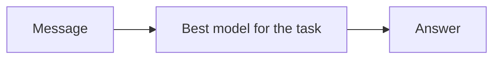
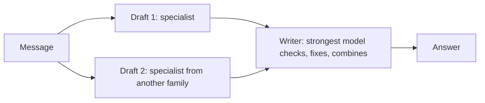
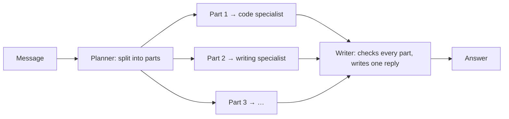

# Free Agent

[Back to the backend documentation index](README.md)

The Free Agent is Nerdplexity's multi-model assistant. The [Free Router](free-router.md) sends each message to the single best free model; the Free Agent can also put several free models to work on one message. It knows which of your models is best at what, asks the right ones, and has the strongest check their work and write one answer, all within a fixed budget of free requests.

Code: `backend/src/runtime/agent.ts` (server), `frontend/src/workspace/AgentActivity.tsx` (the steps panel), `frontend/src/lib/router.ts` (how it is chosen).

## Contents

1. [Free Router, Free Agent, and `openrouter/free`](#1-free-router-free-agent-and-openrouterfree)
2. [Using it](#2-using-it)
3. [The three strategies](#3-the-three-strategies)
4. [Specialists: which model is good at what](#4-specialists-which-model-is-good-at-what)
5. [Choosing a strategy](#5-choosing-a-strategy)
6. [Ensemble: drafts, then a checked answer](#6-ensemble-drafts-then-a-checked-answer)
7. [Plan: parts for specialists](#7-plan-parts-for-specialists)
8. [The writer](#8-the-writer)
9. [Budget and limits](#9-budget-and-limits)
10. [When things fail](#10-when-things-fail)
11. [What the user sees](#11-what-the-user-sees)
12. [API contract](#12-api-contract)
13. [Guarantees](#13-guarantees)
14. [Why it works this way](#14-why-it-works-this-way)
15. [Limitations](#15-limitations)
16. [Changing the agent](#16-changing-the-agent)

---

## 1. Free Router, Free Agent, and `openrouter/free`

| | **Free Router** | **Free Agent** | **`openrouter/free`** |
| --- | --- | --- | --- |
| Whose | Nerdplexity | Nerdplexity | OpenRouter |
| Models per message | One (plus fallbacks) | One to five | One, picked by OpenRouter |
| Chooses among | Free models on all your connections | Free models on all your connections | OpenRouter's free models |
| Best for | Everyday chat, speed, saving quota | Harder questions: math, code, reasoning, multi-part requests | A single OpenRouter key |
| Requests per message | 1 normally, up to 4 on failures | 1 for simple messages, usually 3–4, never more than 5 | 1 |
| In the model picker | **Free Router** (the default) | **Free Agent** | An ordinary model |

The Free Agent is built on the Free Router: it uses the same free-model pool, the same ranking, the same health and cooldowns, and the same fallback rules (`tryInOrder`) for every model it asks. Read the Free Router page for those; this page covers what the agent adds.

It assigns work only to models the Free Router can rank. OpenRouter's own routers (`openrouter/free`, `openrouter/auto`) pick an unknown model on OpenRouter's side, so they are never chosen as a drafter, specialist, or planner, and they do not count toward the two models an ensemble needs. They stay where the Free Router keeps them: last in the writer's list, used only if every other model fails.

## 2. Using it

1. Connect providers with free models, as for the Free Router ([Free Router, section 2](free-router.md#2-using-it)). The agent needs **at least two** free models to combine; with one, it answers like the Free Router.
2. Open the model picker and choose **Free Agent**, the second row, marked with the Nerdplexity logo.
3. Send a message. The live answer shows what the agent is doing ("Drafting with …", "Checking and writing the answer with …"), and a **Free Agent** panel in the Thinking drawer lists every step.
4. For the best choices, run [Bench](bench.md) on your models. The **Specialists** table on the Bench page shows who the agent would ask for each kind of task and why.

Each answer is credited to the model that wrote the final answer ("… · via Free Agent"), and the **Free Agent** panel above it shows the strategy, every model asked, how long each took, and the drafts themselves.

## 3. The three strategies

For every message the agent picks one strategy (section 5):

**Direct**: one model answers. Used for simple messages, when tools are on, or when only one free model can take the message. Costs one request, like the Free Router.



**Ensemble**: two specialists draft independently; the strongest model checks the drafts and writes the answer. Used for code, math, reasoning, structured output, long requests, and longer writing.



**Plan**: a planner splits a message with several parts; each part goes to the model best at that kind of task; the strongest model checks the parts and writes one reply.



In every strategy only the writer's answer streams to the user as the answer. Drafts and part answers are shown as steps.

## 4. Specialists: which model is good at what

`specialists(candidates, base, health, owner, bench)` ranks the free models separately for each kind of task: code, math, reasoning, writing, structured output (`extraction`), and general. Each ranking is the Free Router's `rankCandidates` with the task kind set to that kind, so it uses the same signals ([Free Router, section 7](free-router.md#7-step-3-scoring)):

- **Bench results** for that kind ([Bench](bench.md)): the strongest signal once a model has 3 graded answers. Code uses the code category, math uses math, reasoning uses math and facts, writing and structured output use instructions, general uses facts and instructions.
- **The model's name**: parameter count, and words like "coder" or "r1".
- **What the request needs**: image input, tool support, context size. Models that cannot take the request are left out.
- **Recent health** on this server: success rate, slowness, cooldowns after failures.

The agent uses these rankings to choose the writer (the top model for the message's kind), the drafters (the next models, from other families where possible), the planner (the top model for structured output), and each part's specialist (the top model for that part's kind).

**The Specialists table** on the Bench page calls `POST /v1/agent/specialists` with your current free models and shows, for each kind, the first choice, why, and the next two. It refreshes when your models or Bench results change.

## 5. Choosing a strategy

`chooseStrategy(text, task, usable)` looks at the latest user message and how many free models can take it. The first matching rule wins:

| Order | Condition | Strategy |
| --- | --- | --- |
| 1 | Tools are on (calculator, documents, web search tool) | direct |
| 2 | Fewer than 2 usable models for this kind of task | direct |
| 3 | No images, and the message looks multi-part (below) | plan |
| 4 | The task is code, math, reasoning, or structured output; or the message is over 600 characters; or it is writing over 200 characters | ensemble |
| 5 | Anything else | direct |

The task kind comes from the Free Router's keyword profile ([Free Router, section 5](free-router.md#5-step-1-what-the-message-needs)).

**Multi-part** (`looksMultiPart`): the message is at least 40 characters, has no code block, and either:

- has two or more list items (numbered or bulleted) together with a question mark or a request verb (write, explain, give, list, make, create, find, compare, calculate, solve, summarize); or
- has two or more sentences ending in a question mark; or
- has sentences that need two or more different kinds of work (for example one about code and one about writing).

Examples, computed by the code with three usable models:

| Message | Kind | Multi-part | Strategy |
| --- | --- | --- | --- |
| "Hi!" | general | no | direct |
| "Tell me a fun fact about octopuses." | general | no | direct |
| "Write a short email to my landlord" | writing | no | direct |
| "Solve 12 * 7" | math | no | ensemble |
| "Why is the sky blue?" | reasoning | no | ensemble |
| "Fix this bug in my Python function" | code | no | ensemble |
| "Extract the names as JSON: Ana, Bo, Cy" | extraction | no | ensemble |
| "What is the capital of France? And why did it become the capital?" | reasoning | yes | plan |
| "Write a Python function to parse dates. Then write a short email announcing it to the team." | code | yes | plan |
| "Please do these: 1. Explain TCP vs UDP 2. Give a haiku about networks" | reasoning | yes | plan |
| "Summarize this: - apples - oranges" | writing | no (a list of data, not requests) | direct |

## 6. Ensemble: drafts, then a checked answer

1. **Writer**: the top-ranked model for the message's kind.
2. **Drafters**: up to 2 models after the writer (`pickDrafters`), chosen from **model families** different from the writer's and each other's when possible, so their mistakes are less likely to be the same. A family is the part of the model ID before `/` (`meta-llama/llama-3.3-70b` → `meta-llama`), or the leading word when there is no `/` (`llama-3.1-8b-instant` → `llama`, `gemma-4-31B-it` → `gemma`). When there are not enough other families, models from the same family fill the places.
3. The drafters run **in parallel**, each on the full conversation (including automatic web results, when there are any), with up to 1,500 output tokens. Drafter 1 may fall back to another unused model if its first choice fails before answering; drafter 2 gets one try (section 9).
4. Each finished draft is shown as a step, shortened to 6,000 characters.
5. The writer receives the conversation plus this instruction (after any leading system messages), followed by the drafts:

```text
You are the final writer for Nerdplexity's Free Agent. Other AI models wrote independent drafts answering the user's latest message; they are below, and they can be wrong.
- Work out the correct answer yourself, using the drafts as input: check facts, math, and code, and where the drafts disagree, decide which is right.
- Keep what is correct and useful, fix mistakes, and fill gaps.
- Write one complete answer to the user in your own words, in the format their message asks for.
- Do not mention the drafts, other models, or this process.

Draft 1:
…

Draft 2:
…
```

If every drafter fails, the writer answers on its own, like direct mode.

## 7. Plan: parts for specialists

1. **Planner**: the top model for structured output, given only the latest user message and this instruction, with a 400-token output limit and temperature 0:

```text
Split the user's message into at most 3 independent parts that can be answered separately.
Each part must be self-contained: include every detail from the message that answering it needs.
Reply with JSON only, no other text: {"parts":[{"task":"...","kind":"code|math|reasoning|writing|extraction|general"}]}
If the message is really one task, reply with a single part.
```

2. **Reading the plan** (`parsePlan`): the first `{…}` block in the reply is parsed as JSON, so text around it is tolerated. Parts with an empty task are dropped, at most 3 are kept, tasks are cut to 1,000 characters, and an unknown kind becomes `general`. If the reply has no usable JSON, or only one part, the agent switches to **ensemble** and says so in the strategy step ("The planner found a single task, so two specialists draft it…").
3. **Specialists**: each part goes to the top model for its kind, preferring a model no other part has taken, so parts spread across models and quotas. They run in parallel, each with one try.
4. Each specialist sees the conversation with the latest user message replaced by its part, plus this note (the whole original message is kept as context):

```text
The user's message has several parts; another model will combine the answers. Answer only this part, completely: <part>

The user's full message, for context:
<original message>
```

5. The writer receives the conversation plus:

```text
You are the final writer for Nerdplexity's Free Agent. The user's latest message has several parts. Specialist models answered each part; their answers are below, and they can be wrong.
- Check each part and fix mistakes. If a part has no answer below, answer it yourself.
- Combine everything into one complete, well-organized reply that covers every part, in the order the user asked.
- Do not mention the specialists, other models, or this process.

Part 1: <task>
Answer:
<answer, or "(no answer; answer this part yourself)">
…
```

A part whose specialist failed, or that did not fit in the budget, is passed to the writer marked "no answer", and the writer answers it itself.

## 8. The writer

- The writer is ranked again for the actual request it will receive, drafts included, so a model whose context is too small for the drafts is left out and the next-strongest one writes.
- It streams its answer to the user, with the usual reasoning, status, and model events.
- It gets the tools when tools are on (direct mode only), so a tool-using answer works as in the Free Router.
- If it fails **before any output**, the next-ranked model writes (fallback). If it fails **after** output, the run fails with the partial answer kept, as for any run.
- If **no writer** can answer at all but a draft exists, the first draft becomes the answer, with a status line: "No model could write the final answer, so this is the draft from …". The answer is credited to that draft's model.

## 9. Budget and limits

All limits are in `AGENT_LIMITS` (`backend/src/runtime/agent.ts`):

| Limit | Value | Meaning |
| --- | ---: | --- |
| `calls` | 5 | Model requests per message, counting failed attempts |
| `drafters` | 2 | Drafts in ensemble mode |
| `parts` | 3 | Parts in plan mode |
| `draftTokens` | 1,500 | Output limit for a draft or a part answer |
| `plannerTokens` | 400 | Output limit for the planner |
| `draftChars` | 6,000 | A draft is shortened to this before the writer reads it and before it is shown |

How the 5 requests are shared:

| Strategy | Planner | Drafts or parts | Writer | Most requests |
| --- | ---: | ---: | ---: | ---: |
| direct | – | – | up to 5 (fallbacks) | 5 |
| ensemble | – | drafter 1 up to 2, drafter 2 once | the rest (at least 1) | 5 |
| plan | 1 | one per part, as many parts as the rest allows (keeping 1 for the writer) | the rest (at least 1) | 5 |
| plan that became ensemble | 1 | drafter 1 once, drafter 2 once | the rest | 5 |

What this means for free quotas: OpenRouter's free accounts allow 50 free-model requests a day, so an OpenRouter-only Free Agent can answer roughly 12–16 harder questions a day, against about 50 with the Free Router. Connecting more providers (Groq, Gemini, Cerebras, Mistral, SambaNova, models on your machine) spreads the load, because drafts and parts are assigned to different models and accounts where possible. A simple message still costs one request.

## 10. When things fail

| What fails | What happens |
| --- | --- |
| A drafter's model, before answering | Drafter 1 tries another unused model once; drafter 2 is marked failed. The writer works with the drafts that exist. |
| Every drafter | The writer answers on its own. |
| A drafter after starting to answer, or refusing | That draft is marked failed; the run continues. |
| The planner, or its reply is not usable JSON | The agent switches to ensemble. |
| A part's specialist | The part is passed to the writer marked "no answer", and the writer answers it. |
| The writer's model, before answering | The next-ranked model writes. |
| Every writer, with a draft available | The first draft is the answer, with a status line saying so. |
| Every writer, with no draft | The run fails with the Free Router's "no free model could answer" message ([Free Router, section 12](free-router.md#12-when-no-model-can-answer)). |
| The writer after starting to answer | The run fails with the partial answer kept. |
| An account-wide limit or a bad key | Every model on that account is skipped for the rest of the message, in every step. |

Rate limits and failures update the shared health, so the next message avoids models that are cooling down ([Free Router, section 9](free-router.md#9-health-and-cooldowns)).

## 11. What the user sees

**While it works.** The drawer heading shows the current step ("Planning the parts with …", "Drafting with …", "… is answering a part", "Checking and writing the answer with …"). The **Free Agent** panel in the drawer lists the steps as they start and finish. The answer header shows the Nerdplexity mark until the writer starts, then the writer's logo.

**The saved answer.**

- The provenance line names the writer's model and "via Free Agent". If the writer was `openrouter/free`, it names the concrete model OpenRouter picked.
- The **Free Agent** panel above the answer shows the strategy ("Two drafts, checked and combined", "Split into parts for specialists", "Answered directly"), the final writer, the number of requests, and every step: role (Plan, Draft 1, Part 2 · writing, Final answer), model, connection, time or failure, the reason it was chosen, and **Read the draft / Read this part / Read the plan** to see what each model wrote.
- This is saved in the message's `metadata.agent` (`{ steps, mode, calls, task }`), and in the run record as `agent` (steps) and `agentOutcome`.

**Run history** shows "*writer* via Free Agent · *N* requests" and the same panel in the run details.

**Usage.** Reported tokens are the total across every request of the message, when every request reported usage; otherwise usage is left blank rather than understated.

## 12. API contract

Types: `shared/src/runs.ts` (`AgentMode`, `AgentStep`, `AgentOutcome`, `SpecialistEntry`).

**Start.** `POST /v1/runs` with a route whose strategy is `"agent"`; everything else is as for the Free Router ([Free Router, section 14](free-router.md#14-api-contract)):

```json
{
  "idempotencyKey": "example_agent_12345",
  "route": { "strategy": "agent", "connections": [ … ], "models": [ … ] },
  "messages": [{ "role": "user", "content": "Why is the sky blue?" }],
  "settings": { "maxTokens": 1024 }
}
```

**Events** (in addition to the usual `delta`, `reasoning`, `status`, `model`, `quota`):

| Event | Fields | Meaning |
| --- | --- | --- |
| `agent` | `id`, `role` (`strategy` / `planner` / `drafter` / `specialist` / `writer`), `status` (`running` / `done` / `failed`), `reason`, `connectionId`, `model`, `mode`, `task`, `kind`, `text`, `durationMs` | A step started, switched model, finished, or failed. Updates to one step share its `id` (`strategy`, `planner`, `draft-1`, `draft-2`, `part-1`…`part-3`, `writer`). `text` holds a draft or part answer, shortened. |
| `completed` | `agent: { mode, task, calls, writer: { connectionId, model } }` | How the run went and who wrote the answer |

**Specialists.** `POST /v1/agent/specialists` with `{ "route": { "connections": […], "models": […] } }` (validated like a route; `strategy` is not needed) returns the top three models for each kind:

```json
{
  "specialists": {
    "code": [{ "connectionId": "or", "model": "qwen/qwen3-coder:free", "score": 0.75, "why": ["coding model", "passed 5 of 5 Bench code tests"] }],
    "math": [ … ], "reasoning": [ … ], "writing": [ … ], "extraction": [ … ], "general": [ … ]
  }
}
```

The ranking assumes a text-only request of about 2,000 tokens without tools, and uses the caller's Bench results and this server's health.

## 13. Guarantees

| Guarantee | How |
| --- | --- |
| Only free models | The agent uses the Free Router's pool: models the web app has verified as free ([Free Router, section 4](free-router.md#4-the-free-model-pool)). |
| At most 5 requests per message | `AGENT_LIMITS.calls`, shared by every step; a test sends every request to a failing provider and checks the count. |
| No two models spliced into one answer | The user's answer is only ever the writer's stream (or, when no writer answered at all, one whole draft). |
| Refusals are not routed around | A refusal fails that step; a refused writer fails the run. |
| Every model asked is shown | Every step is an `agent` event and is saved with the answer. |
| Keys are not stored | As for the Free Router: keys stay in the browser; the server hashes them only to track health. |

## 14. Why it works this way

- **Drafts, then a writer ("mixture of agents").** Several models answering independently, with a strong model combining and correcting them, is a published way to get better answers from models that are individually weaker (Wang et al., "Mixture-of-Agents Enhances Large Language Model Capabilities", 2024). With free models of uneven quality, a writer that can see two attempts catches mistakes one model makes alone.
- **Different families for drafts.** Models from the same family share training data and blind spots; drafts from different makers disagree more usefully.
- **Plans only for multi-part messages.** Splitting a single question costs requests and loses context; splitting a message that really asks for several things lets each part go to the model best at it.
- **No model judges another's score.** The writer rewrites; it does not pick a winner by score. That keeps it to one extra request instead of a judging round, and the result is an answer the user can read, not a verdict.
- **Rule-based strategy.** The strategy is chosen by the same kind of predictable wording checks as the Free Router. An LLM classifier would cost a request on every message, including "Hi".
- **A hard request budget.** Free accounts have small daily limits. A fixed ceiling makes the cost of the agent predictable, and direct mode keeps simple messages at one request.

## 15. Limitations

- **Keyword-based decisions.** Strategy and task kind come from wording. A cover letter that mentions "SQL" counts as code; "and in Rust?" after a code question is general and answered directly.
- **More requests and more time.** An ensemble answer takes about one draft's time plus the writer's, and three requests. Drafts are not streamed to the user.
- **The writer is only as good as the strongest free model you have.** It can combine and correct drafts, but it cannot know what none of the models know.
- **No tools in ensemble or plan.** Tool runs use direct mode.
- **Images disable plan mode.** The planner and specialists receive text; images go to drafters and the writer.
- **Drafts are shortened to 6,000 characters** for the writer; very long code answers may lose their end.
- **Health is in memory**, as for the Free Router.
- **Not measured end to end yet.** Bench measures single models. Whether the agent beats the best single model on your connections is not yet measured by Bench.

## 16. Changing the agent

Constants: `AGENT_LIMITS`, `ENSEMBLE_KINDS`, the multi-part patterns (`LIST_ITEM`, `SENTENCE`), and the prompts (`PLANNER_PROMPT`, `WRITER_ENSEMBLE`, `WRITER_PLAN`) are at the top of their sections in `backend/src/runtime/agent.ts`. Rankings come from `backend/src/runtime/router.ts`; change scoring there ([Free Router, section 17](free-router.md#17-changing-the-router)).

When changing the agent, update this page and `backend/src/runtime/agent.test.ts`. The tests that protect the behavior most likely to regress: the strategy table, drafter families, plan parsing, "keeps going when a drafter fails", "falls back to the next writer … and shows a draft when no writer can answer", and "never sends more than 5 requests".

### Code and tests

| File | Contents |
| --- | --- |
| `backend/src/runtime/agent.ts` | Specialists, strategy, planner, drafters, specialists, writer, budget |
| `backend/src/runtime/router.ts` | `tryInOrder` (the fallback loop every step uses), ranking, health |
| `backend/src/routes/runs.ts` | Accepting `strategy: "agent"` and starting agent runs |
| `backend/src/routes/agent.ts` | `POST /v1/agent/specialists` |
| `frontend/src/lib/router.ts` | The agent's identity (`nerdplexity-router` / `agent`), names, strategy |
| `frontend/src/workspace/useRun.ts` | Recording steps, status lines, crediting the writer |
| `frontend/src/workspace/AgentActivity.tsx` | The steps panel |
| `frontend/src/workspace/Bench.tsx` | The Specialists table |
| `backend/src/runtime/agent.test.ts` | Strategy, multi-part detection, families, plan parsing, specialists, every mode, failures, budget |
| `backend/src/routes/bench.test.ts` | The specialists endpoint with real Bench results over HTTP |
| `tests/browser/agent.spec.ts` | Ensemble with draft inspection and writer credit; plan with parts; direct for greetings; the Specialists table |
