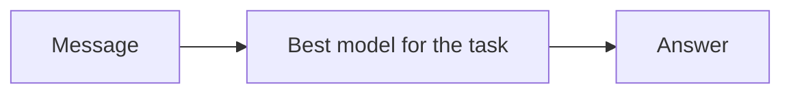
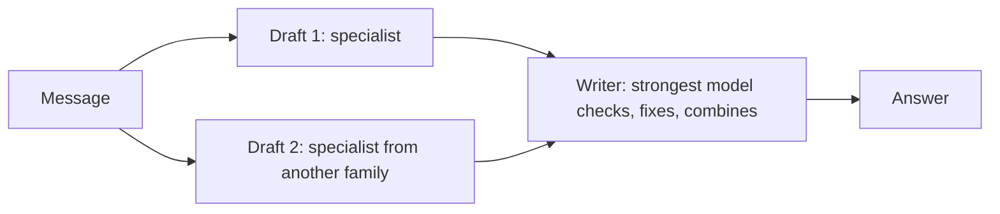
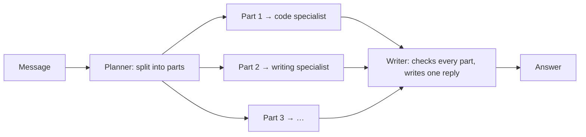

# Free Agent

[Back to the backend documentation index](README.md)

The Free Agent is Nerdplexity's multi-model assistant and the default model. The [Free Router](free-router.md) sends each message to the single best free model; the Free Agent can also put several different free models to work on one message. It knows which of your models is best at what, asks the right ones, and has the strongest check their work and write one answer. You can change how it behaves and which model does each part (section 9).

Code: `backend/src/runtime/agent.ts` (server), `frontend/src/workspace/AgentActivity.tsx` (the steps panel), `frontend/src/workspace/AgentSettings.tsx` (the settings), `frontend/src/lib/router.ts` (how it is chosen). How the pieces fit together, from the browser to the providers, is in [Free Agent architecture](free-agent-architecture.md).

## Contents

1. [Free Router, Free Agent, and `openrouter/free`](#1-free-router-free-agent-and-openrouterfree)
2. [Using it](#2-using-it)
3. [The three strategies](#3-the-three-strategies)
4. [Specialists: which model is good at what](#4-specialists-which-model-is-good-at-what)
5. [Choosing a strategy](#5-choosing-a-strategy)
6. [Ensemble: drafts, then a checked answer](#6-ensemble-drafts-then-a-checked-answer)
7. [Plan: parts for specialists](#7-plan-parts-for-specialists)
8. [The writer](#8-the-writer)
9. [Your settings and limits](#9-your-settings-and-limits)
10. [When things fail](#10-when-things-fail)
11. [What the user sees](#11-what-the-user-sees)
12. [API contract](#12-api-contract)
13. [Guarantees](#13-guarantees)
14. [Why it works this way](#14-why-it-works-this-way)
15. [Limitations](#15-limitations)
16. [Changing the agent](#16-changing-the-agent)

---

## 1. Free Router, Free Agent, and `openrouter/free`

| | **Free Router** | **Free Agent** | **`openrouter/free`** |
| --- | --- | --- | --- |
| Whose | Nerdplexity | Nerdplexity | OpenRouter |
| Models per message | One (plus fallbacks) | At least two: for a simple message one drafts and another checks; for harder ones, up to three drafters or specialists (plus a planner) and a writer. One alone only with tools, a single usable model, or the Quick setting | One, picked by OpenRouter |
| Chooses among | Free models on all your connections | Free models on all your connections | OpenRouter's free models |
| Best for | Everyday chat, speed, saving quota | Harder questions: math, code, reasoning, multi-part requests | A single OpenRouter key |
| Requests per message | 1 normally, up to 4 on failures | 2 for simple messages, usually 3–4 for harder ones; each step has its own limit on attempts (section 9) | 1 |
| In the model picker | **Free Router**, second row | **Free Agent**, first row, the default | An ordinary model |

The Free Agent is built on the Free Router: it uses the same free-model pool, the same ranking, the same health and cooldowns, and the same fallback rules (`tryInOrder`) for every model it asks. Read the Free Router page for those; this page covers what the agent adds.

It assigns work only to models the Free Router can rank. OpenRouter's own routers (`openrouter/free`, `openrouter/auto`) pick an unknown model on OpenRouter's side, so they are never chosen as a drafter, specialist, or planner, and they do not count toward the two models an ensemble needs. They stay where the Free Router keeps them: last in the writer's list, used only if every other model fails.

## 2. Using it

1. Connect providers with free models, as for the Free Router ([Free Router, section 2](free-router.md#2-using-it)). The agent needs **at least two** free models to combine; with one, it answers like the Free Router.
2. The Free Agent is the **default model**: as soon as a connection has a free model and no model has been chosen, the app selects it, for the settings and for an empty new thread. It is the first row of the model picker, marked with the Nerdplexity logo. Choosing any other model (a single model, or the Free Router) keeps that choice; the default never replaces it. Settings that still hold the earlier automatic default, the Free Router, are switched to the Free Agent once (`agentDefault` in the settings records that this happened).
3. Send a message. The live answer shows what the agent is doing ("Drafting", "Answering each part", "Checking and writing the answer"), and a **Free Agent** panel in the Thinking drawer lists every step.
4. Optional: under **Models → Let Nerdplexity choose**, choose how the agent works and which model does which part (section 9).
5. For the best automatic choices, run [Bench](bench.md) on your models. The **Specialists** table on the Bench page shows who the agent would ask for each kind of task and why.

The answer is credited to Nerdplexity, since no single model wrote it. The **Free Agent** panel above it names every model and its role, and while the agent works it opens by itself and streams what each model is thinking and writing, and what is passed from one model to the next (section 11).

## 3. The three strategies

For every message the agent picks one strategy (section 5):

**Direct**: one model answers alone. Used only when tools are on, when only one free model can take the message, or with the Quick setting. Costs one request, like the Free Router.



**Ensemble**: specialists draft independently; the strongest model checks the drafts and writes the answer. A simple message gets one draft and a check by a second model; code, math, reasoning, structured output, long requests, and longer writing get two drafts (one to three in the settings).



**Plan**: a planner splits a message with several parts; each part goes to the model best at that kind of task; the strongest model checks the parts and writes one reply.



In every strategy only the writer's answer streams to the user as the answer. Drafts and part answers are shown as steps.

## 4. Specialists: which model is good at what

`specialists(candidates, base, health, owner, bench)` ranks the free models separately for each kind of task: code, math, reasoning, writing, structured output (`extraction`), and general. Each ranking is the Free Router's `rankCandidates` with the task kind set to that kind, so it uses the same signals ([Free Router, section 7](free-router.md#7-step-3-scoring)):

- **Bench results** for that kind ([Bench](bench.md)): the strongest signal once a model has 3 graded answers. Code uses the code category, math uses math, reasoning uses math and facts, writing and structured output use instructions, general uses facts and instructions.
- **The model's name**: parameter count, and words like "coder" or "r1".
- **What the request needs**: image input, tool support, context size. Models that cannot take the request are left out.
- **Recent health** on this server: success rate, slowness, cooldowns after failures.

The agent uses these rankings to choose the writer (the top model for the message's kind), the drafters (the next models, from other families where possible), the planner (the top model for structured output), and each part's specialist (the top model for that part's kind). A model you choose for a role in the settings goes first in that role's list (section 9).

**The Specialists table** on the Bench page calls `POST /v1/agent/specialists` with your current free models and shows, for each kind, the first choice, why, and the next two. It refreshes when your models or Bench results change.

## 5. Choosing a strategy

`chooseStrategy(text, task, usable, behavior)` looks at the latest user message, how many free models can take it, and the behavior in your settings (section 9). The first matching rule wins:

| Order | Condition | Strategy |
| --- | --- | --- |
| 1 | Tools are on (calculator, documents, web search tool) | direct |
| 2 | Fewer than 2 usable models for this kind of task | direct |
| 3 | Behavior is **Quick** | direct |
| 4 | Behavior is **Thorough**: plan if the message looks multi-part (no images), otherwise ensemble | plan or ensemble |
| 5 | No images, and the message looks multi-part (below) | plan |
| 6 | The task is code, math, reasoning, or structured output; or the message is over 600 characters; or it is writing over 200 characters | ensemble |
| 7 | Anything else | ensemble with one draft: one model drafts, a second checks and writes |

Rules 3 and 4 apply only when you chose that behavior; **Automatic** (the default) skips them.

The task kind comes from the Free Router's keyword profile ([Free Router, section 5](free-router.md#5-step-1-what-the-message-needs)).

**Multi-part** (`looksMultiPart`): the message is at least 40 characters, has no code block, and either:

- has two or more list items (numbered or bulleted) together with a question mark or a request verb (write, explain, give, list, make, create, find, compare, calculate, solve, summarize); or
- has two or more sentences ending in a question mark; or
- has sentences that need two or more different kinds of work (for example one about code and one about writing).

Examples, computed by the code with three usable models and the Automatic behavior:

| Message | Kind | Multi-part | Strategy |
| --- | --- | --- | --- |
| "Hi!" | general | no | ensemble, one draft |
| "Tell me a fun fact about octopuses." | general | no | ensemble, one draft |
| "Write a short email to my landlord" | writing | no | ensemble, one draft |
| "Solve 12 * 7" | math | no | ensemble |
| "Why is the sky blue?" | reasoning | no | ensemble |
| "Fix this bug in my Python function" | code | no | ensemble |
| "Extract the names as JSON: Ana, Bo, Cy" | extraction | no | ensemble |
| "What is the capital of France? And why did it become the capital?" | reasoning | yes | plan |
| "Write a Python function to parse dates. Then write a short email announcing it to the team." | code | yes | plan |
| "Please do these: 1. Explain TCP vs UDP 2. Give a haiku about networks" | reasoning | yes | plan |
| "Summarize this: - apples - oranges" | writing | no (a list of data, not requests) | ensemble, one draft |

## 6. Ensemble: drafts, then a checked answer

1. **Writer**: your chosen final-answer model, or the top-ranked model for the message's kind.
2. **Drafters**: as many as **Drafts per answer** (2 by default; 1 to 3), never the writer. Drafters you chose come first, in their order; the ranking fills the remaining places (`pickDrafters`), choosing models from **model families** different from the writer's and each other's when possible, so their mistakes are less likely to be the same. A family is the part of the model ID before `/` (`meta-llama/llama-3.3-70b` → `meta-llama`), or the leading word when there is no `/` (`llama-3.1-8b-instant` → `llama`, `gemma-4-31B-it` → `gemma`). When there are not enough other families, models from the same family fill the places.
3. The drafters run **in parallel**, each on the full conversation (including automatic web results, when there are any), with up to 1,500 output tokens. A drafter whose model fails before answering moves to another model that is neither the writer nor another drafter's first choice, up to 2 models per drafter (section 9). Each drafter walks the spare models from a different starting place, so two drafters that fail at once do not both move to the same model.
4. Each finished draft is shown as a step, shortened to 6,000 characters.
5. The writer receives the conversation plus this instruction (after any leading system messages), followed by the drafts:

```text
You are the final writer for Nerdplexity's Free Agent. Other AI models wrote independent drafts answering the user's latest message; they are below, and they can be wrong.
- Work out the correct answer yourself, using the drafts as input: check facts, math, and code, and where the drafts disagree, decide which is right.
- Keep what is correct and useful, fix mistakes, and fill gaps.
- Write one complete answer to the user in your own words, in the format their message asks for.
- Do not mention the drafts, other models, or this process.

Draft 1:
…

Draft 2:
…
```

If every drafter fails, the writer answers on its own, like direct mode.

## 7. Plan: parts for specialists

1. **Planner**: your chosen planner, or the top model for structured output, given only the latest user message and this instruction, with a 400-token output limit and temperature 0:

```text
Split the user's message into at most 3 independent parts that can be answered separately.
Each part must be self-contained: include every detail from the message that answering it needs.
Reply with JSON only, no other text: {"parts":[{"task":"...","kind":"code|math|reasoning|writing|extraction|general"}]}
If the message is really one task, reply with a single part.
```

2. **Reading the plan** (`parsePlan`): the first `{…}` block in the reply is parsed as JSON, so text around it is tolerated. Parts with an empty task are dropped, at most 3 are kept, tasks are cut to 1,000 characters, and an unknown kind becomes `general`. If the reply has no usable JSON, or only one part, the agent switches to **ensemble** and says so in the strategy step ("The planner found a single task, so specialists draft it…").
3. **Specialists**: each part goes to your chosen specialist for its kind, or else to the top model for its kind, preferring a model no other part has taken, so parts spread across models and quotas. They run in parallel; a specialist whose model fails before answering moves to the next model for that kind, up to 2 models per part.
4. Each specialist sees the conversation with the latest user message replaced by its part, plus this note (the whole original message is kept as context):

```text
The user's message has several parts; another model will combine the answers. Answer only this part, completely: <part>

The user's full message, for context:
<original message>
```

5. The writer receives the conversation plus:

```text
You are the final writer for Nerdplexity's Free Agent. The user's latest message has several parts. Specialist models answered each part; their answers are below, and they can be wrong.
- Check each part and fix mistakes. If a part has no answer below, answer it yourself.
- Combine everything into one complete, well-organized reply that covers every part, in the order the user asked.
- Do not mention the specialists, other models, or this process.

Part 1: <task>
Answer:
<answer, or "(no answer; answer this part yourself)">
…
```

A part whose specialist failed is passed to the writer marked "no answer", and the writer answers it itself.

## 8. The writer

- The writer is ranked again for the actual request it will receive, drafts included, so a model whose context is too small for the drafts is left out and the next-strongest one writes. Your chosen final-answer model goes first when it can take the request.
- It streams its answer to the user, with the usual reasoning, status, and model events.
- It gets the tools when tools are on (direct mode only), so a tool-using answer works as in the Free Router.
- If it fails **before any output**, the next-ranked model writes (fallback). If it fails **after** output, the run fails with the partial answer kept, as for any run.
- If **no writer** can answer at all but a draft exists, the first draft becomes the answer, with a status line: "No model could check and rewrite the drafts, so this is one unchecked draft." The run is credited to that draft's model (in Run history).

## 9. Your settings and limits

### Settings

**Models → Let Nerdplexity choose** has two cards, **Free Agent** (the default) and **Free Router**, each with a button to use it, and **How the Free Agent works**:

| Setting | Choices | Effect |
| --- | --- | --- |
| Behavior | **Automatic** (default), **Quick**, **Thorough** | Automatic follows the strategy table (section 5). Quick always answers directly with one model: fastest, one request unless a model is busy. Thorough always drafts (or splits a multi-part message into parts) and has the strongest check them. Tools on, or fewer than two usable models, still mean direct. |
| Drafts per answer | 1, **2** (default), 3 | How many drafters an ensemble uses. With 1, one specialist drafts and the writer checks and rewrites it. |
| Final answer | Automatic, or any free model | The writer, in every strategy (in direct mode it is the model that answers). |
| Planner | Automatic, or any free model | The model that splits multi-part messages. |
| Draft 1 … Draft N | Automatic, or any free model | Drafters, in order. Automatic places are filled by the ranking. A drafter that is also the writer is skipped. |
| Specialists for parts | Automatic, or any free model, for each of code, math, reasoning, writing, structured output, general | Which model answers a part of that kind in plan mode. |

Each **Automatic** option says what the ranking would pick now (from `POST /v1/agent/specialists`). **Reset to automatic** clears everything. The settings are saved with your other settings on your Nerdplexity server (`settings.agent`, one row per user; on your computer, the local database), and the web app sends them with each Free Agent run as `route.agent` (section 12).

A chosen model is used only when it can take the message. If it is cooling down after failures, cannot take images, tools, or the context the message needs, or was removed, the ranking chooses for that message, and the strategy step says so ("Your writer, *model*, cannot take this message right now, so the ranking chose instead."). The server drops any choice that is not in the free pool it received, so a stale choice never blocks a message. A chosen model that fails before answering is replaced by the next model in the role's list, as for any step.

### Limits

All limits are in `AGENT_LIMITS` (`backend/src/runtime/agent.ts`). There is no per-message cap on requests; instead each step has its own limit on how many models it tries, counting models that fail before answering:

| Limit | Value | Meaning |
| --- | ---: | --- |
| `attempts.planner` | 2 | Models tried for the plan |
| `attempts.drafter` | 2 | Models tried for each draft |
| `attempts.specialist` | 2 | Models tried for each part |
| `attempts.writer` | 4 | Models tried for the final answer (as many as the Free Router) |
| `drafters` | 2 | Default drafts in ensemble mode |
| `maxDrafts` | 3 | Most drafts a user can choose |
| `parts` | 3 | Parts in plan mode |
| `draftTokens` | 1,500 | Output limit for a draft or a part answer |
| `plannerTokens` | 400 | Output limit for the planner |
| `draftChars` | 6,000 | A draft is shortened to this before the writer reads it and before it is shown |

Requests per message:

| Strategy | Usual | Most, when models keep failing |
| --- | ---: | ---: |
| direct (tools, one usable model, or Quick) | 1 | 4 |
| ensemble, 1 draft (a simple message) | 2 | 1 × 2 + 4 = 6 |
| ensemble, 2 drafts | 3 | 2 × 2 + 4 = 8 |
| ensemble, 3 drafts | 4 | 3 × 2 + 4 = 10 |
| plan, 3 parts | 5 | 2 + 3 × 2 + 4 = 12 |

The worst cases need models that fail before answering, which put them in cooldown, so the next message skips them. An account-wide limit or bad key skips every model on that account at once (section 10).

What this means for free quotas: OpenRouter's free accounts allow 50 free-model requests a day, so an OpenRouter-only Free Agent answers about 25 simple messages or roughly 15 harder questions a day, against about 50 with the Free Router. **Quick** keeps every message at one request, and fewer drafts cost less. Connecting more providers (Groq, Gemini, Cerebras, Mistral, SambaNova, models on your machine) spreads the load, because drafts and parts are assigned to different models and accounts where possible.

## 10. When things fail

| What fails | What happens |
| --- | --- |
| A drafter's model, before answering | The drafter tries one more model (not the writer, not another drafter's first choice). If that fails too, the draft is marked failed and the writer works with the drafts that exist. |
| Every drafter | The writer answers on its own. |
| A drafter after starting to answer, or refusing | That draft is marked failed; the run continues. |
| The planner, or its reply is not usable JSON | The agent switches to ensemble. |
| A part's specialist | It tries the next model for that kind; if that fails too, the part is passed to the writer marked "no answer", and the writer answers it. |
| The writer's model, before answering | The next-ranked model writes, up to 4 models. |
| Every writer, with a draft available | The first draft is the answer, with a status line saying so. |
| Every writer, with no draft | The run fails with the Free Router's "no free model could answer" message ([Free Router, section 12](free-router.md#12-when-no-model-can-answer)). |
| The writer after starting to answer | The run fails with the partial answer kept. |
| An account-wide limit or a bad key | Every model on that account is skipped for the rest of the message, in every step. |
| A model you chose cannot take the message | The ranking chooses for that step, and the strategy step says so. |

Rate limits and failures update the shared health, so the next message avoids models that are cooling down ([Free Router, section 9](free-router.md#9-health-and-cooldowns)).

## 11. What the user sees

**The answer is credited to Nerdplexity.** It is a checked answer from several models, so the answer header shows the Nerdplexity name and mark rather than one model, and there is no single-model credit line. The toolbar shows **Free Agent**; to use one model, choose it in the model picker or on the Models page.

**The Free Agent panel, live.** While the agent works, the panel above the answer opens by itself and shows, as it happens:

- the strategy and why ("A math task: specialists draft independently…"), including any note about your settings;
- a flow line of who works with whom: *Plan* model → *Drafts* or *Parts* models → the model that *Checks and writes*;
- a card per step: its role (Plan, Draft 1, Part 2 · writing, Final answer), the model's logo, ID, and connection, why it was chosen, and its time or failure reason;
- each model's **thinking** (when it reports reasoning) and its **output**, streaming as it writes;
- the hand-offs: a part's task "From the plan", a draft "Sent to *writer* to check", and the writer's "Received Draft 1 from …, Draft 2 from … to check and combine"; the final writer's own thinking streams in its card.

The status line names the models at work ("Qwen3 32B and Gemma 3 12B are drafting", "Llama 3.3 70B is checking and writing the answer"). When the run ends, the panel folds to one line (strategy, the models' logos, "3 models · 3 requests") and each card keeps **Show its thinking** and **Read the draft / Read this part / Read the plan**.

**Run history** shows "*writer* via Free Agent · *N* requests" and the same panel in the run details. If the writer was `openrouter/free`, the record names the concrete model OpenRouter picked.

**Saved data.** The steps are saved in the message's `metadata.agent` (`{ steps, mode, calls, task }`), and in the run record as `agent` (steps) and `agentOutcome`. The message's provenance still records the writer's model, for Run history and exports.

**Usage.** Reported tokens are the total across every request of the message, when every request reported usage; otherwise usage is left blank rather than understated.

## 12. API contract

Types: `shared/src/runs.ts` (`AgentMode`, `AgentStep`, `AgentOutcome`, `SpecialistEntry`).

Types: `AgentConfig`, `AgentBehavior`, and `ModelChoice` for the settings.

**Start.** `POST /v1/runs` with a route whose strategy is `"agent"`; everything else is as for the Free Router ([Free Router, section 14](free-router.md#14-api-contract)). `route.agent` is optional and carries the settings (section 9):

```json
{
  "idempotencyKey": "example_agent_12345",
  "route": {
    "strategy": "agent", "connections": [ … ], "models": [ … ],
    "agent": {
      "behavior": "thorough",
      "drafts": 3,
      "writer": { "connectionId": "groq", "model": "llama-3.3-70b-versatile" },
      "planner": { "connectionId": "or", "model": "qwen/qwen3-32b:free" },
      "drafters": [{ "connectionId": "or", "model": "deepseek/deepseek-r1:free" }],
      "specialists": { "code": { "connectionId": "or", "model": "qwen/qwen3-coder:free" } }
    }
  },
  "messages": [{ "role": "user", "content": "Why is the sky blue?" }],
  "settings": { "maxTokens": 1024 }
}
```

Every field of `agent` is optional. `agentSettings` keeps `behavior` when it is `auto`, `quick`, or `thorough`; `drafts` when it is an integer from 1 to 3; and each model choice only when it names a model in `route.models`. Anything else is dropped, not rejected.

**Events** (in addition to the usual `delta`, `reasoning`, `status`, `model`, `quota`):

| Event | Fields | Meaning |
| --- | --- | --- |
| `agent` | `id`, `role` (`strategy` / `planner` / `drafter` / `specialist` / `writer`), `status` (`running` / `done` / `failed`), `reason`, `connectionId`, `model`, `mode`, `task`, `kind`, `text`, `reasoning`, `durationMs` | A step started, switched model, finished, or failed. Updates to one step share its `id` (`strategy`, `planner`, `draft-1`…`draft-3`, `part-1`…`part-3`, `writer`). On `done`, `text` holds the draft, plan, or part answer and `reasoning` the model's reasoning, each shortened to 6,000 characters. |
| `agent_output` | `id`, `channel` (`text` / `reasoning`), `text` | A piece of a step's output or reasoning as the model writes it, sent at most every 150 ms per step. Append it to the step with that `id`; the step's `done` event replaces it with the full (shortened) text. The writer's output is the answer itself, so it streams as `delta` and `reasoning` instead. |
| `completed` | `agent: { mode, task, calls, writer: { connectionId, model } }` | How the run went and who wrote the answer |

**Specialists.** `POST /v1/agent/specialists` with `{ "route": { "connections": […], "models": […] } }` (validated like a route; `strategy` is not needed) returns the top three models for each kind:

```json
{
  "specialists": {
    "code": [{ "connectionId": "or", "model": "qwen/qwen3-coder:free", "score": 0.75, "why": ["coding model", "passed 5 of 5 Bench code tests"] }],
    "math": [ … ], "reasoning": [ … ], "writing": [ … ], "extraction": [ … ], "general": [ … ]
  }
}
```

The ranking assumes a text-only request of about 2,000 tokens without tools, and uses the caller's Bench results and this server's health.

## 13. Guarantees

| Guarantee | How |
| --- | --- |
| Only free-policy models | The agent uses the Free Router's pool: local models, catalog-listed $0 models, and supported connections confirmed as free-plan accounts with no billing ([Free Router, section 4](free-router.md#4-the-free-model-pool)). |
| A limited number of models per step | `AGENT_LIMITS.attempts`; a test sends every request to a failing provider and checks the count is at most the drafters' and writer's limits. |
| Your choices are used when they can be | A chosen model goes first in its role's list; when it cannot take the message the strategy step says so. Tested for writer, drafters, planner, and specialists. |
| No two models spliced into one answer | The user's answer is only ever the writer's stream (or, when no writer answered at all, one whole draft). |
| Refusals are not routed around | A refusal fails that step; a refused writer fails the run. |
| Every model asked is shown | Every step is an `agent` event and is saved with the answer. |
| Keys are not stored | As for the Free Router: keys stay in the browser; the server hashes them only to track health. |

## 14. Why it works this way

- **Drafts, then a writer ("mixture of agents").** Several models answering independently, with a strong model combining and correcting them, is a published way to get better answers from models that are individually weaker (Wang et al., "Mixture-of-Agents Enhances Large Language Model Capabilities", 2024). With free models of uneven quality, a writer that can see two attempts catches mistakes one model makes alone.
- **Different families for drafts.** Models from the same family share training data and blind spots; drafts from different makers disagree more usefully.
- **Plans only for multi-part messages.** Splitting a single question costs requests and loses context; splitting a message that really asks for several things lets each part go to the model best at it.
- **No model judges another's score.** The writer rewrites; it does not pick a winner by score. That keeps it to one extra request instead of a judging round, and the result is an answer the user can read, not a verdict.
- **Rule-based strategy.** The strategy is chosen by the same kind of predictable wording checks as the Free Router. An LLM classifier would cost a request on every message, including "Hi".
- **Limits per step, not per message.** A single ceiling shared by every step meant a busy drafter could leave the writer with one try. Each step now has its own limit, so the final answer gets the same four tries as the Free Router, and cooldowns keep repeated failures rare. Users who want a predictable cost choose Quick or fewer drafts.
- **Always more than one model.** A second model checking the first catches mistakes one model makes alone, even on simple messages, for one extra request. Quick remains for anyone who prefers speed and quota.
- **Credit to the team, models in view.** The answer is one checked answer, not any single model's, so it is credited to Nerdplexity; the panel shows every model, what it did, and what it passed on, live.
- **User choices first, ranking as the safety net.** A chosen model that is cooling down or cannot take the message is replaced for that message instead of failing it.

## 15. Limitations

- **Keyword-based decisions.** Strategy and task kind come from wording. A cover letter that mentions "SQL" counts as code; "and in Rust?" after a code question is general and answered directly.
- **More requests and more time.** A simple message takes two requests; an ensemble answer takes about one draft's time plus the writer's, and three requests with the default two drafts. Drafts stream in the panel; only the writer's text is the answer.
- **Settings are per user, not per thread.** They apply to every Free Agent message in every thread.
- **The writer is only as good as the strongest free model you have.** It can combine and correct drafts, but it cannot know what none of the models know.
- **No tools in ensemble or plan.** Tool runs use direct mode.
- **Images disable plan mode.** The planner and specialists receive text; images go to drafters and the writer.
- **Drafts are shortened to 6,000 characters** for the writer; very long code answers may lose their end.
- **Health is in memory**, as for the Free Router.
- **Not measured end to end yet.** Bench measures single models. Whether the agent beats the best single model on your connections is not yet measured by Bench.

## 16. Changing the agent

Constants: `AGENT_LIMITS`, `ENSEMBLE_KINDS`, the multi-part patterns (`LIST_ITEM`, `SENTENCE`), and the prompts (`PLANNER_PROMPT`, `WRITER_ENSEMBLE`, `WRITER_PLAN`) are at the top of their sections in `backend/src/runtime/agent.ts`. Rankings come from `backend/src/runtime/router.ts`; change scoring there ([Free Router, section 17](free-router.md#17-changing-the-router)).

When changing the agent, update this page and `backend/src/runtime/agent.test.ts`. The tests that protect the behavior most likely to regress: the strategy table, drafter families, plan parsing, "keeps going when a drafter fails", "falls back to the next writer … and shows a draft when no writer can answer", "gives each step a limited number of models", and the "agent settings" tests.

### Code and tests

| File | Contents |
| --- | --- |
| `backend/src/runtime/agent.ts` | Specialists, strategy, planner, drafters, specialists, writer, limits, settings (`agentSettings`, `withChoice`) |
| `backend/src/runtime/router.ts` | `tryInOrder` (the fallback loop every step uses), ranking, health |
| `backend/src/routes/runs.ts` | Accepting `strategy: "agent"` and starting agent runs |
| `backend/src/routes/agent.ts` | `POST /v1/agent/specialists` |
| `frontend/src/lib/router.ts` | The agent's identity (`nerdplexity-router` / `agent`), names, strategy, `chooseAgentByDefault` |
| `frontend/src/workspace/useRun.ts` | Sending the settings, recording steps, status lines, crediting the writer |
| `frontend/src/workspace/AgentActivity.tsx` | The live panel: flow line, a card per step with its model, thinking, output, and hand-offs |
| `frontend/src/workspace/AgentSettings.tsx` | Let Nerdplexity choose: the two cards and the agent settings |
| `frontend/src/workspace/ChatWorkspace.tsx` | Answers without model names for the Free Agent and Free Router |
| `frontend/src/workspace/Bench.tsx` | The Specialists table |
| `backend/src/runtime/agent.test.ts` | Strategy, multi-part detection, families, plan parsing, specialists, every mode, failures, limits, settings |
| `backend/src/routes/bench.test.ts` | The specialists endpoint with real Bench results over HTTP |
| `tests/browser/agent.spec.ts` | Ensemble with the models and hand-offs in the panel and Run history; plan with parts; two models for a greeting; the panel streaming drafts and thinking live; the Specialists table; settings (Quick, drafts, a chosen writer, reset) |
| `tests/browser/connections.spec.ts` | The Free Agent becomes the default and never replaces a chosen model |
