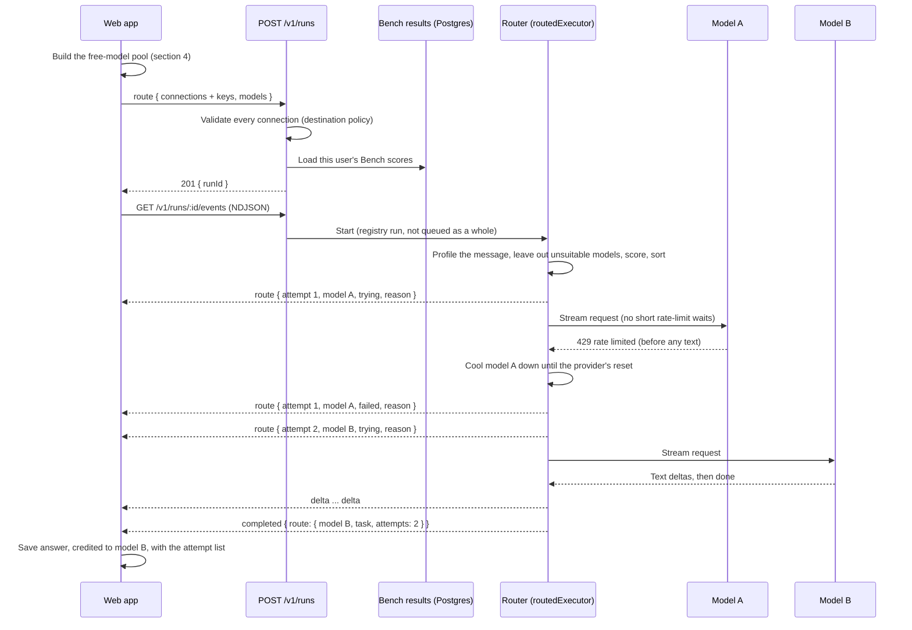

# Free Router

[Back to the backend documentation index](README.md)

The Free Router is Nerdplexity's own model router. Instead of sending a message to one model you picked, you pick **Free Router**, and for each message the server chooses the best free model you have, sends the message there, and moves to the next model if that one is busy or down before it answers. Every attempt, and the reason for it, is shown with the answer.

This page explains exactly how it decides, with every rule and number the code uses. Code: `backend/src/runtime/router.ts` (server) and `frontend/src/lib/router.ts` (the free-model pool).

## Contents

1. [Two routers: ours and OpenRouter's](#1-two-routers-ours-and-openrouters)
2. [Using it](#2-using-it)
3. [One routed message, end to end](#3-one-routed-message-end-to-end)
4. [The free-model pool](#4-the-free-model-pool)
5. [Step 1: what the message needs](#5-step-1-what-the-message-needs)
6. [Step 2: leaving models out](#6-step-2-leaving-models-out)
7. [Step 3: scoring](#7-step-3-scoring)
8. [Step 4: attempts and fallback](#8-step-4-attempts-and-fallback)
9. [Health and cooldowns](#9-health-and-cooldowns)
10. [How Bench changes the ranking](#10-how-bench-changes-the-ranking)
11. [What the user sees](#11-what-the-user-sees)
12. [When no model can answer](#12-when-no-model-can-answer)
13. [Guarantees and where they are enforced](#13-guarantees-and-where-they-are-enforced)
14. [API contract](#14-api-contract)
15. [OpenRouter's router (`openrouter/free`) in Nerdplexity](#15-openrouters-router-openrouterfree-in-nerdplexity)
16. [Limitations](#16-limitations)
17. [Changing the router](#17-changing-the-router)

---

## 1. Two routers: ours and OpenRouter's

Nerdplexity deals with two different things that are both called a "free router". Only one of them is ours.

| | **Free Router** (Nerdplexity) | **`openrouter/free`** (OpenRouter) |
| --- | --- | --- |
| Runs on | Your Nerdplexity server | OpenRouter's servers |
| Chooses among | Every free model on **all** your connections: OpenRouter, Groq, Gemini, Cerebras, Mistral, SambaNova, Hugging Face, Ollama, LM Studio, custom endpoints | OpenRouter's free models only |
| How it chooses | Task type, model capabilities, context size, your Bench results, recent failures (sections 5–10) | OpenRouter's own logic, not visible to Nerdplexity |
| When a model is busy | Tries the next model, up to 4, and shows each attempt | OpenRouter's behavior; Nerdplexity sees one request |
| Picked in the app as | **Free Router**, second row of the model picker (after the Free Agent, the default), marked with the Nerdplexity logo | An ordinary model in the OpenRouter catalog |
| Model ID | Connection `nerdplexity-router`, model `free` (not a real connection) | `openrouter/free` on your OpenRouter connection |

The Free Router can use `openrouter/free` as one of its candidates, always last (section 7). Section 15 covers how the app treats `openrouter/free` on its own. The [Free Agent](free-agent.md) is built on the Free Router and can ask several models per message.

## 2. Using it

1. Connect at least one provider with free models. The quickest is OpenRouter with a free key: its catalog marks $0 models, which the router can use at once. Models on your computer (Ollama, LM Studio) are always free.
2. For providers whose free plan is "an account with no payment method" (Groq, Gemini, Cerebras, Mistral, SambaNova, Hugging Face), set **Account billing** to **No billing enabled** when you add the connection. Nerdplexity cannot read billing settings, so it only uses those models after you say the account cannot be charged.
3. The [Free Agent](free-agent.md), which is built on the Free Router, is the **default model**: as soon as a connection has a free model and no model has been chosen, the app selects it (for the settings and for an empty new thread). To send each message to one model instead, open the model picker and choose **Free Router**, the second row, marked with the Nerdplexity logo, or choose it under **Models → Let Nerdplexity choose**. Its row says how many free models on how many connections it can use. Choosing any model keeps that choice; the default never replaces it. (Until 2026-09-14 the Free Router was the default; a settings value still holding that automatic default is switched to the Free Agent once. A Free Router chosen by hand after that stays.)
4. Optional but recommended: run [Bench](bench.md) on a few models. The router then ranks by measured results instead of guesses from model names.

The answer is credited to Nerdplexity, and the **Free Router** panel above it names every model it tried, why, and what happened. **Run history** shows the model that answered ("… via Free Router") and the same attempts.

## 3. One routed message, end to end



Key points:

- The browser holds the API keys and sends them with each request, as for any run. Each connection's key is sent once, not once per model.
- The run goes through the normal run registry: idempotency keys, numbered events, replay after a reconnect, cancel, and ownership all work exactly as for a single-model run ([Run harness](run-harness.md)).
- A routed run is not put in the local queue as a whole, because most candidates are remote. Only an attempt on a model on this machine waits in the local queue.

## 4. The free-model pool

The web app decides which models the router may use (`routerPool` in `frontend/src/lib/router.ts`, called through `currentRouterPool` in `frontend/src/state/connections.ts`). It is rebuilt at send time so current keys and catalogs are used and nothing is saved with the run.

A model is in the pool only if **all** of these hold:

| Rule | Why |
| --- | --- |
| Its connection is enabled | Disabled connections are ignored everywhere. |
| The connection has its key, if its kind needs one | A request without a key would fail with `auth`. |
| The connection's latest model list succeeded | Models are taken from the catalog, never guessed. |
| `costStatus(...)` says it is free | See below. |

`costStatus` (`frontend/src/lib/cost.ts`) is the same check the **Free only** setting uses. A model counts as free when it is:

- **On this machine** (the connection's catalog reports `execution: 'local'`), or
- **Listed at $0** by the provider's own catalog (`pricing: 'zero-price'`: OpenRouter `:free` models, `openrouter/free`, a Hugging Face provider marked `is_free`, or any catalog reporting `pricing.prompt = 0` and `pricing.completion = 0`), or
- On an account you marked **No billing enabled**.

`paid` and `unknown` prices are never included. That is what keeps a routed run from reaching a model that can charge you.

Limits match the server's: at most **12 connections** and **200 models** per route; models beyond 200 are left out in catalog order.

For **document tools**, the server keeps only models on this machine (documents are never sent online). The web app refuses to send if the pool has none.

## 5. Step 1: what the message needs

`profileTask(messages, tools, maxTokens)` reads the **latest user message** and produces a task profile:

```ts
{ kind: TaskKind; vision: boolean; tools: boolean; estimatedTokens: number }
```

### Task kind

The first rule that matches wins, in this order:

| Order | Kind | Matches (case-insensitive, whole words) |
| --- | --- | --- |
| 1 | `code` | A code fence (three backticks), or: function, class, def, const, compile(s/d), stack trace, exception, bug, debug, refactor, regex, sql, typescript, javascript, python, rust, golang, java, c++, html, css, endpoint, unit test(s), script, snippet, code |
| 2 | `math` | solve, equation, integral, derivative, probability, prove, proof, theorem, calculate, compute, percent(age), matrix, algebra, geometry, arithmetic; or a digit, an operator (`+ * / ^ × ÷ =`), and a digit; or a minus sign with spaces around it ("12 - 7", so dates and phone numbers like 2026-09-14 do not count); or "N% of" |
| 3 | `extraction` | json, yaml, csv, table, extract, parse, classify, categorize/categorise, schema, fill in, bullet list |
| 4 | `writing` | write, draft, rewrite, rephrase, proofread, essay, email/e-mail, letter, story, poem, blog, tweet, summary/summarize/summarise, translate, tone, cover letter |
| 5 | `reasoning` | why, explain, reason(ing), compare, trade-off(s), pros and cons, step by step, analyze/analyse, plan, design, puzzle, riddle, logic |
| 6 | `general` | Anything else |

Examples (checked against the code):

| Message | Kind |
| --- | --- |
| "Fix this bug in my Python function" | `code` |
| "A train travels 120 km in 1.5 hours. Calculate its average speed." | `math` |
| "What is 15% of 80?" | `math` |
| "Extract the names as JSON" | `extraction` |
| "Write a short email to my landlord" | `writing` |
| "Why is the sky blue?" | `reasoning` |
| "Hi!" | `general` |

The order matters: "Write a Python script" is `code`, not `writing`, because `code` is checked first.

### Needs

- `vision`: any message in the request (not only the latest) contains an image. Thread image attachments are sent with every turn, so they count.
- `tools`: the run has any tool enabled (calculator, documents, web search).
- `estimatedTokens` = ⌈characters in all messages ÷ 4⌉ + 1,000 per image + room for the answer: the request's `maxTokens` (2,048 when not set), but at most `RESERVED_OUTPUT` (4,096). A request for a longer answer does not rule a model out; the answer is trimmed to fit it instead (below).

## 6. Step 2: leaving models out

A candidate is removed before scoring when:

| Condition | Reason shown (counted) |
| --- | --- |
| The message has an image and the catalog says the model has **no** image input (`vision: false`) | cannot read images |
| Tools are on and the catalog says the model has **no** tool support (`tools: false`) | cannot use tools |
| The model's context length is known and smaller than `estimatedTokens` (prompt plus at most 4,096 reserved for the answer) | context too small |
| The model, or its whole account, is cooling down (section 9) | cooling down after a failure |

"Unknown" capabilities (`null`) do not remove a model; they lower its score instead. The counts are kept for the message shown when nothing is left (section 12).

**The answer is trimmed to the model, not the other way round** (`fitOutput`). Before a model is sent the request, the output limit is lowered to the smallest of: what was asked, the model's own maximum output when the catalog says, and what is left of its context after the prompt (less 256 tokens). So a request for a long answer, such as a Deep Research report asking for 8,000 tokens, still runs on a model with a smaller context or output cap, and providers do not reject it for asking too much.

## 7. Step 3: scoring

Every remaining candidate gets a score. Higher is better; ties are broken by model ID, then connection ID, so the order is stable.

| Term | Value | Condition |
| --- | --- | --- |
| **Size** | log₁₀(parameters in billions) ÷ 3, clamped to 0–1 (1B → 0, 10B → 0.33, 70B → 0.62, 100B → 0.67, 1T → 1) | Size read from the model ID |
| | 0.5 | Size not in the ID |
| **Coding model** | +0.25 | Task is `code` and the ID contains coder, codestral, devstral, or code |
| **Reasoning model** | +0.2 | Task is `math` or `reasoning` and the ID matches r1, reason, think, qwq, magistral, or math |
| Coding model on prose | −0.15 | Task is `writing` or `general` and it is a coding model |
| Reasoning model on simple tasks | −0.05 | Task is `writing`, `general`, or `extraction` and it is a reasoning model (they are slower) |
| **Tools** | +0.05 / −0.25 | Tools on: supports tools / support unknown |
| **Images** | 0 / −0.3 | Image in the request: reads images / support unknown |
| **Context** | −0.05 | Context length unknown |
| | +0.1 | Request over 16,000 tokens and context at least 4× the request |
| **On this machine** | −0.1 | Local models are usually slower; hosted free models go first |
| **Bench** | see section 10 | At least 3 graded answers for this kind of task |
| **Recent success rate** | +0.25 × (successes ÷ attempts − 0.75) | At least 2 requests on this server (section 9) |
| Slow | −0.1 | Average time to first text over 8 s |
| Just failed | −0.1 | Failed within the last 2 minutes |
| **Meta-router** | −10 | `openrouter/free` or `openrouter/auto`: always last, as a final fallback |

### Reading sizes from IDs

`parameterBillions(id)` reads the total parameter count:

- `llama-3.3-70b-instruct` → 70
- `mixtral-8x7b` → 56 (experts × size)
- `nemotron-3-super-120b-a12b` → 120 (`a12b` is the *active* count and is ignored)
- `llama-3.2-1b` → 1
- `gemma-3n-e4b`, `deepseek-r1-0528`, `qwen3-coder` → unknown (neutral 0.5)

This is a guess from the name and nothing more: it says nothing about quality between two models of the same size, and many large hosted models do not put a size in their ID. Bench exists to replace it.

### Worked example

Message: *"A train travels 120 km in 1.5 hours. Calculate its average speed."* → `math`, no tools, no images, about 2,065 tokens. Five OpenRouter candidates, all with tools and 131K context. Output of the real `rankCandidates`:

**Without Bench results**

| Score | Model | Why |
| ---: | --- | --- |
| 0.700 | `deepseek/deepseek-r1:free` | 0.5 (size unknown) + 0.2 reasoning model |
| 0.615 | `meta-llama/llama-3.3-70b-instruct:free` | 70B parameters |
| 0.500 | `qwen/qwen3-coder:free` | size unknown |
| 0.201 | `google/gemma-3-4b-it:free` | 4B parameters |
| −9.500 | `openrouter/free` | last resort |

**After Bench**, with Llama passing 5 of 5 math questions and DeepSeek R1 passing 2 of 5:

| Score | Model | Why |
| ---: | --- | --- |
| 0.883 | `meta-llama/llama-3.3-70b-instruct:free` | 0.615 + 0.268 (passed 5 of 5 Bench math tests) |
| 0.646 | `deepseek/deepseek-r1:free` | 0.700 − 0.054 (passed 2 of 5) |
| 0.500 | `qwen/qwen3-coder:free` | no results yet |
| 0.201 | `google/gemma-3-4b-it:free` | |
| −9.500 | `openrouter/free` | |

The measured results reverse the name-based guess.

## 8. Step 4: attempts and fallback

The router walks the sorted list:

1. Skip a candidate whose account was blocked earlier in this run, or that started cooling down during this run.
2. Emit `route { attempt, model, status: 'trying', reason }`. The first reason begins "Best free match for *task*: …"; later ones "Trying the next model after *X* failed: …".
3. Send the request **with short rate-limit waits turned off** (`waitOnRateLimit: false`). A single-model run waits out a rate limit of 10 seconds or less (twice at most); the router moves to another model instead.
4. Stream the answer. Status and quota events pass through (quota is tagged with the connection ID).
5. On success: record the success and latency (section 9) and finish with `completed.route = { connectionId, model, task, attempts }`.
6. On failure: record it, then decide:

| Failure category | Moves to the next model? | Notes |
| --- | --- | --- |
| `quota` | Yes | Rate limits and used-up free quotas. Cools the model (or account) down. |
| `unavailable` | Yes | 5xx, provider overloaded. |
| `transport` | Yes | Connection failed before any output. |
| `timeout` | Yes | |
| `invalid-request` | Yes | Often "this model does not support X" or a retired model; another model may accept it. |
| `context` | Yes | Another model may have a larger context. |
| `auth` | Yes | Blocks every model on that account for this run and cools the account down. |
| `refused` | **No** | A refusal is the model's decision. Routing around it would shop for a model that complies. |
| `unknown`, or a non-provider error | **No** | Likely a bug; shown as is. |

**The commit point.** Once the model has produced any answer text, reasoning, or tool call, the run stays on that model. If it fails after that, the run fails with the partial answer kept, exactly like a single-model run. Two models are never spliced into one answer.

**At most 4 attempts** (`MAX_ATTEMPTS`) per run, to keep a message from spending a whole day's free quota across accounts.

**Account-wide failures** (`scope: 'account'`): a rejected key (401/403), no credits (402), and OpenRouter's free-model request limit (`free-models-per-day` / `free-models-per-minute`) apply to the whole account. The router skips every other model on that account for the rest of the run and tries other connections.

**Tools.** With tools on, each attempt runs the whole bounded tool loop ([Tools](tools.md)). The first tool call counts as output, so a failure after a tool ran does not move to another model.

## 9. Health and cooldowns

`RouterHealth` keeps what recent runs showed about each model. It lives in the server's memory: one instance per server process, shared by all routed runs, empty after a restart.

### Identity

Health is kept per **account**: a SHA-256 hash (first 24 hex characters) of the user ID, provider kind, base URL, and API key. Keys are only hashed, never kept. As a result:

- Two users never share health, even with the same model.
- Replacing a key starts fresh, so fixing a bad key is not blocked by an old `auth` cooldown.

### Cooldowns

A failure sets a cooldown on the model (or, for account-wide failures, on every model of the account):

| Category | Default cooldown | With a provider reset time |
| --- | --- | --- |
| `quota` | 60 s | The provider's `Retry-After` or reset time |
| `unavailable` | 30 s | |
| `timeout` | 30 s | |
| `transport` | 20 s | |
| `auth` | 10 min | |
| others (`invalid-request`, `context`, `refused`, `unknown`) | none | |

Cooldowns are at least 1 second and at most 24 hours. A success clears the model's cooldown. While cooling down, a model is left out of routing entirely (section 6).

### Statistics

Per model and account: successes, failures, time of the last failure, and an exponentially weighted average of time to first text (new value weighted 0.3). They feed the scoring terms in section 7 once there are at least 2 requests. At most 2,000 model entries are kept; the oldest is dropped first.

## 10. How Bench changes the ranking

At the start of each routed run the server loads the user's [Bench](bench.md) scores (`benchScores` in `backend/src/store/bench.ts`). If loading fails, the run continues without them.

Each task kind uses the Bench categories that measure it:

| Task kind | Bench categories pooled |
| --- | --- |
| `code` | code |
| `math` | math |
| `reasoning` | math, facts |
| `writing` | instructions |
| `extraction` | instructions |
| `general` | facts, instructions |
| any, with tools on | the above, plus tools |

Passes and fails in those categories are added together (errors are not counted). With **at least 3 graded answers**:

```
rate       = (passed + 1) / (graded + 2)          # smoothed: assumes one pass and one fail
confidence = graded / (graded + 3)
adjustment = confidence × 1.2 × (rate − 0.5)
```

| Graded answers | Confidence | All passed | All failed |
| ---: | ---: | ---: | ---: |
| 3 | 0.50 | +0.18 | −0.18 |
| 5 | 0.63 | +0.27 | −0.27 |
| 10 | 0.77 | +0.32 | −0.32 |
| 20 | 0.87 | +0.38 | −0.38 |

The size guess differs by 0.31 between an 8B and a 70B model, so three graded answers that disagree with the guess are enough to reverse it. That was a deliberate choice, made after a test showed an earlier, weaker weighting still ranking a 70B model that failed 3 of 3 above an 8B model that passed 3 of 3.

Results are keyed by connection ID and model ID, so they belong to one connection on one account. The reason line names them: "passed 3 of 3 Bench math tests".

## 11. What the user sees

**While it runs.** The status line shows "Asking *model*", or "*model* failed; choosing another free model". A live **Free Router** panel lists the attempts, and the answer is headed by the logo of the model currently answering.

**The saved answer.**

- **Provenance** (the "model · connection" line) names the model that wrote the answer, never the router, followed by "via Free Router". When the answering candidate was `openrouter/free`, it names the concrete model OpenRouter reported (section 15).
- A partial answer from a failed run is credited to the last model that was tried.
- The **Free Router** panel (`RouteActivity`) shows one row per attempt: model, connection, "answered" or "failed", the reason it was chosen, and the error when it failed. The summary shows "First choice" or "N fallbacks".
- These are saved in the message's `metadata.route` (`{ steps, task }`), and in the run record as `route` (steps) and `routedTo` (outcome).

**Run history** shows "*model* via Free Router" and the same attempt panel in the run details.

**Quota.** Rate-limit headers from each attempt are saved to that attempt's connection, the same as for single-model runs.

## 12. When no model can answer

If every attempt fails, or nothing was left after step 2, the run fails with one message built from what happened:

- *"3 free models failed (last: …). Left out: 2 cannot read images, 5 cooling down after a failure. The next one is available in 40 s."*
- *"No free model can take this request. Left out: 1 context too small."*

The error's category is the last failure's category (or `quota` when models are cooling down, otherwise `invalid-request`). It is retryable when a model will become available, and carries `retryAfterMs` for the soonest one. The web app shows **Retry**. It does not offer other free models as it does for single-model runs, because the router has already tried them.

If the web app has no free models at all, it does not send anything and says: *"The Free Router has no free models to use. Connect OpenRouter with a free key, or a model on this machine, then refresh its catalog in Models."*

## 13. Guarantees and where they are enforced

| Guarantee | Where |
| --- | --- |
| Never sends to a model with a paid or unknown price | `routerPool` only includes `costStatus(...).free` models; covered by `tests/browser/router.spec.ts` ("never a paid or unpriced one"). The server does not re-check prices; it trusts the pool the same way a single-model run trusts the chosen model. |
| Every connection passes the destination policy | `resolveConnections` in `backend/src/routes/runs.ts` calls `resolveTarget` for each; hosted servers refuse private addresses as usual. |
| Documents never go online | `validateRunRequest` keeps only local candidates when document tools are on. |
| No two models in one answer | The commit point in `routedExecutor`: fallback only before any output. |
| No routing around refusals | `refused` is not in the fallback set. |
| Every switch is visible | `route` events; saved with the answer and run record. |
| Keys are not stored | Keys stay in the browser; the server hashes them for health identity only. |

## 14. API contract

Types live in `shared/src/runs.ts`.

**Start.** `POST /v1/runs` with `route` instead of `target` and `model`:

```json
{
  "idempotencyKey": "example_route_12345",
  "route": {
    "strategy": "free",
    "connections": [
      { "id": "openrouter", "target": { "kind": "openrouter", "apiKey": "<key>" } },
      { "id": "lmstudio", "target": { "kind": "openai-compatible", "baseURL": "http://127.0.0.1:1234/v1" } }
    ],
    "models": [
      { "connectionId": "openrouter", "model": "meta-llama/llama-3.3-70b-instruct:free", "displayName": "Llama 3.3 70B", "capabilities": { "tools": true, "vision": false }, "contextLength": 131072 },
      { "connectionId": "lmstudio", "model": "qwen2.5-7b-instruct" }
    ]
  },
  "messages": [{ "role": "user", "content": "Explain recursion briefly." }],
  "settings": { "maxTokens": 1024 }
}
```

With automatic web search on, the request also carries `search: { provider: 'exa', apiKey, auto: true }`; the router searches once before the first attempt when the message needs current information, and every attempt gets the results ([Tools, automatic web search](tools.md#automatic-web-search)).

Validation (`validateRoute`): `strategy` must be `"free"`; 1–12 connections with unique IDs (letters, digits, `_ . : @ -`, up to 100 characters); 1–200 models, each naming one of the connections, with no duplicates; capabilities other than `true`/`false` become unknown. Everything else (messages, settings, tools, documents, search) is validated as for any run.

**Events** (in addition to the usual ones):

| Event | Fields | Meaning |
| --- | --- | --- |
| `route` | `attempt`, `connectionId`, `model`, `status` (`trying` / `failed`), `reason`, `category` | A model was sent the request, or failed before answering |
| `quota` | `quota`, `connectionId` | Rate-limit headers from one attempt |
| `model` | `model`, `provider` | The concrete model answering, when a provider's own router picked it |
| `completed` | `route: { connectionId, model, task, attempts }` | Which model answered |

## 15. OpenRouter's router (`openrouter/free`) in Nerdplexity

`openrouter/free` is a model on your OpenRouter connection that asks OpenRouter to pick one of its free models. Nerdplexity:

- **Lists it as free.** Discovery (`discoverOpenRouter`) always includes it and classifies it `zero-price`, even when the catalog omits it or reports request-time prices, because OpenRouter documents it as $0.
- **Does not make it the default.** Main briefly defaulted to `openrouter/free` (`0cb9249`); the default is now the Free Agent (section 2). Someone who already had `openrouter/free` chosen keeps it until they pick another model.
- **Shows the model it picked.** OpenRouter's stream reports the concrete model; the adapter emits it once per request as a `model` event, the web app shows that model's name and logo while it streams, and saves it as the answer's model (`routedModel` on the run record).
- **Suggests it first** among free alternatives when a single free model runs out of quota. It is never switched to on its own.
- **Puts it last in the Free Router.** Its choice cannot be ranked or measured, so the Free Router uses it only after its own picks.

## 16. Limitations

- **Task kinds come from keywords.** A message is classified by the words in it, not by understanding it. "Tell me a joke about SQL" is `code`.
- **Only the latest user message decides the kind.** A follow-up like "and in Rust?" after a code question is `general`.
- **Size is read from names.** Models without a size in their ID get a neutral score until Bench measures them.
- **Health is in memory.** It is empty after a server restart and not shared between server processes.
- **Feedback and run history are not used.** Helpful/unhelpful ratings and past routed runs do not affect ranking yet; Bench does.
- **The same model on two providers is two models.** Llama 3.3 70B on Groq and on Cerebras is scored and cooled down separately.
- **The server trusts the web app's free list.** It validates destinations, not prices.
- **Token estimates are rough.** Four characters per token, 1,000 per image.

## 17. Changing the router

All tunable values are constants at the top of their sections in `backend/src/runtime/router.ts`: `MAX_ATTEMPTS`, `FALLBACK`, the task patterns (`CODE`, `MATH`, `EXTRACTION`, `WRITING`, `REASONING`), `CODE_MODEL`, `REASONING_MODEL`, `COOLDOWN`, `MAX_COOLDOWN_MS`, `MAX_TRACKED`, `TASK_BENCH`, and `BENCH_MIN`. The score terms are written inline in `rankCandidates`, each with a comment.

When changing a rule:

1. Change the constant or term, and its comment.
2. Update the tables in this page (sections 5–10).
3. Update `backend/src/runtime/router.test.ts`. The ranking tests ("prefers a coding model…", "ranks by Bench results…") and `backend/src/routes/bench.test.ts` ("the Free Router then prefers the model that passed") protect the behavior most likely to regress.
4. To add a signal (for example, feedback), pass it into `rankCandidates` like `bench`, add one score term with a reason phrase, and test that it can reorder two candidates.

### Code and tests

| File | Contents |
| --- | --- |
| `backend/src/runtime/router.ts` | Task profile, size parsing, health, ranking, routed execution |
| `backend/src/routes/runs.ts` | `validateRoute`, `resolveConnections`, loading Bench scores, starting routed runs |
| `frontend/src/lib/router.ts` | Router identity (`nerdplexity-router` / `free`), the free-model pool |
| `frontend/src/workspace/useRun.ts` | Sending routed runs, recording attempts and provenance |
| `frontend/src/workspace/RouteActivity.tsx` | The attempt panel |
| `frontend/src/workspace/ModelPicker.tsx` | The Free Router row |
| `frontend/src/workspace/RouterMark.tsx` | The Nerdplexity logo shown with the Free Router (picker, chat toolbar, sidebar, attempt panel) |
| `frontend/src/workspace/Workspace.tsx`, `Models.tsx` | Making the Free Agent the default when no model is chosen (`chooseAgentByDefault` in `lib/router.ts`) |
| `backend/src/runtime/router.test.ts` | Classification, sizes, ranking, cooldowns, fallback, commit point, account limits, refusals, attempt limit, messages, validation |
| `tests/browser/router.spec.ts` | Real backend: fallback, cooldown, attribution, Run history; mocked: paid and unpriced models never sent |
