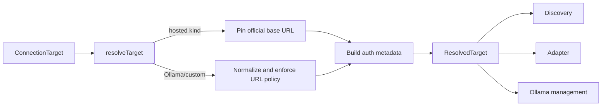
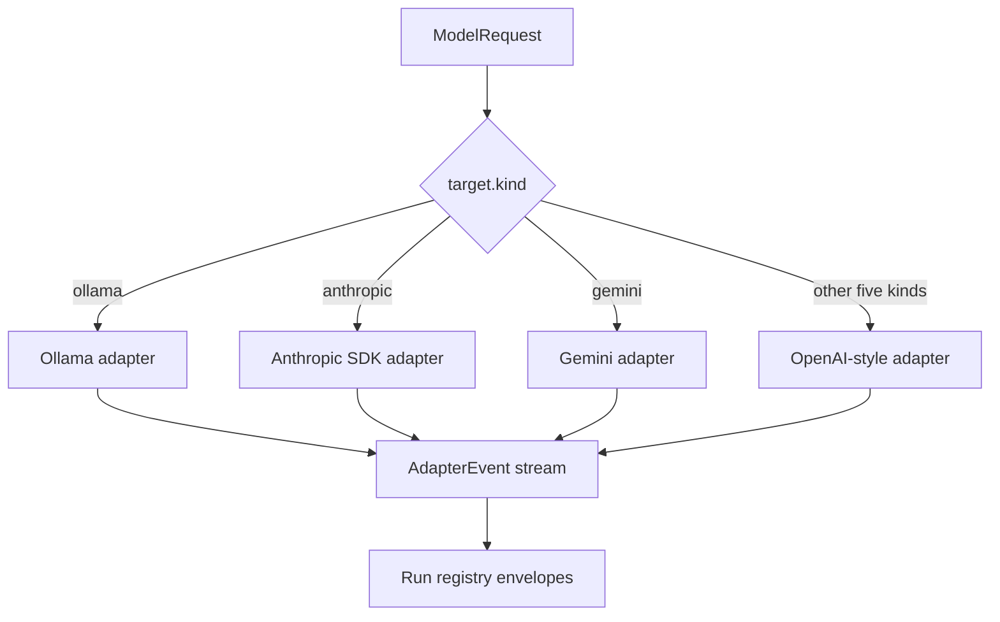
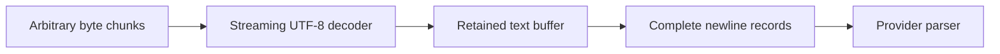
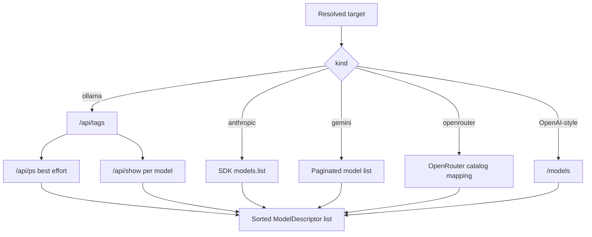

# Providers and model discovery

[Back to the backend documentation index](README.md)

Nerdplexity presents one run contract to the browser while supporting several provider protocols. Two subsystems make that possible:

- **Destination resolution** decides where a connection may send traffic and how it authenticates.
- **Adapters and discovery** translate between Nerdplexity contracts and provider-specific formats.

## 1. Explicit connection routing

A run includes a `ConnectionTarget`:

```ts
interface ConnectionTarget {
  kind: ConnectionKind;
  baseURL?: string;
  apiKey?: string;
}
```

The backend calls `resolveTarget()` before discovery, generation, or Ollama management. It never infers the provider from a model name.



### Provider endpoint and transport table

| Connection kind | Resolved endpoint | Generation adapter | Authentication |
| --- | --- | --- | --- |
| `ollama` | User loopback URL, no `/api` suffix | Ollama NDJSON | Optional/no standard key |
| `openai-compatible` | User URL; bare host gains `/v1` | OpenAI chat-completions SSE | Bearer when supplied |
| `openai` | `https://api.openai.com/v1` | OpenAI chat-completions SSE | Bearer |
| `anthropic` | `https://api.anthropic.com` | Official Anthropic SDK stream | SDK `apiKey` |
| `gemini` | `https://generativelanguage.googleapis.com/v1beta` | Gemini `streamGenerateContent` SSE | `x-goog-api-key` header |
| `deepseek` | `https://api.deepseek.com` | OpenAI chat-completions SSE | Bearer |
| `openrouter` | `https://openrouter.ai/api/v1` | OpenAI chat-completions SSE | Bearer |
| `groq` | `https://api.groq.com/openai/v1` | OpenAI chat-completions SSE | Bearer |

For fixed hosted kinds, a caller-supplied `baseURL` is ignored. This prevents an official-provider credential from being redirected to an arbitrary host.

## 2. Destination policy

For Ollama and custom OpenAI-compatible targets:

- The value must be a full URL.
- Embedded usernames/passwords, query strings, and fragments are rejected.
- Loopback names may use HTTP or HTTPS.
- Non-loopback custom targets must use HTTPS.
- Ollama must use `localhost`, `127.0.0.1`, `[::1]`, or `host.docker.internal` and cannot include `/api`.
- Compatible endpoints preserve paths such as `/api/v1`; a bare host defaults to `/v1`.

When `NERDPLEXITY_HOSTED=1`, local and literal private/reserved destinations are rejected. See [Security and data](security-and-data.md) for the complete boundary and known DNS limitation.

## 3. Common adapter contract

Routes produce a `ModelRequest` containing a resolved target, exact model ID, normalized messages, optional generation settings, and optional JSON-schema tool definitions.

All adapters produce the same internal events:

```text
delta       answer text
reasoning   provider-exposed thinking/reasoning text
status      a visible retry or compatibility notice
quota       normalized rate-limit headers
done        usage, finish reason, load time, and/or tool calls
```

`streamModel()` selects the provider-specific generator, converts ordinary network failures into safe `ProviderFailure` values, and rethrows cancellation so the run registry owns the canceled terminal state.

## 4. Streaming normalization



### OpenAI-style

OpenAI, DeepSeek, OpenRouter, Groq, Cerebras, Mistral, SambaNova, Hugging Face, and custom compatible servers use `POST {baseURL}/chat/completions` with `stream: true`. The parser:

- reads `data:` SSE records and recognizes `[DONE]`;
- accepts a finish reason as completion when a compatible server omits `[DONE]`;
- accumulates fragmented tool call names/arguments by call index;
- reads reasoning from `reasoning_content` or `reasoning` when present;
- reads standard usage and Groq's observed `x_groq.usage` shape;
- uses `max_completion_tokens` for OpenAI and Groq, `max_tokens` elsewhere;
- sends `stream_options: { include_usage: true }` except to Mistral, whose API does not list it; a server that rejects `stream_options` or `temperature` by name before generating gets the request once more without it (at most two such resends).

### Ollama

Ollama uses `POST {baseURL}/api/chat` and newline-delimited JSON. Its adapter maps images to Ollama's base64 `images` array; sends `num_predict`, `num_ctx`, and optional temperature inside `options`; reads content, thinking, and whole tool-call objects; normalizes native token counts; and converts `load_duration` nanoseconds to `loadMs`.

### Gemini

Gemini uses `:streamGenerateContent?alt=sse`, with the key in a header rather than the URL. Its adapter maps roles and images, sends system instructions separately, converts tool schemas/calls/results, preserves thought signatures, separates thought parts from answer text, and maps blocked prompts or stop reasons to `refused` failures. Consecutive turns with the same Gemini role are merged because Gemini expects alternating sides.

### Anthropic

Anthropic uses the official SDK with SDK retries disabled so Nerdplexity owns retry behavior. Its adapter maps system text, base64 images, `tool_use`, and grouped `tool_result` turns; streams text and provider-exposed thinking; includes cache read/creation input tokens in normalized usage; and maps typed SDK errors and refusal outcomes.

## 5. Message conversion

Nerdplexity supports plain text or content parts on user messages:

```json
{
  "role": "user",
  "content": [
    { "type": "text", "text": "Describe this image" },
    { "type": "image", "mimeType": "image/png", "data": "<base64>" }
  ]
}
```

Each adapter maps this common shape to its native representation. System and assistant messages cannot contain image arrays at the HTTP validation boundary.

Tool conversations add two internal message variants: an assistant turn with normalized `ToolCall[]`, and a tool-result turn with call ID, tool name, JSON content, and optional error flag. These variants never appear in the initial browser request contract.

## 6. Stream decoding

Network chunks do not align with JSON records or Unicode characters. `runtime/streams.ts` uses a streaming `TextDecoder`, retains incomplete text between reads, strips CRLF, and yields only complete non-empty lines. It rejects a single buffered record beyond 4,000,000 characters.



This helper is shared by adapters and Ollama pull progress.

## 7. Retry and parameter compatibility

Adapters automatically wait and resend only when all of these are true:

- the failure is a rate/quota response;
- the provider supplies a retry/reset value;
- the wait is at most 10 seconds;
- generation has not begun;
- no more than two automatic retries have already been used.

A visible `status` event tells the user about the wait. Server errors marked retryable are not blindly resent without this short quota condition.

Some newer models reject `temperature`. If a provider returns a pre-generation validation failure that names temperature, the adapter emits a notice, removes the parameter, and resends. It never applies this fallback after output begins.

## 8. Error normalization and redaction

HTTP/provider failures are normalized by category instead of exposing raw implementations:

- 401/403 → `auth`
- 402 → `quota` with credit/balance explanation
- 429 → retryable `quota`
- 404 → `invalid-request` / missing model
- 400/413/422 → `context` when the detail indicates a token limit, otherwise `invalid-request`
- 5xx → retryable `unavailable`
- malformed/empty/dropped streams → `transport`

Raw details are whitespace-normalized, capped, and have the exact API key replaced. OpenRouter receives additional mapping for shared upstream capacity and free-model account limits so `$0 price` is not confused with unlimited request capacity.

## 9. Rate-limit information

When a provider sends recognized `x-ratelimit-*` headers, the adapter emits a `quota` event containing available request/token limits, remaining counts, and reset durations. Missing fields remain absent; Nerdplexity does not invent quota values. Anthropic-specific `anthropic-ratelimit-*` headers are not currently normalized.

## 10. Model discovery

`POST /v1/models/discover` uses the same destination policy, then dispatches by kind:



### Discovery behavior by provider

| Kind | Extra behavior |
| --- | --- |
| Ollama | Adds size, parameter/quantization details, loaded state, capabilities, context length, and local host info where reported. `/api/ps` and `/api/show` enrichments are best effort. |
| OpenAI | Filters known embedding, audio, image, moderation, realtime, search, and non-chat model families. |
| Groq | Filters inactive and known speech-only models. |
| Generic compatible | Keeps returned IDs and available context/output metadata. Reads per-token `pricing.prompt`/`pricing.completion` when a remote catalog reports them (SambaNova, or OpenRouter entered as a custom endpoint); a local server stays `local`. Reads Mistral-style `capabilities` (`function_calling`, `vision`, `completion_chat`), `max_context_length`, and `archived`, and `architecture.input_modalities` for images. Otherwise capabilities remain unknown. |
| Cerebras, Mistral, SambaNova | Generic compatible discovery at the pinned endpoint. Cerebras lists only IDs; Mistral reports capabilities and context; SambaNova reports context, output limit, and prices. |
| Hugging Face | One entry per model with its live providers: largest context, tools if any provider supports them, images from input modalities, and the cheapest live provider's price. A provider marked `is_free` becomes its own `model:provider` entry priced $0, because the default route picks the fastest provider, not the free one. |
| Gemini | Keeps models supporting `generateContent`; maps input/output token limits. |
| Anthropic | Uses SDK pagination; maps display name, image capability, and token limits when present. |
| OpenRouter | Maps pricing per million tokens, tools/vision/temperature capability, expiry, and output/context limits; excludes expired/non-text models and ensures `openrouter/free` exists. |

Discovery has an 8-second general timeout. Ollama's per-model `/api/show` enrichment uses four seconds and at most four concurrent requests.

A successful list means the catalog endpoint worked. It does not prove a particular account can generate with every model, that a local model fits memory, or that an unknown tool/vision capability works.

Discovery never throws through the HTTP route. It returns either `{ ok: true, ... }` or `{ ok: false, error, checkedAt }`. Error categories distinguish offline, auth, not found, rate limited, timeout, invalid response, invalid destination, and unknown failures.

## 11. Ollama model management

When not hosted, the backend supports streamed model pull through `POST /v1/models/ollama/pull` and model deletion through `DELETE /v1/models/ollama`. Both require a valid loopback Ollama target and a restricted model tag. Pull progress is normalized before reaching the browser. These routes are separate from discovery and inference.

## 12. Where to extend provider support

Adding a provider usually requires coordinated changes:

1. Add its connection kind and shared descriptor semantics in `shared/src/connections.ts`.
2. Pin its official endpoint and authentication in `runtime/destinations.ts`.
3. Add discovery mapping in `runtime/discovery.ts`.
4. Add or select a streaming implementation in `runtime/adapters.ts`.
5. Add recorded-format tests for errors, partial streams, usage, images, reasoning, tool calls, and cancellation.
6. Update frontend connection presets and this documentation.

Do not add new generation work to `runtime/local.ts`; it is a retained compatibility helper outside the active run route.
