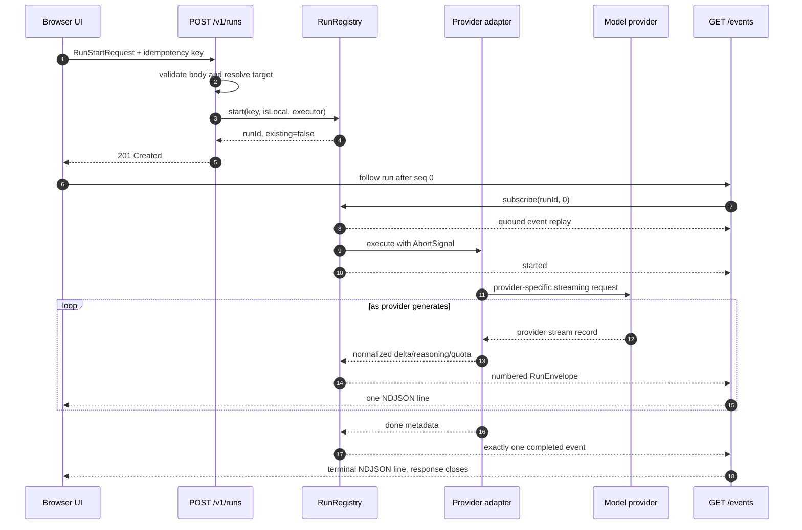
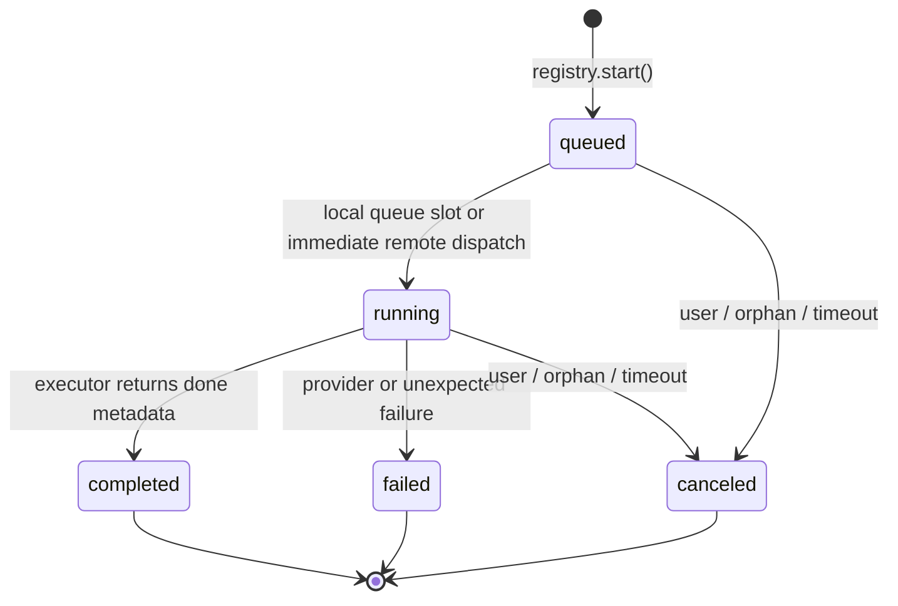
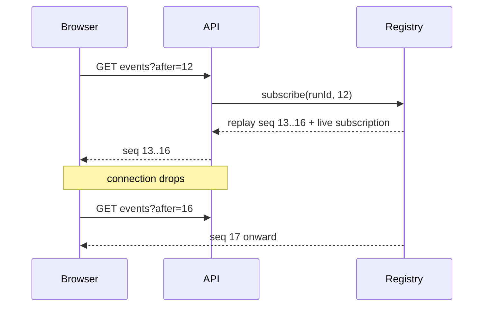
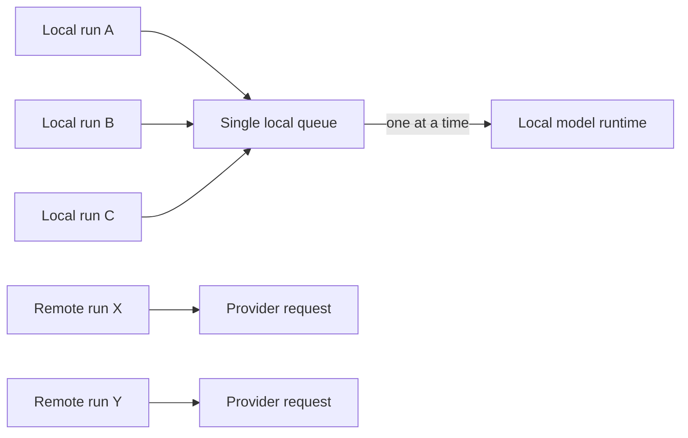
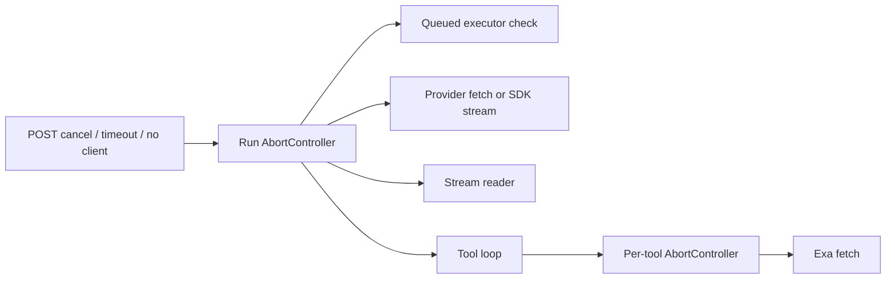

# Run harness

[Back to the backend documentation index](README.md)

The run harness is the center of the backend. It turns a browser request into a controlled model attempt with a stable ID, ordered events, cancellation, reconnect support, safe failures, and optional tools.

The relevant files are:

- `routes/runs.ts`: validates HTTP input and exposes start/follow/cancel endpoints.
- `runtime/runs.ts`: owns lifecycle state and the replay buffer.
- `runtime/adapters.ts`: performs the provider request and normalizes its stream.
- `runtime/toolLoop.ts`: adds bounded model/tool iterations when tools are enabled.
- `queue/localQueue.ts`: serializes work against models on this machine.
- `shared/src/runs.ts`: defines public request, event, error, and timing contracts.

## 1. One ordinary chat run



Starting and following are separate requests. This is essential: if the browser loses the start response, it can safely resend the same idempotency key; if it loses the event connection, it can reconnect after the last sequence number without rerunning the model.

## 2. Request validation before execution

`validateRunRequest()` rejects invalid work before a `RunRegistry` entry is created.

| Input | Current rule |
| --- | --- |
| `idempotencyKey` | 8–100 characters; letters, numbers, `_`, and `-` only |
| `target` | Must pass the destination policy; hosted providers require a key |
| `model` | Non-empty string, at most 200 characters |
| messages | 1–200 messages; roles are `system`, `user`, or `assistant` |
| text | At most 200,000 text characters across messages |
| rich content | Only user messages; 1–5 text/image parts per rich message |
| images | PNG, JPEG, WebP, or GIF base64; estimated decoded total at most 5 MB |
| temperature | 0–2 |
| max output | Integer 1–128,000 |
| context window | Integer 1,024–1,048,576 |
| tools | Unique names from the built-in registry |
| documents | At most 20; title ≤200 chars; UTF-8 content ≤2 MB each and ≤4 MB total |
| web search | Requires `{ provider: "exa", apiKey }` when `web_search` is enabled |

Express also applies a 10 MB JSON-body limit before route validation. The route clones message content so later client-side mutation cannot change the server's input snapshot.

Documents are discarded from the validated server request unless a document tool is enabled. Document tools are rejected for remote execution.

## 3. Run state machine



`RunState` has five values: `queued`, `running`, `completed`, `failed`, and `canceled`. A canceled run is marked terminal **before** its `AbortController` fires. That ordering prevents an aborting provider or tool from appending late output.

The registry's `finish()` method accepts a terminal event only while the run is queued or running, which guarantees at most one terminal event.

### Default lifecycle limits

| Setting | Default | Purpose |
| --- | ---: | --- |
| No-client grace | 60 seconds | Cancel work when no event subscriber is attached |
| Hard run timeout | 10 minutes | Bound queue + model + tool duration |
| Finished-run retention | 10 minutes | Make recent terminal runs reconnectable/replayable |
| Registry target size | 100 runs | Bound in-memory run records when finished entries can be pruned |
| Replay buffer | 8,000,000 serialized characters per run | Bound retained event history |

These are constructor defaults in `RunRegistry`, not environment settings. Tests inject smaller values.

Retention cleanup is lazy: `prune()` runs when a new run starts. Therefore an expired finished run may remain available until later activity triggers pruning. A process restart removes all server runs immediately.

## 4. Idempotency

The registry stores `idempotencyKey → runId`. Repeating `POST /v1/runs` with a key whose run is still retained returns:

```json
{ "runId": "the-original-run-id", "existing": true }
```

The model executor is not called again. The route uses HTTP `200` for an existing run and `201` for a new one.

Important details:

- Idempotency is scoped to this one backend process.
- A key is not tied to a hash of the payload. Reusing the same key with different content still returns the original run.
- The browser creates a UUID per attempt and retries network failures with that same value.
- Once the retained run is pruned or the server restarts, the same key can create a new run.

## 5. Event envelopes and ordering

Every public event is wrapped in:

```json
{
  "v": 1,
  "runId": "0a1b...",
  "seq": 3,
  "ts": 1789300000000,
  "event": { "type": "delta", "text": "Hello" }
}
```

- `v` versions the envelope format.
- `seq` starts at 1 and increases by one within a run.
- `ts` is the server timestamp in milliseconds.
- `event` is a discriminated payload from `shared/src/runs.ts`.

The registry creates sequence numbers, stores envelopes, and synchronously notifies current listeners. Adapters never assign public sequence numbers.

### Normal event patterns

Plain chat:

```text
queued → started → [status/quota/reasoning/delta]* → completed
```

Tool run:

```text
queued → started → model events → tool(running) → tool(result)
       → model events → ... → completed
```

Free Router run ([Free Router](free-router.md)):

```text
queued → started → route(trying) → [route(failed) → route(trying)]* → [model/status/quota/reasoning/delta/tool]*
       → completed { route }
```

A routed run is registered as remote, so it is never queued as a whole; an attempt on a model on this machine waits in the local queue. Fallback happens only before the first delta, reasoning, or tool event of an attempt.

Bench job ([Bench](bench.md)):

```text
queued → started → [bench(result) | bench(skipped) | status]* → completed
```

A Bench job uses the same registry with a 3-hour time limit instead of 10 minutes, and is followed and canceled through the same `/v1/runs/:id` routes.

Failure and cancellation replace `completed` as the one terminal event.

## 6. Replay and reconnection

The browser calls:

```text
GET /v1/runs/:id/events?after=<last-sequence-seen>
```

The registry returns all retained envelopes whose `seq` is greater than `after`, then subscribes the connection to new events. The browser drops any duplicate sequence defensively.



There are two unrecoverable cases:

- `404 unknown-run`: the server does not have this run, usually because it restarted or pruned it.
- `410 replay-unavailable`: the run exists, but the bounded buffer dropped an event the client needs.

The browser then marks its durable local record as interrupted. It does **not** automatically repeat the model call, because doing so might duplicate billing or output.

The browser retries a prematurely closed event stream up to six times with exponential delays capped at four seconds. Disconnecting the event HTTP response does not immediately cancel the run; the registry starts the 60-second no-client timer so the client can reconnect.

## 7. Local queue

All targets classified as `execution: local` share a FIFO, one-at-a-time queue. This includes Ollama and loopback OpenAI-compatible servers. Remote targets bypass the queue and may run concurrently.



The initial `queued.position` reports active plus waiting local work ahead at creation time. It is a snapshot, not a live-updating queue position.

Canceling queued work marks it canceled immediately. The queue item remains until its turn, but its executor sees that the run is no longer queued and releases the slot without contacting the model.

## 8. Cancellation propagation

One `AbortController` belongs to each server run. Its signal flows through:



`POST /cancel` is safe to repeat. It returns the current state even when the run is already terminal. The browser waits briefly for the server's canceled event; if the server cannot confirm, it stops its local follower and records the attempt accordingly.

## 9. Completion, failure, and partial output

An adapter emits internal `done` metadata. The route executor returns it to the registry, which creates the public `completed` terminal event. If an adapter throws `ProviderFailure`, the registry uses its safe structured error. Unexpected errors become `category: unknown` with a message capped at 300 characters.

Provider stream errors do not erase earlier deltas. The browser periodically saves accumulated output and reasoning to IndexedDB, then retains partial content when a terminal failure or interruption occurs.

Provider errors use these categories:

| Category | Typical cause |
| --- | --- |
| `auth` | Rejected API key |
| `quota` | Credits, balance, or rate limit |
| `unavailable` | Provider 5xx response |
| `invalid-request` | Bad parameter or missing model |
| `context` | Prompt/context/output-token limit |
| `refused` | Provider safety/refusal outcome |
| `transport` | Empty, malformed, dropped, or unreachable stream |
| `timeout` | Provider response deadline |
| `unknown` | No safer specific mapping |

## 10. Timing and usage

The server reports:

- `queuedMs`: creation until execution begins;
- `ttftMs`: execution start until the first **answer text** delta; absent if no answer text arrives;
- `durationMs`: creation until the terminal event;
- `loadMs`: provider-reported Ollama model loading time, converted from nanoseconds;
- token usage only when the provider reports both prompt and completion counts.

For tool runs, usage is summed across model steps only when **every** step reports usage. If one step omits usage, the aggregate is omitted rather than understated.

Reasoning events do not set first-text time. Tool time, retries, and intermediate steps are included in overall duration.

## 11. Retry rules

Nerdplexity distinguishes safe transport retry from repeating an attempt:

- Browser start request: up to two network retries with the same idempotency key.
- Browser event connection: reconnect and replay; never restart the model.
- Provider short rate limit: at most two automatic retries when `Retry-After` is ≤10 seconds and no generation began.
- Unsupported temperature: remove the parameter and resend after a pre-generation validation rejection.
- User retry after failure: creates a new linked run attempt in browser history.

It does not automatically retry a model stream after output begins.

## 12. Important limitations for future harness work

- The registry is process-local, so restarting or horizontally scaling without sticky ownership loses runs.
- Event retention is memory-only and approximate by serialized string length.
- There is no durable server-side task queue.
- There is no waiting-for-approval state because current tools have no external side effects.
- The server does not authenticate users or associate a run with an owner.
- Compare orchestration lives in the browser and does not support tools.

Any distributed, multi-user, or side-effecting harness design must address those boundaries explicitly rather than only adding endpoints.
