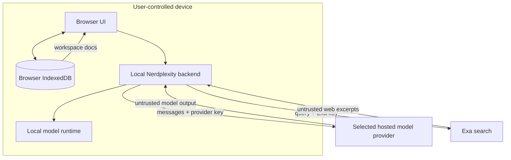
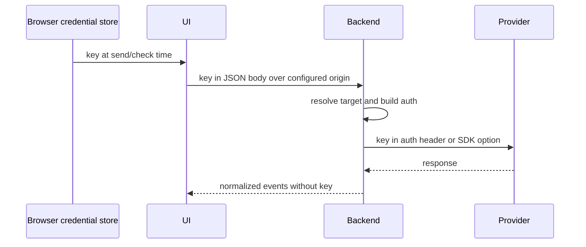

# Security and data boundaries

[Back to the backend documentation index](README.md)

This page documents implemented controls and known limits. It is not a claim that the application has completed a security audit.

## 1. Trust boundaries



The browser, backend, provider, local runtime, and search provider are separate trust domains. "Local-first" does not mean every request remains local: selecting an online connection sends content to that provider, and enabling web search sends a query to Exa.

## 2. Credential flow

Model-provider and Exa keys originate in the browser and are sent to the backend only when needed.



Implemented properties:

- Keys are not accepted in model/discovery query strings.
- Fixed hosted connection kinds ignore caller base URLs and use official endpoints.
- Gemini generation/discovery sends its key in `x-goog-api-key`, not the URL.
- Anthropic authentication is given directly to its SDK.
- Other providers use bearer headers.
- Exa uses `x-api-key` and a fixed operator-controlled host.
- Exact key strings are removed from provider/search detail shown to users.
- Generic error middleware does not log raw error objects or request bodies.
- Run events, tool traces, health responses, and model descriptors do not contain credential fields.
- The backend has no credential database.

Important limits:

- The active executor closure temporarily holds the resolved target/key in server memory.
- The browser can optionally remember keys unencrypted in its own profile; that behavior is frontend persistence, not backend storage.
- TLS protection depends on deployment. Local loopback HTTP is allowed; remote custom endpoints require HTTPS.
- Process memory, runtime debugging, reverse proxies, or compromised dependencies remain part of the threat model.

## 3. Browser origin protection

The backend allows browser origins whose hostname is `localhost`, `127.0.0.1`, or `[::1]`, plus exact origins configured in `ALLOWED_ORIGINS`.

The flow is:

1. CORS adds permission headers only for allowed/no-origin requests.
2. `originGuard` returns HTTP `403` when a browser supplies an unapproved `Origin`.
3. The request is rejected before JSON parsing and before any provider/runtime access.

`ALLOWED_ORIGINS` is a comma-separated list of exact HTTP(S) origins. Trailing slashes are removed. Paths, malformed values, and wildcards are ignored.

Example:

```dotenv
ALLOWED_ORIGINS=https://nerdplexity.example,https://preview.example
```

Requests without an `Origin` header are permitted so command-line and native clients work. Consequently, CORS/origin checks are **not authentication** and do not prevent direct scripted use of a publicly reachable server.

Health routes are deliberately cross-origin readable and state whether the asking origin would be accepted for protected API routes.

## 4. Destination and SSRF controls

`resolveTarget()` is the central outbound destination policy.

### Official providers

OpenAI, Anthropic, Gemini, DeepSeek, OpenRouter, and Groq are pinned to constant official base URLs. Their keys cannot be paired with a request-provided host.

### Custom endpoints in local mode

- Ollama is restricted to recognized loopback hostnames.
- Loopback custom compatible endpoints may use HTTP/HTTPS.
- Non-loopback compatible endpoints require HTTPS.
- URLs with embedded credentials, query strings, or fragments are rejected.
- Redirect following is disabled on outbound fetch calls.

### Additional hosted-mode restrictions

When `NERDPLEXITY_HOSTED=1`, the backend refuses:

- loopback targets;
- IPv4 loopback, private, link-local, carrier-grade NAT, multicast, and reserved ranges;
- all IPv6 literals;
- hostnames ending in `.local` or `.internal`.

This reduces server-side request forgery against the hosting environment. Current known limitation: a public-looking hostname that later resolves to a private IP is not blocked. There is no DNS resolution/rebinding defense yet.

## 5. Local versus hosted deployment

| Property | Local default | Hosted mode |
| --- | --- | --- |
| Default bind | `127.0.0.1` | `0.0.0.0` |
| Ollama/custom loopback | Allowed | Refused |
| Private network targets | HTTPS policy applies; most LAN HTTP is rejected | Refused by literal/name checks |
| Ollama pull/delete | Enabled | Not mounted |
| Hosted providers | Allowed with user key | Allowed with user key |
| Extra frontend origins | Optional | Usually required |

Setting `HOST` can override the bind address. Exposing local mode on a LAN or public interface broadens access without adding authentication; do so only with an appropriate network boundary.

## 6. Message, image, and body limits

Limits reduce accidental overload and bound model inputs:

- Express JSON body: 10 MB.
- Conversation: 200 messages and 200,000 text characters.
- Rich user message: up to five text/image content parts.
- Estimated decoded images: 5 MB total.
- Model ID: 200 characters.
- API key: 1,000 characters at destination validation; Exa run key has a stricter printable 8–200-character rule.

Image validation checks the allowed MIME label and base64-shaped text. The backend does not decode and inspect the actual file signature, dimensions, or decompression behavior. Provider-side validation still applies.

## 7. Documents

Durable documents remain in browser IndexedDB. For one run:

- the frontend includes its workspace documents only when document tools are enabled;
- the backend drops supplied documents when no document tool is enabled;
- the backend rejects document tools unless execution is local;
- the model initially receives IDs/titles only;
- document text reaches the model in search/read results;
- text is explicitly described as untrusted data, not instructions.

Current limits are 20 documents, 100,000 characters each, and 400,000 total characters.

This prevents documents from being sent to hosted model targets through the supported run route. The browser still sends the workspace documents to the local Express process for that tool-enabled run, and a local model receives the inventory and tool-returned passages. A compromised local server/runtime can access that traffic.

## 8. Tools and prompt injection

Current tools are read-only:

- calculator uses a fixed arithmetic parser;
- document tools access only the request's attached document array;
- web search calls only the configured Exa endpoint;
- no tool runs arbitrary code, visits a model-chosen URL, or mutates external state.

Tool output is limited, timed, traced, and returned to the model as data. The system instruction warns against following instructions found in documents or web excerpts.

Prompt instructions reduce model misuse but are not a complete security boundary. The hard boundary is the narrow registry/context: even if a document convinces the model to request an unavailable function, `executeTool()` returns an unknown/denied error rather than executing it.

Side-effecting tools require an approval protocol before they are added. See [Tools](tools.md).

## 9. Output and error safety

Provider and tool output is untrusted application data. The backend:

- parses provider streams into typed event categories;
- rejects malformed records and incomplete streams;
- caps displayed provider error details at 300 characters;
- caps web result fields and tool output;
- prevents output after a run becomes terminal;
- preserves partial output instead of treating it as a clean success.

Frontend rendering is a separate boundary and must continue to sanitize/render Markdown safely.

## 10. Server data retention

The `RunRegistry` keeps only active and recent run events in memory:

- default replay budget: 8,000,000 serialized characters per run;
- default terminal retention: 10 minutes, pruned lazily on later starts;
- default registry target: 100 runs, pruning finished entries;
- no-client cancellation: 60 seconds;
- hard run limit: 10 minutes.

There is no server disk persistence. Restarting the process clears events and idempotency mappings. Browser IndexedDB independently preserves local run input, partial/final output, tool traces, timing, and status.

## 11. Public-hosting gaps

Before sharing a backend widely, address at least:

- authentication and per-user run ownership;
- request and concurrency rate limits;
- abuse/cost controls;
- durable or distributed run/event ownership;
- DNS rebinding/private-resolution validation for custom destinations;
- reverse-proxy body, stream, timeout, and buffering configuration;
- logging/monitoring policies that exclude prompts, documents, and credentials;
- CSRF assumptions if cookie-based authentication is introduced;
- dependency and deployment review.

Anyone who can reach the current API can send requests using their own keys. Origin checks mainly protect browsers from unrelated sites; they do not make the server multi-tenant safe.

## 12. Security review checklist for a change

Ask these questions for backend work:

1. Can user/model input choose a new network destination?
2. Can a key appear in a URL, log, exception, event, trace, or stored run snapshot?
3. Does the change accept a larger/unbounded body, record, output, loop, or duration?
4. Does cancellation reach every wait, fetch, reader, and tool?
5. Can late output appear after a terminal state?
6. Can remote models receive documents or attachments the user did not explicitly send?
7. Does a retry risk duplicate billing or external effects?
8. Does hosted mode expose the host's local/private network?
9. Is a model instruction being mistaken for authorization?
10. Are error details both useful and safely redacted/bounded?
