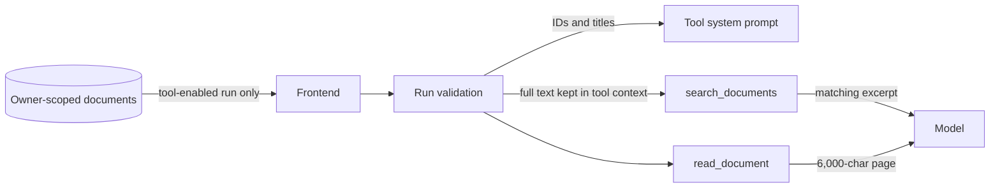
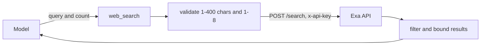

# Tools and the bounded agent loop

[Back to the backend documentation index](README.md)

Tool-enabled runs let a model ask Nerdplexity to perform one of four narrow, read-only operations. This is the current "agent" capability of the harness.

It is intentionally not a general computer agent: there is no shell, filesystem write, arbitrary HTTP fetch, browser control, or MCP connection.

## 1. Components

- `runtime/toolLoop.ts` coordinates repeated model and tool steps.
- `runtime/tools.ts` defines the registry, validation, execution, timeouts, and output limits.
- `runtime/webSearch.ts` implements the fixed Exa network integration.
- `routes/runs.ts` validates which tools and supporting data a run may receive.
- `shared/src/runs.ts` defines public tool names and trace events.

## 2. Tool loop lifecycle

```mermaid
sequenceDiagram
    autonumber
    participant Registry as Run registry
    participant Loop as Tool loop
    participant Model as Provider adapter/model
    participant Tool as Enabled tool

    Registry->>Loop: request + enabled tools + signal
    Loop->>Model: messages + tool schemas + safety instruction
    Model-->>Loop: text/reasoning + tool calls
    Loop-->>Registry: preparatory text as typed activity
    loop for each requested call
        Loop-->>Registry: tool status=running
        Loop->>Tool: validated arguments + scoped context
        Tool-->>Loop: bounded result or correctable error
        Loop-->>Registry: completed/error/denied trace
        Loop->>Model: tool result matched to call
    end
    Loop->>Model: next model step
    Model-->>Loop: final streamed answer + done
    Loop-->>Registry: aggregated done metadata
```

The loop supports at most six model steps and twelve tool calls across a run. Calls within one model step execute sequentially. If the model asks for a batch that would cross the total call limit, none of that batch executes. Text is buffered until a step ends: when the step calls a tool it is emitted and saved as `activity`; when the step is terminal it becomes answer `delta` text. This keeps tool narration out of the final answer without losing it.

## 3. System instruction and schemas

For a tool run, Nerdplexity prepends a system message that:

- lists only tools enabled by the user;
- explains the six-step/twelve-call limit;
- says tool results and document/web content are data, not instructions;
- forbids browsing beyond search results, file writes, and code execution;
- includes only document IDs/titles when document tools are enabled;
- asks the model to cite document titles and web URLs and acknowledge missing evidence.

Each enabled tool is also sent in the provider's native function-definition format. The adapters translate a shared name/description/JSON Schema into OpenAI-style functions, Ollama functions, Anthropic tools, or Gemini function declarations.

## 4. Built-in tools

| Tool | Source label | Input | Output | Limits |
| --- | --- | --- | --- | --- |
| `calculator` | `computed` | `{ expression }` | Expression and finite numeric result | Expression 1–500 chars; default 10 s timeout |
| `search_documents` | `retrieved` | `{ query }` | Up to 5 scored excerpts | Query 1–500 chars; documents supplied to this run only |
| `read_document` | `retrieved` | `{ id, offset? }` | Up to 6,000 chars and `next_offset` | ID must be attached; valid integer offset |
| `web_search` | `web` | `{ query, num_results? }` | Exa titles, URLs, dates, excerpts, optional reported cost | Query 1–400 chars; 1–8 results; Exa key; 20 s timeout |

Every serialized result returned to the model is limited to 12,000 characters. Oversized data becomes `{ truncated: true, partial: "..." }`.

## 5. Calculator safety

The calculator is a custom recursive-descent arithmetic parser. It does **not** call JavaScript `eval`, create a function, or run model-provided code.

It supports:

- `+`, `-`, `*`, `/`, `%`, and exponentiation (`^` or `**`);
- parentheses and scientific notation;
- constants `pi` and `e`;
- a fixed map of math functions such as `sqrt`, `abs`, logs, trigonometry, rounding, `min`, and `max`.

Names come from `Map` instances rather than prototype-bearing objects. Unknown syntax, non-finite answers such as division by zero, and trailing tokens become tool errors the model can correct. Successful results are rounded to 15 significant digits.

## 6. Document tools

Documents live in the owner-scoped server database. The frontend attaches the workspace documents to a run request only when a document tool is enabled. The route enforces:

- at most 20 documents;
- at most 100,000 characters per document;
- at most 400,000 total characters;
- local model execution only.

The tool-loop system prompt receives document IDs and titles, not full content. Content reaches the model only inside results of `search_documents` or `read_document`.



### Search behavior

Document search is lexical, not semantic:

1. Split the lowercase query on whitespace.
2. Count how many distinct query terms occur in each title/content string.
3. Build a 1,400-character excerpt near the first matched term.
4. Sort by matched-term count.
5. Return the best five documents.

There is no stemming, phrase ranking, embedding, vector database, or chunk index. A zero-score result means literal query words were not found, not necessarily that the concept is absent.

### Read behavior

Document read requires an exact attached document ID. It returns a 6,000-character slice starting at `offset`, plus the next offset or `null`. The model must call it again to page through longer text.

## 7. Web search

Web search is fixed to Exa. The model controls only the query and result count; it cannot choose the destination. The operator-only `EXA_API_URL` environment value exists for fixtures/testing.



The request asks Exa for automatic search and relevant highlights. Returned data is reduced to:

- title, capped at 300 characters;
- HTTP(S) URL, capped at 2,000 characters;
- optional publication date reduced to `YYYY-MM-DD` text;
- excerpt, capped at 1,500 characters;
- optional Exa-reported total cost.

At most eight results are allowed. Exa error details are redacted and bounded; 401/403, 402, 429, 5xx, and rejected queries receive specific messages.

Nerdplexity does not open result pages. Search excerpts are untrusted external data, and the model is explicitly instructed never to follow instructions inside them.

### Automatic web search

In the web app, web search has no button: with an Exa key saved and **Search automatically** on (the default, under Connections → Web search), every run sends `search: { provider: 'exa', apiKey, auto: true }`. The server then decides, per message, whether to search before the model answers (`backend/src/runtime/autoSearch.ts`):

1. `webSearchQuery` reads the latest user message. It searches when the message:
   - asks for it: "search the web", "search for", "web search", "look it up", "google it", "on the web", "find sources / links / articles / reviews", "with sources", "cite sources", "fact-check";
   - contains a link (`http(s)://…` or `www.…`);
   - asks about something that changes: latest, newest, most recent, recent(ly), today, tonight, yesterday, tomorrow, this week/weekend/month/year/season, right now, as of, breaking, news, headline(s), upcoming, trending, just announced/released/launched, nowadays; "current" followed by events, news, price, version, release, status, state, situation, leader, CEO, president, weather, rate, standings, or champion; "what's happening / what's new";
   - asks for live data: price(s) of, stock price, share price, market cap, weather, forecast, exchange rate, who won, election, release date, box office, standings, live score, CEO of, president of, prime minister of, population of;
   - mentions a year from 2024 to 2039.

   A message containing a code fence is searched only when it asks for a search outright, so "update this function" does not trigger one. The query is the message itself, cut at a word boundary to at most 300 characters.
2. `withWebResults` runs one Exa search (5 results) through the same `web_search` tool, with its validation, timeout, and output limits. It emits the usual two `tool` events with ID `web_auto` and **step 0**, which the app labels "Automatic".
3. On success, the results go to the model as a system message placed after any leading system messages, dated, marked as untrusted pages, with instructions to rely on them over older knowledge, cite the URLs used, and say when they do not answer the question. On failure (bad key, no credits, time-out), the failed search is shown and the model answers without it; the run never fails because of the search.

It works for every model, including ones without tool support: the model does not have to call anything. For the [Free Router](free-router.md), the search runs once before the first attempt and every attempt gets the same results; they count toward each candidate's context size. Bench and Compare never search automatically.

The model does not get the `web_search` tool from automatic search. Small models often call tools they do not need, which would slow answers and spend Exa credits; the wording check is predictable, and a message can always ask for a search ("search the web for …"). Threads and presets saved with the old **Web** tool keep the setting, but it no longer enables anything.

## 8. Tool trace events

Each call normally produces two public events with the same call ID, name, and step:

```json
{
  "type": "tool",
  "id": "call_1",
  "name": "calculator",
  "input": { "expression": "6*7" },
  "output": null,
  "step": 1,
  "status": "running",
  "source": "computed"
}
```

Then:

```json
{
  "type": "tool",
  "id": "call_1",
  "name": "calculator",
  "input": { "expression": "6*7" },
  "output": { "expression": "6*7", "result": 42 },
  "step": 1,
  "status": "completed",
  "durationMs": 1,
  "source": "computed"
}
```

Possible final statuses are:

- `completed`: the tool returned a bounded result;
- `error`: unknown tool, malformed input, validation failure, timeout, or tool failure;
- `denied`: the tool exists but was not enabled for the run.

Errors that the model may correct are returned as tool results. Run cancellation is different: it throws through the loop so execution stops.

Provider-generated call IDs are retained. When a provider sends no ID, Nerdplexity generates one and rewrites it with step/index so it stays unique across the run.

## 9. Text and usage across steps

Every model step uses the normal streaming adapter, so answer text, provider reasoning, notices, quota, and provider failures remain visible. If separate steps emit answer text, the loop inserts a blank line between them in the saved output.

Token usage is added across steps only if every step reports it. Model load time uses the first reported value. The final adapter finish reason is passed through.

## 10. Failure boundaries

| Situation | Result |
| --- | --- |
| Model requests malformed JSON arguments | `error` trace returned to model |
| Model names a nonexistent tool | `error` trace with available names |
| Model names a disabled built-in tool | `denied` trace |
| Tool exceeds its timeout | `error` trace and per-tool signal abort |
| Tool output is huge | Successful but truncated result |
| One call fails | Model can inspect error and continue |
| Requested calls exceed 12 | Run fails before that batch executes |
| Model uses all 6 steps without final answer | Run fails; traces remain in history |
| User cancels | Run and active tool/provider request abort |

## 11. Adding a new tool safely

A read-only tool currently belongs in `DEFINITIONS` in `runtime/tools.ts`. A complete change should:

1. Add the literal name to shared `ToolName`.
2. Define a narrow JSON Schema and clear description.
3. Validate every argument again at runtime; schemas guide models but do not enforce trust.
4. Give the tool only the context it needs.
5. Fix network destinations in application code, not model input.
6. Define a timeout and rely on the supplied abort signal.
7. Return bounded, serializable output with an honest source label.
8. Add unit tests for success, malformed input, timeout, cancellation, oversized output, and secret redaction.
9. Add adapter fixtures if the schema or result shape exposes provider differences.
10. Update this page and the frontend control.

Do not add a side-effecting tool through the current auto-execution path. File writes, shell commands, messages, purchases, or mutable external APIs require a permission decision protocol, a waiting state, ownership/authentication, audit records, and clear replay semantics first.
