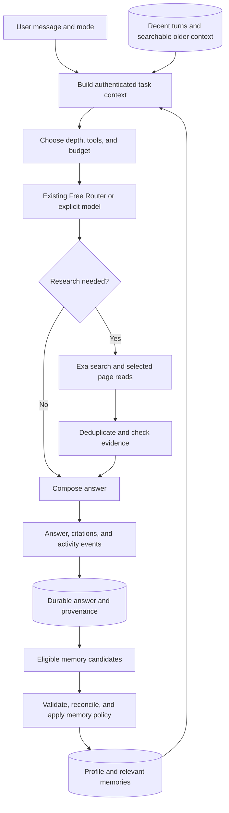

# Nerdplexity: chat quality, personal memory, and grounded research

Status: proposal accepted for phased implementation. Phase 0 documentation reconciliation and the Phase 1 everyday-chat foundation were implemented on 2026-09-14; Phases 2–5 remain proposed.

Implementation update: `everyday-chat-v1` now supplies versioned assistant behavior; context is fitted at whole-turn boundaries with transparent output-limit adjustments; tool-step narration is a separate typed activity; and answer rendering uses sanitized CommonMark/GFM. See `docs/assistant-behavior.md` and the tests beside the changed runtime/frontend modules.

Prepared: 2026-09-14. Code baseline: fetched `origin/main` at `9d0b33e`. The local `nerdplexity-main` worktree was still at `0cb9249`; this proposal inspected the newer branch with `git show`. This file is written in the active `Nerdplexity` workspace for handoff. No runtime files, databases, deployments, or model settings were changed.

## 1. Outcome and working agreement

Make Nerdplexity a conversational assistant that understands the ongoing task, adapts to the user, researches when appropriate, and produces useful, well-presented answers. Use ChatGPT's documented personalization and Perplexity's source-grounded research as product references, not as claims that we know their private implementation.

The original planning checkpoint requested a pause before implementation. The later user instruction to continue and finish the active checkpoint authorized Phase 0 and Phase 1 implementation. This development preference does not mean adding Astra as a paid runtime dependency in Nerdplexity.

Assumptions for review:

- Preserve the free-first product. Paid inference requires an explicit user setting and budget; never silently upgrade.
- Exa search is a separate service with its own usage costs, even when generation uses a free model.
- Improve the existing React/Express/shared-types architecture, provider adapters, run harness, Free Router, and Bench.
- The initial scope is text chat, existing attachments, research, context, personalization, and documentation. Voice, video, computer control, unrestricted connectors, and training a foundation model are separate projects.
- ChatGPT-level quality is an aspiration to measure on representative tasks, not a guarantee achievable through prompting every free model.

## 2. What the code actually does today

These are code findings, not a live production quality evaluation. No private chats, API keys, or production database rows were inspected.

| Area | Evidence at baseline | Implication |
| --- | --- | --- |
| Assistant behavior | `frontend/src/lib/workbench.ts`: `systemPrompt: ''` by default | Ordinary chat has no consistent product-level writing or collaboration instructions unless a user supplies them. Tool instructions are a separate, narrow layer. |
| Context | Same file: default 8,192-token context budget, 2,048 output tokens, all/recent history; byte-based estimate and warnings | History exists, but no automatic semantic compaction or retrieval of relevant older conversation content. Provider reasoning/output limits need explicit budgeting. |
| User memory | `backend/src/db/schema.ts`, context builder, and chat flow | Durable conversations/settings exist; no dedicated profile, memory extraction, memory retrieval, correction, or expiry lifecycle was found. |
| Research | `backend/src/runtime/webSearch.ts`: Exa `/search`, `type: auto`, up to eight results, 1,500-character excerpts | Useful first retrieval step. No page-reading tool or dedicated evidence-verification stage. Short excerpts alone can miss qualifications. |
| Tools | `backend/src/runtime/toolLoop.ts`: six steps, twelve calls; tools default off in workbench | Bounded execution is already useful. Tool selection depends on the model. Intermediate step text is appended into the same answer stream. |
| Sources | `Message.tsx` expects `webSearchResults`; `useRun.ts` final metadata saves tool traces, reasoning, and routing | Source-chip rendering and new tool output are not connected through a normalized citation/evidence contract. Existing source UI should be integrated, not duplicated. |
| Presentation | `frontend/src/components/Message.tsx` contains a handwritten line-based Markdown parser | Mixed emphasis/links, tables, math, and incomplete streaming Markdown need more robust handling. This is a separate issue from model intelligence. |
| Routing | `backend/src/runtime/router.ts`, `frontend/src/lib/router.ts`, `backend/src/bench/*` | Nerdplexity already has its own Free Router: task heuristics, capability/context filtering, health, fallback, and Bench scores. Extend it. Name/parameter-size heuristics remain when measurements are sparse. |
| Persistence | `frontend/src/lib/store.ts`, DB schema, `backend/src/app.ts` | Server data uses local PGlite or hosted Postgres; hosted mode has Better Auth and user-scoped access. Provider keys remain browser/session credentials. |
| Documentation | `backend/docs/architecture.md`, `security-and-data.md` | Several statements still describe browser-only persistence/no database or missing auth. Documentation must be reconciled with the current implementation before expanding it. |

OpenRouter's `openrouter/free` and Nerdplexity's `Free Router` are different products. OpenRouter documents random selection after capability filtering. Nerdplexity can rank individual candidates using its own measurements. Keep both identifiable in the UI and docs. [OpenRouter free router](https://openrouter.ai/docs/guides/routing/routers/free-router).

## 3. The user experience we want

Examples of observable behavior:

- “Explain this simply” produces an accessible explanation with a concrete example and an appropriate amount of detail.
- “What about Railway?” during a deployment conversation carries forward the current architecture and constraints.
- “Compare these options using today's information” searches, reads relevant sources, and attaches citations to the claims they support.
- “I prefer short answers and TypeScript examples” becomes an editable preference when memory is enabled. “Explain this one in depth” overrides the normal brevity preference for that answer.
- “I stopped using that stack” corrects the old project memory; future answers no longer recommend it as the user's current stack.
- Long conversations continue with preserved decisions, open questions, and relevant exact excerpts. A summary is not the only place important details survive.

Proposed composer controls: `Auto`, `Chat`, `Research`; retain a separate model picker. Auto decides whether retrieval is useful, Chat avoids automatic web searches, Research explicitly performs bounded research. If Exa is unavailable, disclose that before presenting anything as freshly researched.

Answer layout:

1. Compact activity area above the answer: actual selected model, search/read progress, and a concise explanation of the approach when supplied.
2. Readable answer with appropriate paragraphs, lists, code, math, and tables.
3. Inline citations opening source previews; a full source list remains available.
4. Existing feedback/copy/retry controls, plus an optional “Memory used” disclosure and actionable follow-ups when useful.

Only show real execution events and provider-supplied reasoning summaries/content intended for display. Do not fabricate thought text or promise access to private internal reasoning. Preserve all displayable content actually received; do not equate provider-exposed text with the model's entire thought process. Finished activity can collapse without losing its content.

## 4. Proposed architecture

The backend should own authenticated memory retrieval, instruction composition, research budgets, and evidence IDs. The frontend renders events and lets users preview/control what is used. Keep the provider adapter interface portable. Do not send the same request through two competing context builders: introduce a versioned context contract and migrate the frontend preview to reflect the server's result.

### Assistant instructions and answer composition

- Add versioned base assistant instructions: answer the real question first, preserve task continuity, adapt depth, ask only useful questions, acknowledge uncertainty, and avoid repetitive canned openings or forced headings.
- Compose explicit user preferences, task instructions, relevant memory, and evidence as separate sections with clear precedence. Current user instructions override learned preferences; retrieved data cannot rewrite application instructions.
- Treat uploaded files, historical excerpts, retrieved pages, and extracted memories as attributed data. Avoid inserting their contents as authoritative system instructions.
- Prefer one answer generation pass for normal chat. Use bounded planning/review only for difficult tasks or Research mode; do not run an expensive multi-model chain for every greeting.
- Separate preparatory commentary/tool steps from final answer content using typed events and phase IDs. For providers without reliable phase metadata, buffer ambiguous text within a tool step; persist it as activity if the step issues calls, and publish it as answer content if it is terminal.
- Detect output/context limits. Preserve partial content and expose a Continue action instead of declaring a truncated answer complete. Include model reasoning budget where applicable.

### Routing and quality consistency

- Extend the existing Bench/Free Router with conversational quality, follow-up understanding, grounded research, and memory adherence scores.
- Filter by actual required capabilities, output/context fit, free-price policy, account availability, and data-sharing settings before ranking.
- Prefer measured task quality, then reliability and latency. Record benchmark version, sample size, evaluation date, and uncertainty. Do not treat parameter count or a three-item score as strong evidence of conversational quality.
- Prefer continuity on a well-performing model within a thread where appropriate. A change in task or availability can warrant another model; show the selection and reason.
- Proposed default for new users: Nerdplexity's measured Free Router, with `openrouter/free` as fallback. Existing explicit selections stay intact. This changes the earlier default recommendation and is proposed here for review, not already applied.
- No quality claim that “all models work equally well.” Keep compatibility tests and clear capability labels; surface provider limitations without pretending a prompt can remove them.

### Context and memory

Use four distinct layers:

| Layer | Contents | Lifecycle |
| --- | --- | --- |
| Explicit profile | Preferred name, language, expertise, tone, response depth, examples, custom instructions | User-editable; explicit changes take priority. |
| Long-term memory | Stable stated preferences, repeated habits, interests, constraints | Evidence-backed, confidence-tagged, scope-aware, correctable, and expirable. |
| Project/task memory | Stack, decisions, goals, unresolved questions, relevant artifacts | Attached to a task/project; avoid contaminating unrelated chats. |
| Conversation context | Recent turns, structured summaries, relevant historical passages | Rebuilt per turn under a token budget; original messages remain retrievable. |

“Personality” means practical communication preferences and user-shared self-description. For example, remember “prefers direct feedback” from evidence; do not invent a psychological diagnosis from punctuation or infer sensitive traits. Repeated inferred habits remain distinguishable from things the user explicitly said.

Proposed typed records:

- `user_profiles`: user ID, explicit preferences, custom instructions, memory read/write settings, revision, updated time.
- `memory_items`: owner, ID, kind, text, scope, explicit/inferred origin, supporting conversation/message IDs, confidence, status, observed/confirmed time, expiry, revision, superseded item ID.
- `memory_events`: owner, operation, item/revision, source references, reason, timestamp; avoid duplicating deleted sensitive content in audit rows.
- `conversation_summaries`: owner, conversation/branch, covered message range, source revision/hash, structured task state, model/prompt version.
- `evidence_sources`: owner, run/answer, canonical URL, title, publication/retrieval time, selected passages, retrieval status/content hash.

Every ownership/reference constraint must include the user and appropriate conversation scope. Extend existing migrations and runtime validation; use typed shared contracts, not unvalidated settings blobs.

Retrieval starts with Postgres/PGlite-compatible text search, recency, explicitness, and task relevance. Benchmark whether embeddings add value before introducing vector infrastructure or new provider credentials. Keep memory context small and task-relevant; fetching everything the app knows about the user is not personalization.

Compaction triggers before the chosen model's usable context is exhausted. Preserve goal, constraints, decisions, identifiers, completed actions, open questions, and recent turns. Re-fetch exact source passages when needed. Invalidate summaries when a source is edited, deleted, or branched; budget tools and output separately. Provider-native compaction may be an adapter optimization, not a cross-provider dependency. [OpenAI conversation state](https://developers.openai.com/api/docs/guides/conversation-state).

Memory controls ship with memory: inspect, edit, delete, clear, export, separate read/learn toggles, “remember this,” “forget this,” and temporary chat. New auto-learning should be opt-in with understandable onboarding. Temporary chat should use neither personal memories nor durable chat/run/evidence/memory writes; document the separate minimal operational-retention policy. Existing conversations must not be retroactively mined without a deliberate user action.

Extraction runs only on eligible user statements and attributable repeated evidence. Deduplicate candidates, reconcile contradictions, and honor corrections before saving. Do not save passwords, API keys, transient emotional conclusions, or unrequested sensitive inferences. A single thumbs-down is not proof of a personality preference.

The credential boundary matters: keys currently live in the browser. Initial model-assisted memory extraction can run as a bounded follow-up while a request credential is available, or wait for the next credential-bearing session. Do not promise continuous background inference after the browser closes without a separately designed credential service. A durable job may contain source IDs and status, never plaintext keys; interrupted credential-dependent jobs become `awaiting_credentials`.

Deletion must invalidate derived summaries, retrieval indexes, cached context, and pending extraction jobs. Prevent deleted facts from being silently relearned from unchanged source messages; use scoped source/revision suppression without retaining the deleted fact text. “Forget” must explain whether original chat text also needs deletion. Stored run snapshots must not become a hidden secondary personal-memory archive.

### Exa research and evidence

Keep Exa as the retrieval layer and the selected model as the answer author. Exa supports search plus content retrieval, allowing selective reads beyond snippets. [Exa search reference](https://exa.ai/docs/reference/search-api-guide-for-coding-agents), [Exa contents](https://exa.ai/docs/reference/get-contents).

Proposed pipeline:

1. Decide whether freshness, citations, a specific URL, or uncertainty calls for research.
2. Generate a small set of distinct queries. Include relevant task context; exclude unnecessary private profile data.
3. Search using `auto` and useful highlights by default. Apply dates/domains/category only where supported and appropriate; use more expensive search options only when measured gains justify them.
4. Deduplicate URLs and syndicated sources; select authoritative, relevant pages and competing evidence.
5. Read selected pages through Exa `/contents`. Use current documented freshness controls for time-sensitive questions. Mark inaccessible pages and snippet-only evidence explicitly.
6. Build stable source IDs and evidence passages with dates. Separate source assertions from the assistant's inference.
7. Check coverage of important claims and contradictions. Make one further bounded retrieval pass when it can resolve a gap.
8. Stream a synthesized answer with source IDs, then validate references. Mechanical ID validation catches invented citations; semantic support still needs evaluation and, for Research mode, a review pass.

Initial configurable budgets for evaluation: Auto up to two searches and four page reads; Research up to six searches and twelve reads. Enforce a total deadline, provider usage ceiling, cancellation, deduplication, caching, and per-user limits. These are initial product choices, not Exa service limits or measured latency promises. Reserve capacity for synthesis rather than exhausting every step on search.

For models with weak/no native tool calling, the backend can perform the authorized research workflow and provide evidence as context. The UI must attribute this to Nerdplexity/Exa instead of claiming the model called a tool it did not call.

Use a fixed Exa destination, validate public URLs, reject local/private destinations and credentials in URLs, sanitize rendered links, and treat all returned text as untrusted data. Never expose a generic backend fetch proxy to model-chosen addresses. If research fails, provide a clearly qualified answer from available context rather than pretending verification occurred.

### Presentation and events

- Replace the handwritten parser with a maintained Markdown pipeline supporting CommonMark/GFM, fenced code, nested lists, and math as needed. Confirm dependencies against current official docs during implementation; disallow unsafe raw HTML/URLs.
- Add shared event contracts for activity, evidence/source discovery, citation references, route selections, and optional memory usage. Every event has run/step identity and the existing ordered replay semantics.
- Store answer text, citations, evidence IDs, activity, and model provenance together. Reload and export must retain their relationship.
- Keep activity above the answer, actual model selection visible, and source previews accessible on mobile/keyboard.
- Avoid scroll jumps while users read older text; use “Jump to latest.” Test incomplete Markdown during streaming and large completed answers for rendering performance.

## 5. Implementation sequence and acceptance

Each phase includes code, relevant verification, documentation changes, and a reviewable handoff. The table records the intended sequence; current implementation status is stated above and in `docs/assistant-behavior.md`.

| Phase | Deliverable | Acceptance gate |
| --- | --- | --- |
| 0 — Baseline and truthful docs | Reconcile current main/worktrees; document actual storage/auth/execution; extend Bench with a versioned conversational dataset | Record representative baseline answers and metrics, with actual model and prompt versions. Separate reliability from quality. |
| 1 — Better everyday chat | Versioned assistant instructions, task/style adaptation, context/output budgeting, phase-aware streaming, robust Markdown | Clear improvement on ordinary chat, writing, coding, and follow-ups; no default web calls on simple greetings; no lost text or broken mixed formatting. |
| 2 — Grounded Exa answers | Auto/Chat/Research policy, selective page reads, evidence store, inline citations/source previews | Fresh research uses retrieved evidence; citations resolve to real sources; missing evidence is acknowledged; cancellation and budgets work. |
| 3 — Explicit personalization | Profile/settings UI, manual memory CRUD, scoped retrieval, temporary-chat path, user isolation | Preferences affect relevant answers; per-turn instructions override defaults; memory controls and cross-user isolation pass end-to-end. |
| 4 — Learned memory and long chats | Eligible extraction, correction/expiry, structured compaction, relevant history recall, deletion invalidation | Corrected facts win; forgotten facts do not reappear from unchanged sources; long-thread tests retain critical constraints; jobs survive/recover honestly under browser-key limits. |
| 5 — Quality-based defaults and release | Extend router evaluation, calibrated ranking, compatibility matrix, rollout flags, deployment/runbooks | Quality gates pass for the proposed default; existing selections remain; free policy remains enforced; staged Railway/Vercel smoke tests pass. |

Suggested evaluation set: 60–100 representative cases spanning natural conversation, technical help, writing, research/citation support, ambiguous follow-ups, long context, memory correction, temporary chats, and model/provider failure. Start from existing Bench infrastructure. Use blinded side-by-side human scoring for helpfulness, naturalness, specificity, correctness, and instruction adherence; automated checks for verifiable invariants. Optional model graders supplement, not replace, human review.

Provisional release targets to validate with the baseline: at least 70% preference for new answers on the fixed everyday-chat set; at least 95% manually audited support for externally sourced factual claims on the research set; 100% valid citation IDs; zero cross-user memory leaks, secret persistence, or silent paid fallbacks in the release suite. Report sample sizes and failures. Small samples are not a claim of general parity with ChatGPT.

Track time to first meaningful output and final answer, retrieval cost, token usage, task success, unsupported claims, wrong/stale memory use, and routing failures. Run focused tests for each phase, then normal repository release checks. Mocked tests verify plumbing; real-model opt-in evaluation is required to establish answer quality. Do not send private conversations to benchmark graders by default.

## 6. Documentation is part of every phase

Create a single documentation index and label pages `implemented`, `proposed`, or `deprecated`, with verification dates. Correct old claims instead of merely adding new pages that contradict them.

Planned documents:

- Product behavior: modes, model selection, answer/citation UI, memory controls, limitations.
- Architecture: local PGlite versus hosted Postgres, auth, browser credentials, active-run lifetime, context/research/memory flows.
- Contracts: request/events, evidence and citation IDs, memory APIs, record schemas, validation, migrations.
- Decision records: router/default policy, prompt precedence, memory scope/consent, extraction scheduling, provider portability.
- Provider compatibility: roles/tools/streaming/reasoning/context/output behavior, known provider limitations, free-versus-paid boundaries.
- Exa integration: endpoints, authentication boundary, freshness, caching, budgets, costs, failure handling.
- Memory lifecycle: collection, inference, source evidence, correction, expiry, deletion, re-learning suppression, temporary chats, exports, retention/backups.
- Operations: Railway/Vercel setup, database migrations/backups/restore, health checks, redacted observability, rollback, provider outages.
- Evaluation: dataset provenance, prompt/model versions, baseline and release reports, reproducible commands, regression cases.
- Changelog and implementation handoff: phase status, files changed, tests run, remaining limitations, rollout status.

Every implementation PR must update the applicable behavior/contract/operations docs alongside tests. Add documentation-link checks and contract examples to CI where useful. Documentation must contain placeholders for credentials and synthetic user data only.

## 7. Rollout and portability

Use independent flags for assistant instructions, research/evidence, memory reads, memory learning, and new routing defaults. Additive migrations first; existing chats continue to load. Rollback disables behavior without deleting user data. Deletion and access controls stay enforced even if learning is disabled.

Keep the current single-process run limitation explicit unless event persistence is implemented. Neither a durable memory table nor durable saved answers makes in-flight generations restartable. Scale Railway replicas only after shared run ownership/replay is designed, or retain one executor instance for the initial release.

Before deployment, verify authenticated browser requests from Vercel to Railway, database migrations, account isolation, streamed/reloaded citations, temporary-chat behavior, old-chat compatibility, and absence of keys in saved records/logs. Preserve existing credentials and data. The implementation model must re-read current main before editing because the repository has concurrent branches.

## 8. Reference decisions

These are public product/API references, reviewed on 2026-09-14. Our proposed architecture is our own.

- [OpenAI personalization](https://learn.chatgpt.com/docs/personalize): distinguish custom instructions, communication style, and reusable memory; give users controls. This shaped the separation between profile and learned context in this plan.
- [OpenAI conversation state](https://developers.openai.com/api/docs/guides/conversation-state): context limits and compaction inform long-thread management, without assuming an OpenAI-only backend.
- [Perplexity Pro Search](https://www.perplexity.ai/help-center/en/articles/10352903-what-is-pro-search): take inspiration from iterative source research, synthesis, citations, and contextual follow-ups.
- [Perplexity Brain](https://www.perplexity.ai/help-center/en/articles/19700001-what-is-brain): take inspiration from source-linked, correctable task/project memory. Our first version does not include its connector scope or imply feature parity.
- [Exa search](https://exa.ai/docs/reference/search-api-guide-for-coding-agents) and [contents](https://exa.ai/docs/reference/get-contents): use retrieval and selected page reads as evidence for the app's answers.
- [OpenRouter free router](https://openrouter.ai/docs/guides/routing/routers/free-router): random compatible-model selection motivates a separate measured-quality default proposal.

## 9. Handoff checkpoint

Planning is complete and the accepted Phase 0/1 checkpoint has been implemented. The next checkpoint is Phase 2 (grounded Exa answers), followed by explicit personalization; those features and deployment are not implied by this document. Keep the implementation status and documentation current as each later phase lands.
