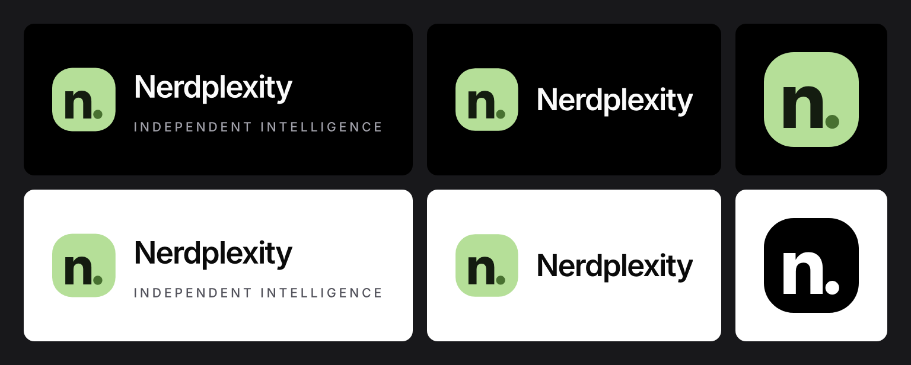

# Nerdplexity Logo Kit



All logo files use **real glyph outlines** from Inter (weight 750), not text elements — so they render identically everywhere without the font installed.

## Files

### `svg/` — Production SVGs (outlined paths)

| File | Use |
|---|---|
| `nerdplexity-mark.svg` | The green `n.` app icon — primary mark. The `n.` is centred in the tile, with a small gap before the dot |
| `nerdplexity-mark-black.svg` | Monochrome black mark |
| `nerdplexity-mark-white.svg` | Monochrome white mark |
| `nerdplexity-lockup-on-dark.svg` | Full logo (mark + "Nerdplexity" + tagline) for dark backgrounds |
| `nerdplexity-lockup-on-light.svg` | Full logo for light backgrounds |
| `nerdplexity-lockup-compact-on-dark.svg` | Compact lockup (no tagline) for dark backgrounds |
| `nerdplexity-lockup-compact-on-light.svg` | Compact lockup for light backgrounds |

### `figma/` — Editable SVGs

| File | Use |
|---|---|
| `nerdplexity-editable.svg` | Text layers preserved — import into Figma, Sketch, or Penpot to edit |

### `png/` — Raster exports (transparent background)

| Files | Use |
|---|---|
| `nerdplexity-mark-{16,32,48,64,128,180,192,256,512,1024}.png` | App icons, favicons (180 = Apple touch icon, 192/512 = web app manifest) |
| `nerdplexity-mark-{black,white}-{256,1024}.png` | One-colour marks |
| `nerdplexity-lockup-{on-dark,on-light}-{600,1200,2400}.png` | Full logo |
| `nerdplexity-lockup-compact-{on-dark,on-light}-{400,800,1600}.png` | Compact logo |

`favicon.ico` holds 16, 32, and 48 px icons. `preview.png` shows every variant on the background it is made for.

### `tokens.json` — Brand tokens

All colors, sizes, weights, and spacing values used in the logo, extracted from the app's CSS. Use these when building marketing pages, social assets, etc.

### `build.py` and `export.mjs` — Reproducible build

`build.py` generates all SVGs from Inter (the `@fontsource-variable/inter` package); `export.mjs` renders the PNGs, `favicon.ico`, and `preview.png` with Playwright. Run both from a folder containing the font package:
```bash
npm install fontkit @fontsource-variable/inter @playwright/test
pip install fonttools brotli uharfbuzz skia-pathops
python build.py out && node export.mjs
```

## Brand Colors

| Token | Value | Use |
|---|---|---|
| Tile (accent) | `#b5df98` | The green background of the mark |
| Letter | `#141c10` | The "n" character |
| Dot | `#487130` | The "." character |
| Wordmark on dark | `#fafafa` | "Nerdplexity" text on dark backgrounds |
| Tagline on dark | `#a1a1aa` | "INDEPENDENT INTELLIGENCE" on dark |
| App background | `#000000` | The app's pure black background |
| Wordmark on light | `#0a0a0a` | "Nerdplexity" text on light backgrounds |
| Tagline on light | `#52525b` | "INDEPENDENT INTELLIGENCE" on light |

## Usage

- Clear space: keep at least half the tile's width free around the logo.
- Minimum size: 16 px for the mark; use the compact lockup below 300 px wide, since the tagline gets too small to read.
- Do not recolour the `n.`, stretch the tile, or set the wordmark in another typeface.
- Inter is licensed under the SIL Open Font License 1.1. The production SVGs contain outlines, so the font is not needed to display them.

## Figma

- **Drag in `svg/*.svg`** for exact vector outlines. The tile is a real rectangle with a corner radius, and the `n`, the dot, the wordmark, and the tagline are separate named layers.
- **Drag in `figma/nerdplexity-editable.svg`** to play with live text. It uses Inter, which Figma includes, so the letters stay editable. Change the text, weight, or spacing, then use *Outline stroke / Flatten* to turn it into shapes.
- Add the colours from `tokens.json` as Figma styles or variables to reuse them.

## Stitch and other tools

Google Stitch and most AI design tools work from images: upload `preview.png` or `png/nerdplexity-mark-1024.png` as a reference, and paste the colours from `tokens.json` into the prompt. Penpot, Sketch, Illustrator, and Affinity open the SVGs directly.

