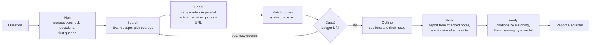

# Deep Research: plan

Status: plan, revised 2026-09-15 after the Gemini research ([`research/deep-research.md`](research/deep-research.md), with review notes: it gives no sources, and several numbers are outdated). The changes it led to are listed at the end.

## What it is

A mode for questions that need a real investigation. The user asks once; Nerdplexity plans the research, searches the web in rounds, has several free models read the sources in parallel, looks for gaps and searches again, then writes a report where every claim is cited, and checks each citation against the source before showing it. It takes minutes and tens of requests, not seconds and one.

It is built on the Free Agent: the same free-model pool, ranking, per-kind specialists, health, fallback (`tryInOrder`), step events, and panel. The new parts are search rounds, source reading, a notes store, gap finding, citation writing, and citation checking.

## Pipeline



| Step | Model role | Output | Notes |
| --- | --- | --- | --- |
| Plan | Planner (structured-output specialist) | Research brief; 3–5 perspectives on the topic; 3–6 sub-questions drawn from them; first queries | Shown to the user to edit before it runs (R3) |
| Search | none | Ranked, deduplicated URLs with page text | Exa (the key users already add). Pages without text go through a reader service (Jina Reader). Scholarly questions add OpenAlex, Semantic Scholar, arXiv, Unpaywall |
| Read | Readers, spread across providers and paced per provider | Per source: facts, each with a short verbatim quote, the URL, and the sub-question it answers | A quote is kept only if it appears in the page text (exact match after normalizing spaces and quotes). Unmatched notes are dropped and counted |
| Reflect | Strongest reasoning model | What is answered, what conflicts, what is missing, new queries | Loops until the depth or budget is reached |
| Outline | Strongest reasoning model | Report outline, each section listing the note IDs it will use | Outline first, as STORM does |
| Write | Strongest long-context writer | Report where each claim follows the note it uses, cited `[n]` | Only checked notes are in its context. Streams to the user |
| Verify | First by matching, then a different model | Each cited sentence: its note exists and says it (supported, partly, not) | Citations to missing notes are removed without a model; the model check covers meaning. Unsupported claims are removed or marked; conflicts are stated |

## Budgets

| Setting | Rounds | Sources read | Requests (about) |
| --- | ---: | ---: | ---: |
| Quick | 1 | 6 | 10 |
| Standard (default) | 2 | 15 | 25 |
| Deep | 3 | 30 | 50 |

Hard caps on searches, model requests, and minutes. When a budget or the free quota runs out, the report is written from the notes so far and says what was not covered.

## Phases

0. **R0, live multi-model panel** (also for the Free Agent): every model's role, thinking, and output streams live, with the hand-offs between models. Deep Research is built on it.
1. **R1, engine.** Plan → search → read (with quote matching) → outline → write with citations, one round. `research` steps in the live panel. Tests with a fake search API and fake models.
2. **R2, loop and checks.** Reflection rounds, the citation checker, conflicting sources.
3. **R3, experience.** A Deep research choice for a message (it costs many requests, so it is chosen, not automatic), plan preview and edit, live progress (sources found, reading 4 of 12), a report view with numbered sources, export.
4. **R4, evaluation.** A small question set with known answers: answer accuracy and citation support, against the Free Agent's single answer. Tune budgets from the results.
5. **R5, free-router.** Offer it to any client as a model, `free-router/research`.

## Changes after research

1. **Perspectives and an outline.** The planner lists perspectives first and draws sub-questions from them; the report is outlined, with notes assigned per section, before it is written (STORM).
2. **Citations checked by matching first.** Model-based checkers disagree with each other on what is unsupported, so the first checks are deterministic: a reader's quote must be found in the page, and every `[n]` in the report must point to a checked note. Only then does a model judge meaning.
3. **No unchecked citation reaches a model.** Wrong citations in context make models more likely to repeat errors, so the writer sees checked notes only.
4. **Claim follows its note.** The writer is asked to name the note before each claim, rather than adding citations afterwards.
5. **Pacing per provider.** Readers run in parallel, but requests to each provider are spaced to its per-minute limit (for example, OpenRouter's free models allow 20 a minute), so a burst waits instead of failing.
6. **More sources.** A reader service for pages without text, and free scholarly APIs for academic questions (arXiv at one request every three seconds).
7. **Live log and steering.** A running log of what each model is doing (R0), and later a way to redirect a run while it works.

Not taken: the report's model assignments (they rest on outdated limits: retired Gemini 1.5 models, GitHub Models' 8,000-token input cap, Cerebras's 5 requests a minute), its search-price table (unverified), DuckDuckGo scraping, and response caching. Model roles stay with the ranking, which already prefers large, healthy models and uses Bench results.

## Where it lives

Nerdplexity first. It already has the Free Agent, Exa search, the run harness (long runs, replay after reload, cancel), and the steps panel. The engine is written as a self-contained module so free-router can expose it later (R5).

## Research request for Gemini (Deep Research)

Paste the output back into the conversation; it is saved as `plan/research/deep-research.md`.

```text
I am building a "deep research" feature (like OpenAI Deep Research, Gemini Deep Research, Perplexity Deep Research) for an open-source, local-first AI app. The hard constraint: it must run only on FREE models (OpenRouter's free models, Groq, Cerebras, Gemini API free tier, Mistral free tier, SambaNova, Hugging Face free inference, and local models via Ollama) and free or cheap web search. The pipeline I plan: plan (sub-questions and queries) → web search → several models read sources in parallel and extract facts with verbatim quotes → reflect on gaps and search again → write a report with inline citations → verify each citation against its quote.

Research the following. For every factual claim give the source URL and its date. Prefer primary sources (papers, official docs, source code, official pricing/limit pages) over blog posts. Mark anything you could not verify, and say when information may be out of date.

1. How existing deep research systems work, step by step. Cover closed systems (OpenAI Deep Research, Gemini Deep Research, Perplexity, Anthropic's research mode, Grok DeepSearch) as far as they are documented, and open-source ones (GPT-Researcher, Stanford STORM / Co-STORM, LangChain open_deep_research, Hugging Face smolagents open Deep Research, Jina node-DeepResearch, dzhng/deep-research, Together's open deep research, and any newer ones). For each: planning, query generation, breadth vs depth and their default numbers, how pages are read and summarized, how context is kept small, reflection/gap finding, stopping rules, report writing, citation handling, and verification. A comparison table, please.

2. What measurably improves quality. Evidence (ablations, benchmark results) on: number of search rounds, sources per round, query diversification, reading full pages vs snippets, extracting quotes before writing, reflection loops, multi-agent vs single agent, separate verifier models, and citation-first writing. Which of these help most with small or weak models?

3. Evaluation I can run cheaply at home. Benchmarks and datasets for deep research and for citation faithfulness (for example BrowseComp, GAIA, FRAMES, DeepResearch Bench, SimpleQA, HotpotQA, ELI5/ALCE for citations, and newer ones): what each measures, size, license, and how to grade automatically. Recommend a small (20–50 question) evaluation set and grading method suitable for free models.

4. Free and low-cost web search and page-reading APIs as of now: Exa, Tavily, Brave Search API, Serper, SerpAPI, Google Programmable Search, Bing (status), DuckDuckGo (official or not), SearXNG (self-hosted), Jina Reader and Jina Search, Firecrawl, Wikipedia API, arXiv, Semantic Scholar, OpenAlex, Crossref. For each: free allowance (requests per month/day), rate limits, whether results include full page text, whether automated use and storing results are allowed by the terms, and quality for research. A table, please.

5. Which currently free models are best at each role: planning and query writing, reading long pages and extracting facts faithfully, reasoning about gaps and conflicts, writing long cited reports, and checking whether a sentence is supported by a quote. Include context window sizes, output limits, tool-calling support, and any published hallucination or faithfulness measurements (for example Vectara's hallucination leaderboard, FACTS Grounding, RAGTruth). Note which free models are too unreliable for which role.

6. Failure modes of deep research with weak models (hallucinated citations, citing the wrong source, losing track of the question, looping, over-trusting one source, SEO spam, outdated pages) and the specific mitigations that work, with sources.

7. User experience patterns in deep research products: showing and editing the plan before running, progress display, how long users will wait, report structure, how sources and conflicting evidence are shown, follow-up questions, and exporting. What do users complain about most?

8. Rate-limit strategy: how to run tens of model requests for one report on free tiers (for example OpenRouter free models: 20 requests per minute and 50 per day, or 1,000 per day after a one-time $10 credit purchase; Groq and Cerebras per-minute and per-day caps). Current limits per provider, and techniques for spreading, batching, and caching.

End with: (a) a recommended design for my pipeline with concrete default numbers (rounds, queries per round, sources, tokens per step, which model role goes where), each justified by the evidence above; (b) the five biggest risks; (c) a list of claims in your report that you are least sure of.
```
