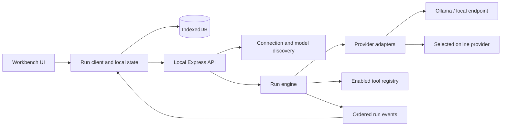

# Nerdplexity: model workbench and harness plan

Status: P0 complete; P1 next.
Updated: 2026-09-10.
User direction: make Nerdplexity an excellent interface for running local models and online models using personal API keys, including free offerings. Keep the Nerdplexity identity.

This document supersedes the two older dashboard redesign plans. It is based on source inspection and provider documentation, not a completed runtime audit.

## 1. Product outcome

Nerdplexity should let someone connect a model, understand what it can do, run it, switch models, and inspect the result without managing a different interface for every provider.

The primary experience is a model workbench. Chat, local model management, provider connections, files, comparisons, and optional tool execution share one consistent interface. Analytics explains actual runs.

Confirmed first-release emphasis: general model workbench with chat, files, comparisons, and optional tools. The user selected this direction. Terminal-based coding-agent execution and a large research subsystem are later extensions.

### Success scenarios

1. An Ollama user opens Nerdplexity, sees installed models, selects one, and receives a visibly streaming answer. A stopped local service produces a useful connection state.
2. A user adds an online connection, discovers accessible models, chooses an eligible free offering, and chats. Exhausted quota produces a clear recovery action.
3. A user switches from model A to B for the next turn. Existing messages retain their original model identity; context compatibility is checked.
4. A user saves “Quick local”, “Careful answer”, and “Coding” presets. The settings reflect capabilities supported by each selected model.
5. A user compares the same prompt and context across two models, inspects timing and usage, and continues from the preferred answer.
6. A tool-capable model can perform a bounded tool loop with visible actions, cancellation, and a durable result record.

## 2. Product decisions

- Delivery: retain the existing React/Express local web app for the first release. A desktop package is a later distribution decision.
- Local-first: conversations, presets, files, and analytics stay in the local browser database by default. Selected cloud inference and online tools necessarily transmit the context they need.
- Connectivity: Ollama native integration plus a configurable OpenAI-compatible connection cover the main local and online paths. Dedicated adapters handle provider-specific differences.
- Identity: a model selection is a connection ID plus model ID, never a guess from the model name.
- Model switching: explicit selection per turn first. Saved planner/executor/reviewer profiles and policy-based routing come after reliable individual runs.
- Context: preserve the full transcript; build a bounded request context separately. Show omissions or compaction explicitly. Do not silently slice the last N messages.
- Cost: separate “local inference”, “zero-price model”, “provider free tier”, “paid”, and “unknown”. Free-only selection fails closed for paid or unverified routes. A local model has no hosted inference fee but still uses the user's hardware.
- Reasoning: expose actual provider-supported controls and returned summaries/content. Do not pretend a generic “think harder” prompt is a native reasoning setting.
- Honest feedback: display measured run states and metrics. Remove timed “planning/refining” animations that imply work the application has not observed.
- Compatibility: preserve existing conversations and working provider integrations through migrations and adapter shims.
- Scope control: deliver complete vertical slices; avoid a framework rewrite or a speculative multi-agent scheduler.

## 3. Provider strategy

Provider offerings and account eligibility change. Refresh catalogs and display availability; do not freeze a permanent “best free models” list in source code.

| Connection | First-release treatment | Evidence |
| --- | --- | --- |
| Ollama | Discover installed models, inspect model details, distinguish installed/running state, stream chat, report native usage; then add explicit pull/remove controls | [Model listing](https://docs.ollama.com/api/tags), [running models](https://docs.ollama.com/api/ps), [usage metrics](https://docs.ollama.com/api/usage) |
| LM Studio | Named preset for a configurable OpenAI-compatible local endpoint; detect supported features | [Compatibility endpoints](https://lmstudio.ai/docs/developer/openai-compat) |
| OpenRouter | Catalog with pricing/capabilities, explicit eligible free-model selection, actionable rate-limit handling | [Models API](https://openrouter.ai/docs/guides/overview/models), [limits](https://openrouter.ai/docs/api_reference/limits) |
| Groq | Named compatible-endpoint preset with its own capability mapping and quota state | [Compatibility](https://console.groq.com/docs/openai), [free-plan limits and headers](https://console.groq.com/docs/rate-limits) |
| Gemini | Maintain native adapter, discover available models, represent model/account-specific free-tier availability | [Pricing and free-tier conditions](https://ai.google.dev/gemini-api/docs/pricing) |
| Existing paid providers | Preserve OpenAI, Anthropic, and DeepSeek connections; verify each adapter before claiming full streaming/tool support | Current repository adapters; official contract review required during implementation |
| Custom compatible endpoint | User-supplied name, base URL, optional key, model discovery or manual ID, tested capabilities | Compatibility is verified per endpoint rather than assumed |

Gemini's pricing documentation distinguishes free and paid tiers and their data-use conditions. Surface a concise provider policy link during setup. Free-tier eligibility is not proof that a particular request on an arbitrary account cannot be billed.

For a strict free-only run, allow only a verified zero-price route or a connection whose no-billing configuration can be established. Otherwise explain that eligibility is unknown and require the user to choose another route or explicitly permit potential charges. App-level cost estimates are not a substitute for provider billing controls.

Ollama supports tool calling, which makes it a viable local harness backend when the selected model supports the required behavior. [Official tool-calling documentation](https://docs.ollama.com/capabilities/tool-calling)

## 4. Interface specification

### Navigation

Primary: Chat, Models, Connections, Compare.
Secondary: Runs, Settings.
Keep existing analytics routes as aliases while moving their useful content into Runs.

### Main workbench

- Left: collapsible navigation, conversation search/history, new conversation.
- Top: conversation title, searchable model picker, connection/local indicator, preset selector.
- Center: readable transcript with code blocks, attachments, sources when available, inline tool activity, and per-answer model provenance.
- Bottom: composer, attachment action, enabled tools, Send/Stop, compact context indicator.
- Optional right panel: generation settings, included context, run timing/usage, and tool details. Closed by default.

On a phone, use a navigation drawer and a settings sheet; keep the composer usable with the keyboard open. Model names must truncate visually while remaining available accessibly. Wide code blocks and comparison panels scroll within their own regions.

### Models

Search and filter by installed, local, free offering, provider, tool support, vision, context size, and availability. Favorites and recent models appear first. Each entry exposes origin, supported inputs, current availability, and pricing status. Installed size is not presented as a guarantee that the model fits runtime memory.

Ollama management: refresh installed/running models, show download progress, cancel a pull where supported, and explicitly confirm model removal. Selecting a model never silently downloads it.

### Connections

Provider presets plus custom endpoint. Show connection status, model discovery status, credential status, and an actionable test result. Distinguish reachability, authentication, model access, and inference validation; do not equate a catalog listing with a successful chat.

Keys are masked and never appear in model URLs, telemetry, exports, or errors. New connections use session-only keys by default. “Remember on this device” is an explicit option with accurate storage disclosure; preserve existing remembered keys during migration and let the user clear them.

### Chat behavior

- Enter sends; Shift+Enter inserts a newline. Provide keyboard-accessible alternatives.
- Stream actual deltas, stop promptly, retry an attempt, edit a user message into a branch, regenerate, copy, rename, search, export, and delete a conversation.
- Switching models affects subsequent runs; each historical response keeps its provider/model/settings snapshot.
- If the target model cannot accept images, tools, or the current context length, offer an explicit conversion/omission/compaction choice before running.
- Handle empty, connecting, downloading, queued, running, completed, canceled, failed, and interrupted states.
- Preserve partial answers on interruption with their status. Never persist an error message as an ordinary successful model answer.

### Presets and comparison

A preset stores connection/model reference, system instruction, supported generation settings, context policy, tools, and cost policy. Unsupported settings remain visibly incompatible rather than silently ignored.

Start Compare with two runs from the same immutable input/context snapshot. Default local runs to sequential execution to avoid memory contention. Report warm/cold state, actual usage, and settings; do not claim a universal quality winner from a tiny sample.

### Visual direction

Keep Nerdplexity's existing blue identity and improve consistency using current CSS tokens and primitives. Use restrained surfaces, clear typography, and emphasis on transcript readability. Model badges convey factual state, not decoration. Use visible focus, accessible labels, reduced-motion support, and defined loading/empty/error states. Review 390px, 768px, and 1440px layouts in both supported themes.

## 5. Verified repository gaps

| Observation | Consequence / planned correction |
| --- | --- |
| `components/Chat.tsx` waits for `response.json()`, then marks the first token | True streaming and TTFT require a new end-to-end transport |
| `providers/openai.ts` and the active Ollama adapter request non-streaming responses | A frontend animation cannot repair the transport |
| Ollama helper splits each network chunk into JSON lines without retaining incomplete lines | Add buffered NDJSON parsing with arbitrary chunk-boundary fixtures before enabling that path |
| `constants/models.ts` and `SettingsModal.tsx` maintain different model lists; the shared local list has one model | Replace them with one discovery/catalog service |
| Shared, frontend, and server message/provider types disagree; tool messages are absent | Establish shared contracts and migrations before adding providers/tools |
| Server infers a provider from model-name substrings | Replace ambiguous routing with explicit connection identity |
| Local chat trims history by message count and inserts prompt enhancements | Introduce visible context construction and optional system presets |
| `BenchmarkPage.tsx` reads legacy localStorage settings and uses fixed local defaults | Run comparisons through the same engine/settings as chat |
| `MetricsDashboard.tsx` is the routed dashboard; `Dashboard.tsx` is legacy | Refactor the active surface first |
| Event reads use browser Dexie storage, catch errors as empty data, and refresh on mount | Distinguish errors, subscribe to changes, reuse typed derivation |
| Another event database exists in `promptops/db.ts` | Trace its callers and preserve data before consolidation |
| Web-search fallback produces helper links when retrieval fails | Represent retrieval failure honestly; helper links are not retrieved evidence |
| Initialization has no visible failure recovery path | Add retry/recovery without clearing user data |
| README ports/routes/claims differ from implementation | Rewrite documentation around verified release behavior |
| `pnpm typecheck` could not start because pnpm is missing on PATH | Restore the documented toolchain before claiming validation |

No live provider calls, application build, browser baseline, or full security audit have been completed in this planning pass.

## 6. Architecture and contracts

Retain React, Zustand, Dexie, Express, and the monorepo. Separate UI state, durable local data, model transport, and run execution.

### Shared domain

Define contracts in `packages/types/src/`; split into domain files as needed.

- Connection: ID, adapter kind, display name, base URL, credential reference/storage mode, local/remote execution classification, enabled state.
- ModelDescriptor: connection ID, model ID, display name, capability values with known/unknown state, context/output limits if known, pricing classification/provenance, discovery timestamp.
- Message: stable ID, parent/branch reference, role including tool, typed content parts, attachments, and run provenance.
- Run: ID, conversation/branch ID, immutable input and effective-settings snapshot, resolved model, lifecycle state, usage/timing, attempt lineage.
- RunEvent: version, run ID, monotonically increasing sequence, timestamp, discriminated payload.
- Preset: versioned system instruction, model reference, parameters, tools, context policy, and budget policy.
- ToolDefinition/ToolCall/ToolResult: namespaced ID, validated arguments, execution policy, status, result/error, and bounded output.
- ProviderError: category (auth, quota, unavailable, invalid request, context, transport), safe message, retryability, optional retry-after.

Do not store credentials in run snapshots or event payloads. Legacy records receive “unknown” provenance where the old schema cannot establish historical model/settings; do not manufacture certainty.

### Run lifecycle

`created → queued → running → completed | failed | canceled | interrupted`.
Tool-enabled runs may transition `running → waiting_for_tool → running`.
Exactly one terminal outcome per attempt. Retrying creates a linked attempt, not a duplicate user message. Completion means persisted final content plus a terminal record.

Suggested routes:
- `POST /v1/connections/check`: validate a supplied connection configuration without placing secrets in a URL.
- `POST /v1/models/discover`: query the selected configured connection; return normalized descriptors.
- `POST /v1/runs`: validate capabilities/context/budget and start an attempt with an idempotency key.
- `GET /v1/runs/:id/events`: SSE stream with event IDs; use a fetch-based reader if authorization headers are required.
- `POST /v1/runs/:id/cancel`: cancel queued or active work.
- `POST /v1/runs/:id/tool-decisions`: resolve pending tool decisions when tool mode is enabled.
- Ollama model-management routes remain separate from inference and target an explicitly configured connection.

Event payloads include started/queued, text delta, provider-exposed reasoning content or summary, tool-call update/result, usage, and terminal outcome. Never synthesize missing provider reasoning or token counts.

Keep a bounded replay buffer for active/recent server runs. Reconnection resumes after the last sequence when available; if the server restarted or history expired, mark the client run interrupted and offer a new attempt. Never automatically repeat a possibly billed request or tool action.

Propagate cancellation and deadlines through queue, fetch, stream reader, and tools. Preserve exact model output, including literal backslashes/code. Apply UI batching and periodic local persistence instead of a database write per token.

### Adapter boundary

Adapters implement discovery where supported, capability normalization, streaming chat, safe error mapping, and usage normalization. Optional model-management/tool capabilities are explicit.

Reuse common OpenAI-compatible transport with provider-specific mappings. Do not assume every compatible server supports the same parameters, multimodal format, usage reporting, or tools. Unknown capability is a valid state; allow a deliberate compatibility test.

All provider traffic goes through the local backend to centralize streaming and endpoint handling. Restrict requests to configured destinations; a prompt or tool result cannot choose a new credential destination. Bind local services to loopback by default and validate allowed origins. Cloud connections require HTTPS; explicitly configured local endpoints can use HTTP.

## 7. Phased implementation backlog

Implement in order. Each phase ends with a demonstrable user workflow, targeted checks, and a progress entry. Use medium reasoning for ordinary implementation; increase effort for unresolved architecture or repeated difficult failures.

### P0 — Toolchain and baseline

Files: manifests, lockfile, TypeScript/Vite configuration, scripts, README, baseline notes.

- Make the pinned pnpm toolchain available without replacing the workspace lockfile.
- Run typecheck/build and inventory meaningful tests/lint. Repair blockers as separate small changes.
- Start web/backend independently of Ollama; cloud-only setup must not require a local inference process.
- Capture active routes with synthetic data and empty/error states.
- Record exact commands, results, versions, and known failures.

Done: repeatable local startup and an honest validation baseline. Missing tests are a gap, not a passing suite.

### P1 — Shared contracts, connections, discovery

Depends on P0.
Files: shared types; frontend database/store/settings/model selector; server validation/provider registry; new connection/catalog modules.

- Define shared connection/model/message/run types and versioned persistence migration.
- Convert legacy per-provider settings into connections while preserving conversations and keys.
- Implement Ollama discovery and one configurable compatible endpoint.
- Replace both hardcoded model lists with the same catalog, search, favorites, status, and manual model-ID fallback.
- Centralize capability checks and explicit provider routing.

Done: all installed Ollama models appear; custom endpoint works through the same picker; migration preserves data; auth/offline/empty-catalog states are distinct. Provider discovery alone never claims inference success.

### P2 — Real streaming run engine

Depends on P1.
Files: new server run/stream modules, queue, adapters; frontend run client/store, Chat, Message, ThinkingHUD, instrumentation.

- Implement ordered events, stable run IDs, idempotency, terminal-state handling, and cancellation.
- Implement buffered NDJSON/SSE parsers and adapt Ollama plus the compatible transport first.
- Replace full-response waiting and simulated stages with actual events.
- Persist partial/final runs and per-message provenance; handle reconnect and server restart.
- Preserve code/text exactly and collect true first-content latency separately from request/queue/loading timing.

Done: a response displays before completion; Stop releases queued/active work; split UTF-8/JSON chunks lose no text; errors and reconnects create no duplicate messages or side effects.

### P3 — Online provider access and free-use controls

Depends on P1 and P2.
Files: adapter presets, discovery/capability mapping, connection UI, error/quota state, pricing metadata.

- Add OpenRouter and Groq presets; update Gemini and existing providers against current official contracts.
- Normalize catalogs without promising unavailable or retired models.
- Implement explicit free-only policy, pricing provenance, unknown-state handling, and user-controlled fallback.
- Read rate-limit headers when present; honor retry-after with bounded retry only when replay is safe.
- Keep credentials out of URLs, logs, exports, analytics, and run events.

Done: representative adapters pass fixtures; live checks are reported per available connection; a rate-limited free route never silently becomes a paid or different-provider request.

### P4 — Workbench UI and model switching

Depends on P1–P3.
Files: app routing/shell, sidebar, header/model picker, chat/composer, settings/presets, CSS tokens, database.

- Build the navigation and workbench layout specified above.
- Implement preset saving, per-turn switching, immutable run snapshots, edit/branch/regenerate, search, and export/import.
- Add explicit request-context construction, token-budget estimates with provenance, and a compatibility preview.
- Expose only supported generation controls and distinguish configured/effective values.
- Finish responsive, keyboard, dialog-focus, theme, and reduced-motion behavior.

Done: switch models and continue coherently; history retains original provenance; incompatible context requires a deliberate resolution; phone and desktop flows pass visual and interaction review.

### P5 — Files, local management, and comparisons

Depends on P4; comparison also requires P2 metrics.
Files: attachment/context modules, Models and Compare pages, model-management routes, persistence/export.

- Start with bounded text/Markdown/code attachments; add image input only for compatible models. Make extraction and context inclusion visible.
- Add Ollama pull progress and removal controls after validating the model-management API.
- Replace the legacy benchmark request path with two runs sharing a frozen input snapshot.
- Save comparison results, allow continuation from either answer, and distinguish measured from estimated metrics.
- Enforce file/output limits and validate imported data. Exports omit secrets.

Done: attached context can be inspected and removed; model operations show actual status; comparisons use identical source context and the shared engine; import does not silently overwrite existing data.

### P6 — Optional tools and bounded agent runs

Depends on P2, P4, P5.
Files: tool registry/executor, shared tool contracts, adapter tool serialization, context builder, run UI.

- Start with explicitly enabled bounded tools: calculator and search/read access to user-provided documents. Add online retrieval through a separately configured provider.
- Validate arguments; match tool call IDs/results across providers; enforce step/time/output limits and cancellation.
- Show the exact action/result and distinguish model text, tool output, and retrieved evidence.
- Keep tool capabilities and destinations scoped to the user's configured workspace/connections.
- Tool effects that change external state require an explicit user policy and reviewable action.
- Add MCP connectivity only after the core tool contract is validated against the then-current official protocol.
- Coding-agent terminal/filesystem execution is deferred beyond this general-workbench release and needs a dedicated sandbox/workspace design before implementation.

Done: one tool call and a multi-step loop work on a supported local and online model; unknown tools, malformed arguments, timeout, denial, and cancellation terminate cleanly; retries do not repeat completed effects.

### P7 — Run analytics and release hardening

Depends on P2–P6 for the corresponding enabled features.
Files: promptops analytics, shared derivation, tests, CI, README, verification notes.

- Build Runs from canonical events and reactive browser storage.
- Show model, origin, state, latency, TTFT, tokens/s where valid, usage/cost provenance, tools, and context utilization.
- Remove static trend arrows and unvalidated factual-quality scores; keep explicit user feedback separate.
- Verify migrations, exports, startup recovery, provider failures, browser refresh, storage errors, and disconnected services.
- Run typecheck/build, targeted automated tests, and browser checks across the defined layouts.
- Update branding/setup/feature/privacy documentation to match validated behavior.

Done: acceptance matrix below is satisfied and live-untested integrations are clearly listed. A local release does not imply authorization to deploy or publish.

## 8. Release boundaries and acceptance

Milestone A: P0–P3, dependable local and online streaming with discovered models.
Milestone B: P4–P5, a polished everyday workbench with presets, files, and comparisons.
Milestone C: P6–P7, bounded tool execution and an inspectable release candidate.

| Area | Required evidence |
| --- | --- |
| Persistence | Existing-data migration fixtures; no lost messages/keys; interrupted-write and failed-import handling |
| Streams | Arbitrary chunk boundaries, UTF-8 splits, disconnect, terminal error, cancellation, replay deduplication |
| Model switching | Historical attribution unchanged; next run uses selected connection; unsupported context handled explicitly |
| Providers | Adapter fixtures plus separately recorded live checks; auth/quota/unavailable distinctions |
| Cost policy | Paid/unknown route blocked under strict free-only; no invisible provider fallback |
| Local runtime | Unreachable service, empty catalog, missing model, queued run, download failure, cancellation |
| Files/tools | Size limits, explicit context inclusion, unsupported input, malformed tool call, bounded loop, no effect replay |
| UI | Desktop/tablet/phone review, keyboard flow, focus management, long content, empty/loading/error states |
| Metrics | Actual first-content measurement; usage provenance; null-safe aggregates; no fabricated quality or price |

Do not set arbitrary performance-score targets before a baseline exists. Record measurable UI/stream performance regressions with reproducible workloads.

Later opportunities: planner/executor/reviewer routing, richer retrieval and citations, larger evaluation suites, desktop packaging/OS credential storage, additional local runtimes, and advanced multimodal workflows. Prioritize them using observed user workflows after the core releases.

## 9. Efficient model handoff

Planning: resolve requirements, contracts, phase boundaries, and acceptance criteria using high reasoning when useful.
Implementation: switch the current model's reasoning effort to medium first, or choose another available coding model; complete one phase at a time.
Review: use higher effort for migrations, stream/cancellation correctness, tool execution boundaries, or a stubborn failure. Routine styling and wiring do not require xhigh.

Model/effort switching is controlled by the user through Codex. In CLI, use `/model` and verify with `/status`; these commands are documented in [official OpenAI documentation](https://learn.chatgpt.com/docs/developer-commands?surface=cli). The assistant cannot change its own active model.

Paste after switching:

> Read plan/implementation-plan.md and git status. Build Nerdplexity as the general model workbench specified there: chat, local and online models, files, comparisons, and optional tools. Start with P0, then implement the milestones in order. Use the shared contracts and acceptance criteria, preserve existing data, verify the active code rather than following old dashboard plans, and update the progress log after each phase. Make routine decisions autonomously. Surface material scope changes or a difficult architectural blocker with the concrete evidence and decision needed. Do not publish or deploy without an instruction to do so.

## 10. Progress log

- Completed: source review, corrected product direction, provider documentation checks, and this phased plan.
- Application changes: none.
- Validation attempted: `pnpm typecheck`; command unavailable on PATH.
- Confirmed: the user chose the general model workbench (chat, files, comparisons, optional tools) for the first release.
- P0 complete (2026-09-10): Ollama-optional startup, loopback binding, Playwright suite (4/4 passing), UI capture script and screenshots, README rewrite. Typecheck, build, and lint pass; Vitest has no test files. Details in [baseline notes](baseline.md).
- Next: P1, shared contracts, connections, and model discovery.
