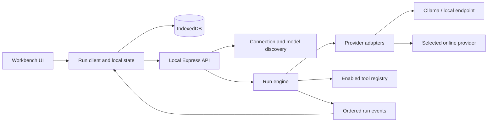

# Nerdplexity: model workbench and harness plan

Status: P0–P9 complete. Pending items: [pending.md](pending.md).
Updated: 2026-09-13.
User direction: make Nerdplexity an excellent interface for running local models and online models using personal API keys, including free offerings. Keep the Nerdplexity identity.

This is the canonical product plan and implementation record. Obsolete dashboard redesign plans and handoff prompts were removed after the workbench replaced them.

## 1. Product outcome

Nerdplexity should let someone connect a model, understand what it can do, run it, switch models, and inspect the result without managing a different interface for every provider.

The primary experience is a model workbench. Chat, local model management, provider connections, files, comparisons, optional tool execution, and inspectable run history share one consistent interface.

Confirmed first-release emphasis: general model workbench with chat, files, comparisons, and optional tools. The user selected this direction. Terminal-based coding-agent execution and a large research subsystem are later extensions.

### Success scenarios

1. An Ollama user opens Nerdplexity, sees installed models, selects one, and receives a visibly streaming answer. A stopped local service produces a useful connection state.
2. A user adds an online connection, discovers accessible models, chooses an eligible free offering, and chats. Exhausted quota produces a clear recovery action.
3. A user switches from model A to B for the next turn. Existing messages retain their original model identity; context compatibility is checked.
4. A user saves “Quick local”, “Careful answer”, and “Coding” presets. The settings reflect capabilities supported by each selected model.
5. A user compares the same prompt and context across two models, inspects timing and usage, and continues from the preferred answer.
6. A tool-capable model can perform a bounded tool loop with visible actions, cancellation, and a durable result record.

## 2. Product decisions

- Delivery: retain the existing React/Express local web app for the first release. A desktop package is a later distribution decision.
- Local-first: conversations, presets, files, and run history stay in the local browser database by default. Selected cloud inference and online tools necessarily transmit the context they need.
- Connectivity: Ollama native integration plus a configurable OpenAI-compatible connection cover the main local and online paths. Dedicated adapters handle provider-specific differences.
- Identity: a model selection is a connection ID plus model ID, never a guess from the model name.
- Model switching: explicit selection per turn first. Saved planner/executor/reviewer profiles and policy-based routing come after reliable individual runs.
- Context: preserve the full transcript; build a bounded request context separately. Show omissions or compaction explicitly. Do not silently slice the last N messages.
- Cost: separate “local inference”, “zero-price model”, “provider free tier”, “paid”, and “unknown”. Free-only selection fails closed for paid or unverified routes. A local model has no hosted inference fee but still uses the user's hardware.
- Reasoning: expose actual provider-supported controls and returned summaries/content. Do not pretend a generic “think harder” prompt is a native reasoning setting.
- Honest feedback: display measured run states and metrics. Remove timed “planning/refining” animations that imply work the application has not observed.
- Compatibility: preserve existing conversations and working provider integrations through migrations and adapter shims.
- Scope control: deliver complete vertical slices; avoid a framework rewrite or a speculative multi-agent scheduler.

## 3. Provider strategy

Provider offerings and account eligibility change. Refresh catalogs and display availability; do not freeze a permanent “best free models” list in source code.

| Connection | First-release treatment | Evidence |
| --- | --- | --- |
| Ollama | Discover installed models, inspect model details, distinguish installed/running state, stream chat, report native usage; then add explicit pull/remove controls | [Model listing](https://docs.ollama.com/api/tags), [running models](https://docs.ollama.com/api/ps), [usage metrics](https://docs.ollama.com/api/usage) |
| LM Studio | Named preset for a configurable OpenAI-compatible local endpoint; detect supported features | [Compatibility endpoints](https://lmstudio.ai/docs/developer/openai-compat) |
| OpenRouter | Catalog with pricing/capabilities, explicit eligible free-model selection, actionable rate-limit handling | [Models API](https://openrouter.ai/docs/guides/overview/models), [limits](https://openrouter.ai/docs/api_reference/limits) |
| Groq | Named compatible-endpoint preset with its own capability mapping and quota state | [Compatibility](https://console.groq.com/docs/openai), [free-plan limits and headers](https://console.groq.com/docs/rate-limits) |
| Gemini | Maintain native adapter, discover available models, represent model/account-specific free-tier availability | [Pricing and free-tier conditions](https://ai.google.dev/gemini-api/docs/pricing) |
| Existing paid providers | Preserve OpenAI, Anthropic, and DeepSeek connections; verify each adapter before claiming full streaming/tool support | Current repository adapters; official contract review required during implementation |
| Custom compatible endpoint | User-supplied name, base URL, optional key, model discovery or manual ID, tested capabilities | Compatibility is verified per endpoint rather than assumed |

Gemini's pricing documentation distinguishes free and paid tiers and their data-use conditions. Surface a concise provider policy link during setup. Free-tier eligibility is not proof that a particular request on an arbitrary account cannot be billed.

For a strict free-only run, allow only a verified zero-price route or a connection whose no-billing configuration can be established. Otherwise explain that eligibility is unknown and require the user to choose another route or explicitly permit potential charges. App-level cost estimates are not a substitute for provider billing controls.

Ollama supports tool calling, which makes it a viable local harness backend when the selected model supports the required behavior. [Official tool-calling documentation](https://docs.ollama.com/capabilities/tool-calling)

## 4. Interface specification

### Navigation

Primary: Chat, Models, Connections, Workspace, Run history, Compare.
Former analytics URLs redirect to Run history; their useful per-run measurements live there.

### Main workbench

- Left: collapsible navigation, conversation search/history, new conversation.
- Top: conversation title, searchable model picker, connection/local indicator, preset selector.
- Center: readable transcript with code blocks, attachments, sources when available, inline tool activity, and per-answer model provenance.
- Bottom: composer, attachment action, enabled tools, Send/Stop, compact context indicator.
- Optional right panel: generation settings, included context, run timing/usage, and tool details. Closed by default.

On a phone, use a navigation drawer and a settings sheet; keep the composer usable with the keyboard open. Model names must truncate visually while remaining available accessibly. Wide code blocks and comparison panels scroll within their own regions.

### Models

Search and filter by installed, local, free offering, provider, tool support, vision, context size, and availability. Favorites and recent models appear first. Each entry exposes origin, supported inputs, current availability, and pricing status. Installed size is not presented as a guarantee that the model fits runtime memory.

Ollama management: refresh installed/running models, show download progress, cancel a pull where supported, and explicitly confirm model removal. Selecting a model never silently downloads it.

### Connections

Provider presets plus custom endpoint. Show connection status, model discovery status, credential status, and an actionable test result. Distinguish reachability, authentication, model access, and inference validation; do not equate a catalog listing with a successful chat.

Keys are masked and never appear in model URLs, telemetry, exports, or errors. New connections use session-only keys by default. “Remember on this device” is an explicit option with accurate storage disclosure; preserve existing remembered keys during migration and let the user clear them.

### Chat behavior

- Enter sends; Shift+Enter inserts a newline. Provide keyboard-accessible alternatives.
- Stream actual deltas, stop promptly, retry an attempt, edit a user message into a branch, regenerate, copy, rename, search, export, and delete a conversation.
- Switching models affects subsequent runs; each historical response keeps its provider/model/settings snapshot.
- If the target model cannot accept images, tools, or the current context length, offer an explicit conversion/omission/compaction choice before running.
- Handle empty, connecting, downloading, queued, running, completed, canceled, failed, and interrupted states.
- Preserve partial answers on interruption with their status. Never persist an error message as an ordinary successful model answer.

### Presets and comparison

A preset stores connection/model reference, system instruction, supported generation settings, context policy, tools, and cost policy. Unsupported settings remain visibly incompatible rather than silently ignored.

Start Compare with two runs from the same immutable input/context snapshot. Default local runs to sequential execution to avoid memory contention. Report warm/cold state, actual usage, and settings; do not claim a universal quality winner from a tiny sample.

### Visual direction

Use the Nerdplexity black-and-green identity from the logo kit (`logo/`, adopted in P8 from the `codex/local-workspace` branch; replaces the earlier blue direction), with a green light theme, and keep consistency through the CSS tokens and primitives. Use restrained surfaces, clear typography, and emphasis on transcript readability. Model badges convey factual state, not decoration. Use visible focus, accessible labels, reduced-motion support, and defined loading/empty/error states. Review 390px, 768px, and 1440px layouts in both supported themes.

## 5. Initial repository gaps (resolved during P0–P7)

| Observation | Consequence / planned correction |
| --- | --- |
| `components/Chat.tsx` waits for `response.json()`, then marks the first token | True streaming and TTFT require a new end-to-end transport |
| `providers/openai.ts` and the active Ollama adapter request non-streaming responses | A frontend animation cannot repair the transport |
| Ollama helper splits each network chunk into JSON lines without retaining incomplete lines | Add buffered NDJSON parsing with arbitrary chunk-boundary fixtures before enabling that path |
| `constants/models.ts` and `SettingsModal.tsx` maintain different model lists; the shared local list has one model | Replace them with one discovery/catalog service |
| Shared, frontend, and server message/provider types disagree; tool messages are absent | Establish shared contracts and migrations before adding providers/tools |
| Server infers a provider from model-name substrings | Replace ambiguous routing with explicit connection identity |
| Local chat trims history by message count and inserts prompt enhancements | Introduce visible context construction and optional system presets |
| `BenchmarkPage.tsx` reads legacy localStorage settings and uses fixed local defaults | Run comparisons through the same engine/settings as chat |
| `MetricsDashboard.tsx` is the routed dashboard; `Dashboard.tsx` is legacy | Refactor the active surface first |
| Event reads use browser Dexie storage, catch errors as empty data, and refresh on mount | Distinguish errors, subscribe to changes, reuse typed derivation |
| Another event database exists in `promptops/db.ts` | Trace its callers and preserve data before consolidation |
| Web-search fallback produces helper links when retrieval fails | Represent retrieval failure honestly; helper links are not retrieved evidence |
| Initialization has no visible failure recovery path | Add retry/recovery without clearing user data |
| README ports/routes/claims differ from implementation | Rewrite documentation around verified release behavior |
| `pnpm typecheck` could not start because pnpm is missing on PATH | Restore the documented toolchain before claiming validation |

No live provider calls, application build, browser baseline, or full security audit have been completed in this planning pass.

## 6. Architecture and contracts

Retain React, Zustand, Dexie, Express, and the monorepo. Separate UI state, durable local data, model transport, and run execution.

### Shared domain

Define contracts in `packages/types/src/`; split into domain files as needed.

- Connection: ID, adapter kind, display name, base URL, credential reference/storage mode, local/remote execution classification, enabled state.
- ModelDescriptor: connection ID, model ID, display name, capability values with known/unknown state, context/output limits if known, pricing classification/provenance, discovery timestamp.
- Message: stable ID, parent/branch reference, role including tool, typed content parts, attachments, and run provenance.
- Run: ID, conversation/branch ID, immutable input and effective-settings snapshot, resolved model, lifecycle state, usage/timing, attempt lineage.
- RunEvent: version, run ID, monotonically increasing sequence, timestamp, discriminated payload.
- Preset: versioned system instruction, model reference, parameters, tools, context policy, and budget policy.
- ToolDefinition/ToolCall/ToolResult: namespaced ID, validated arguments, execution policy, status, result/error, and bounded output.
- ProviderError: category (auth, quota, unavailable, invalid request, context, transport), safe message, retryability, optional retry-after.

Do not store credentials in run snapshots or event payloads. Legacy records receive “unknown” provenance where the old schema cannot establish historical model/settings; do not manufacture certainty.

### Run lifecycle

`created → queued → running → completed | failed | canceled | interrupted`.
Tool-enabled runs may transition `running → waiting_for_tool → running`.
Exactly one terminal outcome per attempt. Retrying creates a linked attempt, not a duplicate user message. Completion means persisted final content plus a terminal record.

Suggested routes:
- `POST /v1/connections/check`: validate a supplied connection configuration without placing secrets in a URL.
- `POST /v1/models/discover`: query the selected configured connection; return normalized descriptors.
- `POST /v1/runs`: validate capabilities/context/budget and start an attempt with an idempotency key.
- `GET /v1/runs/:id/events`: SSE stream with event IDs; use a fetch-based reader if authorization headers are required.
- `POST /v1/runs/:id/cancel`: cancel queued or active work.
- `POST /v1/runs/:id/tool-decisions`: resolve pending tool decisions when tool mode is enabled.
- Ollama model-management routes remain separate from inference and target an explicitly configured connection.

Event payloads include started/queued, text delta, provider-exposed reasoning content or summary, tool-call update/result, usage, and terminal outcome. Never synthesize missing provider reasoning or token counts.

Keep a bounded replay buffer for active/recent server runs. Reconnection resumes after the last sequence when available; if the server restarted or history expired, mark the client run interrupted and offer a new attempt. Never automatically repeat a possibly billed request or tool action.

Propagate cancellation and deadlines through queue, fetch, stream reader, and tools. Preserve exact model output, including literal backslashes/code. Apply UI batching and periodic local persistence instead of a database write per token.

### Adapter boundary

Adapters implement discovery where supported, capability normalization, streaming chat, safe error mapping, and usage normalization. Optional model-management/tool capabilities are explicit.

Reuse common OpenAI-compatible transport with provider-specific mappings. Do not assume every compatible server supports the same parameters, multimodal format, usage reporting, or tools. Unknown capability is a valid state; allow a deliberate compatibility test.

All provider traffic goes through the local backend to centralize streaming and endpoint handling. Restrict requests to configured destinations; a prompt or tool result cannot choose a new credential destination. Bind local services to loopback by default and validate allowed origins. Cloud connections require HTTPS; explicitly configured local endpoints can use HTTP.

## 7. Phased implementation backlog

Implement in order. Each phase ends with a demonstrable user workflow, targeted checks, and a progress entry. Use medium reasoning for ordinary implementation; increase effort for unresolved architecture or repeated difficult failures.

### P0 — Toolchain and baseline

Files: manifests, lockfile, TypeScript/Vite configuration, scripts, README, baseline notes.

- Make the pinned pnpm toolchain available without replacing the workspace lockfile.
- Run typecheck/build and inventory meaningful tests/lint. Repair blockers as separate small changes.
- Start web/backend independently of Ollama; cloud-only setup must not require a local inference process.
- Capture active routes with synthetic data and empty/error states.
- Record exact commands, results, versions, and known failures.

Done: repeatable local startup and an honest validation baseline. Missing tests are a gap, not a passing suite.

### P1 — Shared contracts, connections, discovery

Depends on P0.
Files: shared types; frontend database/store/settings/model selector; server validation/provider registry; new connection/catalog modules.

- Define shared connection/model/message/run types and versioned persistence migration.
- Convert legacy per-provider settings into connections while preserving conversations and keys.
- Implement Ollama discovery and one configurable compatible endpoint.
- Replace both hardcoded model lists with the same catalog, search, favorites, status, and manual model-ID fallback.
- Centralize capability checks and explicit provider routing.

Done: all installed Ollama models appear; custom endpoint works through the same picker; migration preserves data; auth/offline/empty-catalog states are distinct. Provider discovery alone never claims inference success.

Reconciled scope (2026-09-10, after checkpoint `323d763`). Already present: Ollama and localhost OpenAI-compatible discovery, buffered NDJSON/SSE line reading, local chat streaming (`runtime/local.ts`, `runtime/streams.ts`, `routes/localRuntime.ts`). Remaining:

1. Shared `Connection`, `ModelRef`, `ModelDescriptor` (tri-state capabilities), and categorized discovery results in `@app/types`, imported by web and server.
2. Dexie v4: `connections` and `credentials` tables; legacy runtime URLs and saved keys become connections; conversations gain `connectionId`; new assistant messages record provenance; legacy messages stay unknown. Fixture-tested.
3. Connection presets (Ollama, LM Studio, OpenAI, Anthropic, Gemini, DeepSeek, custom compatible). New keys session-only unless "Remember on this device"; migrated keys stay remembered. Cloud endpoints require HTTPS. Keys never travel in URLs.
4. Server discovery for every connection kind; the Models page becomes the single catalog with search, favorites, manual model IDs, and distinct offline/auth/empty/not-found states. Live code stops using `DEFAULT_MODELS` and the Settings modal list.
5. Runs resolve through `connectionId`; model-name provider detection is removed; custom endpoints stream through the existing run path; document-agent runs remain local-only.
6. Tests: discovery and URL-policy fixtures, migration fixture, Playwright connection flow.

Out of P1: unrouted legacy components (`components/Chat.tsx`, `pages/Landing.tsx`, etc.), analytics, benchmark, cloud streaming (P2), OpenRouter/Groq presets and pricing (P3), per-turn switching (P4).

### P2 — Real streaming run engine

Depends on P1.
Files: new server run/stream modules, queue, adapters; frontend run client/store, Chat, Message, ThinkingHUD, instrumentation.

- Implement ordered events, stable run IDs, idempotency, terminal-state handling, and cancellation.
- Implement buffered NDJSON/SSE parsers and adapt Ollama plus the compatible transport first.
- Replace full-response waiting and simulated stages with actual events.
- Persist partial/final runs and per-message provenance; handle reconnect and server restart.
- Preserve code/text exactly and collect true first-content latency separately from request/queue/loading timing.

Done: a response displays before completion; Stop releases queued/active work; split UTF-8/JSON chunks lose no text; errors and reconnects create no duplicate messages or side effects.

### P3 — Online provider access and free-use controls

Depends on P1 and P2.
Files: adapter presets, discovery/capability mapping, connection UI, error/quota state, pricing metadata.

- Add OpenRouter and Groq presets; update Gemini and existing providers against current official contracts.
- Normalize catalogs without promising unavailable or retired models.
- Implement explicit free-only policy, pricing provenance, unknown-state handling, and user-controlled fallback.
- Read rate-limit headers when present; honor retry-after with bounded retry only when replay is safe.
- Keep credentials out of URLs, logs, exports, and run events.

Done: representative adapters pass fixtures; live checks are reported per available connection; a rate-limited free route never silently becomes a paid or different-provider request.

### P4 — Workbench UI and model switching

Depends on P1–P3.
Files: app routing/shell, sidebar, header/model picker, chat/composer, settings/presets, CSS tokens, database.

- Build the navigation and workbench layout specified above.
- Implement preset saving, per-turn switching, immutable run snapshots, edit/branch/regenerate, search, and export/import.
- Add explicit request-context construction, token-budget estimates with provenance, and a compatibility preview.
- Expose only supported generation controls and distinguish configured/effective values.
- Finish responsive, keyboard, dialog-focus, theme, and reduced-motion behavior.

Done: switch models and continue coherently; history retains original provenance; incompatible context requires a deliberate resolution; phone and desktop flows pass visual and interaction review.

### P5 — Files, local management, and comparisons

Depends on P4; comparison also requires P2 metrics.
Files: attachment/context modules, Models and Compare pages, model-management routes, persistence/export.

- Start with bounded text/Markdown/code attachments; add image input only for compatible models. Make extraction and context inclusion visible.
- Add Ollama pull progress and removal controls after validating the model-management API.
- Replace the legacy benchmark request path with two runs sharing a frozen input snapshot.
- Save comparison results, allow continuation from either answer, and distinguish measured from estimated metrics.
- Enforce file/output limits and validate imported data. Exports omit secrets.

Done: attached context can be inspected and removed; model operations show actual status; comparisons use identical source context and the shared engine; import does not silently overwrite existing data.

### P6 — Optional tools and bounded agent runs

Depends on P2, P4, P5.
Files: tool registry/executor, shared tool contracts, adapter tool serialization, context builder, run UI.

- Start with explicitly enabled bounded tools: calculator and search/read access to user-provided documents. Add online retrieval through a separately configured provider.
- Validate arguments; match tool call IDs/results across providers; enforce step/time/output limits and cancellation.
- Show the exact action/result and distinguish model text, tool output, and retrieved evidence.
- Keep tool capabilities and destinations scoped to the user's configured workspace/connections.
- Tool effects that change external state require an explicit user policy and reviewable action.
- Add MCP connectivity only after the core tool contract is validated against the then-current official protocol. **Pending: deferred by the owner on 2026-09-11; tracked in [pending.md](pending.md).**
- Coding-agent terminal/filesystem execution is deferred beyond this general-workbench release and needs a dedicated sandbox/workspace design before implementation.

Done: one tool call and a multi-step loop work on a supported local and online model; unknown tools, malformed arguments, timeout, denial, and cancellation terminate cleanly; retries do not repeat completed effects.

### P7 — Run inspection and release hardening

Depends on P2–P6 for the corresponding enabled features.
Files: Run history, shared per-run measurements, tests, CI, README, verification notes.

- Build Runs from canonical events and reactive browser storage.
- Show model, origin, state, latency, TTFT, tokens/s where valid, usage/cost provenance, tools, and context utilization.
- Remove static trend arrows and unvalidated factual-quality scores; keep explicit user feedback separate.
- Verify migrations, exports, startup recovery, provider failures, browser refresh, storage errors, and disconnected services.
- Run typecheck/build, targeted automated tests, and browser checks across the defined layouts.
- Update branding/setup/feature/privacy documentation to match validated behavior.

Done: acceptance matrix below is satisfied and live-untested integrations are clearly listed. A local release does not imply authorization to deploy or publish.

## 8. Release boundaries and acceptance

Milestone A: P0–P3, dependable local and online streaming with discovered models.
Milestone B: P4–P5, a polished everyday workbench with presets, files, and comparisons.
Milestone C: P6–P7, bounded tool execution and an inspectable release candidate.

| Area | Required evidence |
| --- | --- |
| Persistence | Existing-data migration fixtures; no lost messages/keys; interrupted-write and failed-import handling |
| Streams | Arbitrary chunk boundaries, UTF-8 splits, disconnect, terminal error, cancellation, replay deduplication |
| Model switching | Historical attribution unchanged; next run uses selected connection; unsupported context handled explicitly |
| Providers | Adapter fixtures plus separately recorded live checks; auth/quota/unavailable distinctions |
| Cost policy | Paid/unknown route blocked under strict free-only; no invisible provider fallback |
| Local runtime | Unreachable service, empty catalog, missing model, queued run, download failure, cancellation |
| Files/tools | Size limits, explicit context inclusion, unsupported input, malformed tool call, bounded loop, no effect replay |
| UI | Desktop/tablet/phone review, keyboard flow, focus management, long content, empty/loading/error states |
| Metrics | Actual first-content measurement; usage provenance; null-safe aggregates; no fabricated quality or price |

Do not set arbitrary performance-score targets before a baseline exists. Record measurable UI/stream performance regressions with reproducible workloads.

Later opportunities: planner/executor/reviewer routing, richer retrieval and citations, larger evaluation suites, desktop packaging/OS credential storage, additional local runtimes, and advanced multimodal workflows. Prioritize them using observed user workflows after the core releases.

## 9. Efficient model handoff

Planning: resolve requirements, contracts, phase boundaries, and acceptance criteria using high reasoning when useful.
Implementation: switch the current model's reasoning effort to medium first, or choose another available coding model; complete one phase at a time.
Review: use higher effort for migrations, stream/cancellation correctness, tool execution boundaries, or a stubborn failure. Routine styling and wiring do not require xhigh.

Model/effort switching is controlled by the user through Codex. In CLI, use `/model` and verify with `/status`; these commands are documented in [official OpenAI documentation](https://learn.chatgpt.com/docs/developer-commands?surface=cli). The assistant cannot change its own active model.

Paste after switching:

> Read plan/implementation-plan.md and git status. Build Nerdplexity as the general model workbench specified there: chat, local and online models, files, comparisons, and optional tools. Start with P0, then implement the milestones in order. Use the shared contracts and acceptance criteria, preserve existing data, verify the active code rather than following old dashboard plans, and update the progress log after each phase. Make routine decisions autonomously. Surface material scope changes or a difficult architectural blocker with the concrete evidence and decision needed. Do not publish or deploy without an instruction to do so.

## 10. Progress log

- Completed: source review, corrected product direction, provider documentation checks, and this phased plan.
- Application changes: none.
- Validation attempted: `pnpm typecheck`; command unavailable on PATH.
- Confirmed: the user chose the general model workbench (chat, files, comparisons, optional tools) for the first release.
- P0 complete (2026-09-10): Ollama-optional startup, loopback binding, Playwright suite (4/4 passing), UI capture, and README rewrite. Typecheck, build, and lint passed. Its obsolete pre-workbench capture artifacts were removed in P8.2.
- P1 complete (2026-09-10): shared connection/model contracts in `@app/types`; server destination policy (`runtime/destinations.ts`) and discovery for Ollama, OpenAI-compatible, OpenAI, Anthropic (official SDK), Gemini, and DeepSeek (`runtime/discovery.ts`, `POST /v1/models/discover`); Dexie v4 with `connections` and `credentials`, idempotent legacy migration, and a retryable startup error; session-only keys by default with opt-in device storage; Models page as the single catalog (connections, search, filters, favorites, manual model IDs); runs routed by `connectionId`; custom endpoints stream through the run route; assistant answers record and show provenance; model-name provider detection and the key-in-URL ping removed; Settings modal replaced by Connections.
- P1 verification: typecheck, build, lint pass. Vitest 28/28 (server 21: policy, discovery fixtures per provider, key redaction, chunk and UTF-8 splits; web 7: v3 to v4 migration, idempotency, fresh install, credential storage). Playwright 6/6. Unmocked smoke through the real backend to a local fake OpenAI-compatible server: discovery, wrong-key auth, streamed answer split into 7-byte chunks, remembered key after reload, no phone overflow. No live provider account or real Ollama model was used.
- Open after P1: hosted providers do not stream yet (P2); the message renderer strips emoji from model output, contrary to "preserve exact output" (P2); the workspace UI from `323d763` uses a green palette and low-contrast answer text rather than the blue identity (P4); unrouted legacy components (`components/Chat.tsx`, `ChatHeader.tsx`, `hooks/useLocalKeys.ts`, `pages/Landing.tsx`) still compile against compatibility shims; LAN runtimes over plain http are not allowed by the destination policy.
- P2 complete (2026-09-10), on branch `claude/engine`: run engine with `POST /v1/runs` (idempotency key), `GET /v1/runs/:id/events?after=N` (NDJSON envelopes with sequence numbers, replay, reconnect), and `POST /v1/runs/:id/cancel`; exactly one terminal event per run; runs canceled while queued release the local queue without calling the model; runs with no client for 60 s are canceled; bounded replay buffer and retention. Streaming adapters for Ollama, OpenAI-compatible, OpenAI (`max_completion_tokens`), DeepSeek, Gemini (SSE, thought parts), and Anthropic (official SDK, refusal stop reason) with categorized errors (auth, quota with retry-after, unavailable, invalid request, context, refused, transport, timeout) and key redaction. A single safe resend without temperature when a model rejects it before generating. Browser client: start with idempotent retries, reconnect with backoff, reattach after reload, interrupted state when the server lost the run, rendering batched per animation frame, partial output persisted every second, exactly-once finalization across tabs, labeled partial answers, Retry as a linked attempt without a duplicate user message, reasoning shown separately. Transcript renders model output exactly (emoji stripping removed). `/v1/local/run` and the old `streamChat` path removed. Ports configurable via `WEB_PORT`/`PORT`; Playwright no longer silently reuses servers (`PW_REUSE=1` opts in).
- P2 verification: typecheck, build, lint pass. Vitest 54/54 (server 47, web 7). Playwright 14/14 with a fake provider through the real backend; run-engine browser tests repeated 3x without flakes. Bugs found by the new tests and fixed: output emitted during cancellation leaked into the stream; a mid-stream disconnect was reported as "unable to reach the server"; finished answers blinked out while re-rendering. No live provider account or real model was used.
- Open after P2: live verification of each hosted adapter with real keys; Anthropic/Gemini reasoning display requires opting into provider thinking settings (not sent); document agent steps remain non-streaming; legacy `/v1/chat` remains for the unrouted legacy screens and benchmark page (P5); runs are lost if the backend restarts (by design, reported as interrupted).
- P3 complete (2026-09-10), branch `claude/engine`. Provider contracts checked against current documentation (OpenRouter models, limits, and key endpoints; Groq OpenAI compatibility, models, and rate-limit headers; Gemini pricing, data use, and usage metadata). Added OpenRouter and Groq as pinned hosted connections. OpenRouter discovery classifies $0 models as `zero-price`, reports per-million prices, tools and vision support, and retirement dates, and hides expired and non-text models; router models with request-time pricing stay `unknown`. Groq discovery hides inactive and speech models. Groq uses `max_completion_tokens`; its `x_groq` usage is read. Gemini output tokens include thinking tokens. 402 maps to a non-retryable quota error. Rate-limit headers (`x-ratelimit-*`, OpenRouter epoch reset) are parsed into quota state saved per connection. Short rate limits (≤10 s, at most twice) are waited out visibly, since the model never ran; longer waits are shown to the user. Free only policy: allowed only for local, catalog-verified $0, or accounts the user marks as having no billing; unknown is blocked before sending with an explicit per-thread override; free alternatives are offered after a free route hits its limit and never chosen automatically. Model Check sends one short prompt (confirmation first when it may be billed). Gemini data-use and provider limit notes shown at setup. Credential audit: the global error handler logged raw request bodies (including keys) on malformed JSON; it now logs only method, path, and error type, and returns 400.
- P3 verification: typecheck, build, lint pass. Vitest 68/68 (server 54, web 14). Playwright 19/19; cost and run-engine suites repeated without failures after fixing a transient duplicate answer that the repeat runs exposed. Live checks per connection: Ollama, LM Studio, OpenAI, Anthropic, Gemini, DeepSeek, OpenRouter, Groq have **not** been exercised against live accounts or runtimes in this environment (no keys or local models available); behavior is verified with documentation-based fixtures and a local fake provider. Use Check on each connection to record a live result.
- Open after P3: live verification per provider; OpenRouter credit status (`/api/v1/key`) is not shown; Anthropic rate-limit headers (`anthropic-ratelimit-*`) are not parsed; free-tier model lists are never hardcoded, so Gemini and Groq rely on the account billing statement.
- Next: P4, workbench UI and model switching.
- P4 complete (2026-09-11): added an inline searchable model picker with favorites; durable reusable model/settings presets; per-thread system instructions, model-default/custom temperature, output limits, explicit history selection, approximate context budgeting, request inspection, and compatibility warnings that block sends until resolved. Every run now stores an immutable input/settings/document snapshot and provider adjustment notices; retries reuse the original snapshot. Added non-destructive edit and regenerate branches, rename/copy actions, content search, credential-safe thread JSON export/import with fresh IDs and no model or charge route, dedicated Connections navigation, sidebar collapse, persistent light/dark themes, native modal focus restoration, mobile focus trapping, and reduced-motion/responsive styling. Historical answers keep their original provenance when the next turn changes models.
- P4 verification: typecheck and production build pass. Vitest 80/80 (server 54, web 26), including a v4-to-v5 preservation/reopen fixture. Playwright 24/24 after targeted workbench checks; visual artifacts cover 1440, 768, and 390 px in light mode plus phone dark mode and settings. No live provider account or local runtime was used; requests were checked through the deterministic local provider.
- Open after P4 (differences from the spec, found in a post-P5 review, 2026-09-11): (1) Navigation is Chat, Models, Connections, Workspace, Run history, Compare; section 4 lists Chat, Models, Connections, Compare, Runs, Settings. There is no separate Settings page; settings open per thread from chat. (2) Context that exceeds a model's limit offers only omitting earlier turns; the conversion/compaction choice from section 4 (for example summarizing older turns) is not built. (3) The layout screenshots saved by the browser tests were reviewed by the implementing agent only; the owner has not reviewed them.
- P5 complete (2026-09-11), branch `codex/engine`: added thread-scoped text/Markdown/code attachments (100 KB each) and compatible-model PNG/JPEG/WebP/GIF input (2 MB each, four images, 5 MB total). Files are stored in the browser, inspectable/removable, included with named boundaries in context previews and immutable snapshots, and round-trip through validated v2 thread exports without route or credential data. Image requests are blocked unless discovery confirms vision support and map to OpenAI-style data URLs, Ollama image arrays, Anthropic base64 image blocks, and Gemini inline data. Added loopback-policy-protected Ollama pull/delete routes, streamed runtime progress, browser cancellation, catalog refresh, and confirmed removal. Added `/app/compare`: two explicitly selected models are submitted together through `/v1/runs` with the same frozen messages/settings/attachments; models on this machine execute one at a time through the shared local queue (hosted models run in parallel). Results persist in Dexie v6 and Run history, show the shared effective settings, distinguish measured run time/first text/queue wait and provider-reported usage and Ollama model-load time from the input estimate, export without destinations, and can continue either answer in a new thread. Run time excludes local queue wait so the second local model is not penalized for waiting on the first. Legacy benchmark routes redirect to Compare.
- P5 verification (final check, 2026-09-11): typecheck, production build, and lint pass. Vitest 87/87 (server 59, web 28), including all four image adapter formats, Ollama `load_duration` mapping, multimodal validation, Ollama management validation, attachment limits/import-export, and v4-to-v6 data preservation. Playwright 26/26, including text/image attachment delivery, identical comparison requests, sequential execution of two local comparison models, persistence/continuation/removal, and Ollama install/remove state. No live provider account, real Ollama pull, or local model was used. The new Compare metric tiles and settings line were checked by browser assertions, not by a visual review at 390/768/1440 px.
- Open after P5: PDF/OCR, larger-document extraction, and advanced multimodal workflows remain later opportunities. A real Ollama installation should be used to verify pull cancellation, disk/runtime error messages, and `load_duration` reporting. Warm/cold state is shown as the runtime-reported load time rather than a derived label; other providers do not report it. Comparison runs do not yet reattach after a browser reload while still running; their canonical Run history records retain the interruption/recovery behavior of the shared engine. Thread image attachments are re-sent with every new turn while attached.
- P6 complete (2026-09-11), branch `codex/engine`: added a built-in tool registry (`runtime/tools.ts`) with a calculator (a small arithmetic parser, never `eval`) and document search/read, and a bounded tool loop (`runtime/toolLoop.ts`) that streams every step through the normal adapters, so text, reasoning, quota, rate-limit waits, and failures behave as in chat. Tool definitions, streamed tool calls, and tool results are mapped for OpenAI-style providers (fragmented calls assembled by index), Ollama (whole calls, results by tool name), Anthropic (tool_use/tool_result blocks, one step's results in one user turn), and Gemini (function declarations without additionalProperties, function responses, thought signatures returned with calls). Limits: 6 model steps, 12 tool calls, 10 s per tool, 12,000 serialized characters per result. Unknown tools, disabled tools (reported as denied), malformed arguments, tool errors, and timeouts become results the model can read; cancellation stops between and during calls; generated call IDs are unique per run. `POST /v1/runs` takes `tools` instead of `agent`; documents are sent only when a document tool is enabled and only to models on this machine; image input now works with tools. The old non-streaming local document agent was removed. In the web app, Calculator and Documents are per-thread toggles in the composer (so presets save them); enabled tools are never dropped silently: an unsupported model, an online model with Documents, or no documents blocks the send with an explanation. Each call's input, result or error, step, duration, and source (computed by the app, or retrieved from your documents) is shown with the answer, saved with the message, and shown in Run history.
- P6 verification (2026-09-11): typecheck, production build, and lint pass. Vitest 125/125 (server 97, web 28), including calculator parsing and rejection (a prototype-chain lookup found by these tests was fixed), tool validation/denial/timeout/output bounds/cancellation, tool-call mapping for all four provider formats in both directions, and loop tests for multi-step runs, step and call limits, unique generated IDs, cancellation between calls, and usage that is omitted rather than understated when a step does not report it. Playwright 29/29, including the calculator round trip with the exact request sequence and persistence after reload, malformed arguments returned to the model, and a search-then-read document loop.
- Open after P6: (1) Online retrieval through a separately configured provider needs a choice of search API and a key; the legacy `/v1/chat` DuckDuckGo path is unchanged and still returns helper links when retrieval fails. (2) Whether Documents may run on online models with explicit consent is an owner decision; they remain local-only. (3) No tool changes external state, so the approval flow (`/v1/runs/:id/tool-decisions`, `waiting_for_tool`) is not built; it is required before adding such a tool. (4) MCP is deferred. (5) Compare runs without tools. (6) Tool calling was verified with adapter fixtures and the local fake provider, not live providers or a real local model; Ollama streams tool calls only in versions that support it, and models whose catalog reports tool support as unknown surface a provider error if they reject tools.
- P6.2 complete (2026-09-11): Exa web search as a `web_search` tool for every model (`runtime/webSearch.ts`). Requests go only to `https://api.exa.ai/search` with the key in the `x-api-key` header; the key comes from the browser for each run (`search: { provider: 'exa', apiKey }`), is never stored in run snapshots or events, and is redacted from errors. Results are reduced to title, http(s) URL, date, and query-relevant highlights (at most 8 results, 1,500 characters each) plus Exa's reported cost; 20 s timeout with the request aborted on timeout or cancellation; 401/402/429/5xx mapped to plain messages. The model is told results are untrusted pages and to cite URLs. The Exa key is entered in a Web search panel on Connections (session-only unless remembered); the composer's Web toggle leads there when no key is set, and the footnote says queries go to Exa, including for local models. Web search results show as "Searched the web" with safe source links.
- P6.2 verification: typecheck, build, lint pass. Vitest 136/136 (server 108, web 28). Playwright 30/30, including the Exa key flow with a local Exa stand-in (`EXA_API_URL`, operator-only), unsafe links dropped, and the key absent from model requests and the saved run. Live check in Chrome (2026-09-11) on a separate origin (`127.0.0.1:5373`) so the owner's existing browser data was not migrated: through the owner's OpenRouter key (a custom compatible connection), `nvidia/nemotron-3-super-120b-a12b:free` called the calculator (48127 * 3919 - 2^17 = 188,478,641, correct) and Exa web search (5 real results, 1.5 s) and answered from them; `google/gemma-4-31b-it:free` was rate limited upstream (429). No key appeared in the server log. Native Anthropic and Gemini tool paths were not exercised live.
- P7 complete (2026-09-12), branch `codex/engine`: replaced the disconnected PromptOps dashboards with `/app/analytics`, derived reactively from canonical Dexie run records and saved conversations. Analytics now shows actual outcomes, model/origin rollups, queue-excluded p50/p95 model time, measured TTFT, provider-reported tokens, valid plain-run tokens/s, frozen-budget context utilization, tool-run counts, metric coverage, and immutable catalog-snapshot cost estimates. Missing data remains unmeasured. Helpful/unhelpful controls save explicit feedback on assistant messages, separate from performance metrics; fabricated quality/groundedness/hallucination scores and static trends were removed. Run records now capture execution/pricing provenance and runtime-reported load time; Run history is reactive, hides nonexistent comparison-thread links, and exports without backend recovery identifiers. Retired analytics URLs redirect to the canonical page. Unrouted legacy chat, provider, telemetry, DuckDuckGo, and PromptOps paths were removed. Added a least-privilege GitHub Actions workflow and updated setup, route, privacy, metric-provenance, acceptance, and live-test documentation.
- P7 verification (2026-09-12): typecheck, production build, and source-policy lint pass. Vitest 141/141 (server 108, web 33), including null-safe analytics, percentile/rate/context validity, price provenance, explicit feedback separation, and run-export redaction. Playwright 32/32 through isolated local services, including saved analytics/feedback after reload, retired API/route checks, and overflow/screenshots at 1440, 768, and 390 px. The full P0–P7 acceptance evidence and provider/runtime limits are in [release-verification.md](release-verification.md). No deploy or publish was performed.
- Pending items across all phases are tracked in [pending.md](pending.md). Owner decisions: documents stay local; web search uses Exa; MCP is deferred.
- Next: use the release candidate in real workflows and prioritize remaining items from observed needs.
- P8 complete (2026-09-12), branch `codex/engine`: merged `codex/local-workspace` (four UI commits made after P1 in the other checkout) with both histories kept. Its files were P1-era, so the merge started from the engine's P7 screens and ported the UI onto them: the pure-black/green theme (with a green light theme kept, `--np-faint` lightened for 4.5:1 contrast on black, and a darker light-mode accent for AA), the large model search, OpenRouter-style model rows with brand logos, the provider form in a modal, the button copy ("Add Provider", "Save Connection", "Select Model"), and answers headed by the model's logo and catalog name. The engine features on those screens stayed (price labels, Check, Ollama install/remove, Free only, Web search key, feedback, tool activity, provenance, accurate key-storage wording rather than the branch's "saved securely"). The branch's `@lobehub/icons` (React 19, antd 6, `@lobehub/ui` peers; about 4,900 lockfile lines) was replaced by `@lobehub/icons-static-svg` (MIT, no dependencies) with 46 imported logos on white circles; pale or white color icons use their one-color file. The logo kit (`logo/`) was added and supplies the favicon, touch icon, SVG mark, and sidebar colors. Markdown links in model output now render only for http(s) and mailto, so a `javascript:` link from a model stays text. The unrouted legacy `Chat.tsx` stays deleted.
- P8 verification (2026-09-12): typecheck, production build (main bundle 534 KB), and lint pass. Vitest 155/155 (server 108, web 47, including logo resolution and name formatting). Playwright 32/32 after updating shared helpers for the adopted labels and locating model rows by the model ID in the heading title. Visual check in Chrome on a separate origin with the owner's OpenRouter catalog: model list with logos, provider dialog, Connections with the Web search panel, chat with logo-headed answers, tool activity and feedback, in dark and light themes. No deploy or publish.
- P8 follow-up (2026-09-12): README rewritten around the logo kit (theme-aware lockup, badges, features, quick start, provider table, privacy, status) with screenshots captured reproducibly from scripted demo data (`scripts/capture-readme.mjs`, output `docs/screenshots/readme/`). The capture exposed a phone layout bug: with four tool buttons the Send button overflowed the composer at 390 px; tool buttons now show icons only at 480 px and below (labels stay available to screen readers) and the button row can wrap. Playwright 32/32 after the change.
- Deployment split (2026-09-12): every Vercel deployment since P0/P1 had failed (last success `323d763`); the dashboard log was not available, and a clean install and build of `main` passed locally, so the fix does not depend on the unknown cause. Owner decision: Vercel hosts only the web app; the server goes to Render or Railway. `vercel.json` (repo root) builds the web app as a static site with SPA rewrites that leave `/v1/*` and `/health` alone; `packages/server/vercel.json` does the same if the project builds from that folder. The web app reads the server address from `VITE_API_URL` (empty means same origin), and shows a notice with Retry when the server's `/v1/health` does not answer (a plain `/health` was answered by the Vite dev server, which made the first version of the notice appear locally). The server accepts extra exact browser origins from `ALLOWED_ORIGINS`; `NERDPLEXITY_HOSTED=1` listens on all interfaces, refuses this-machine, private, link-local, IPv6-literal, `.local`, and `.internal` targets (a hosted server would otherwise probe its own network), and turns off Ollama model management. Verified: Vitest 160/160 (server 113, web 47), Playwright 34/34 (notice shown and cleared; `/v1/health` through the proxy), both Vercel build layouts simulated from a clean copy, the hosted server checked over HTTP (allowed origin with CORS, unlisted origin refused, local target refused, Ollama routes off, preflight), and the compiled server started with `node dist/server.js` serving the web app.

- P8.1 complete (2026-09-12), local `main`: diagnosed OpenRouter's nested 429 from `google/gemma-4-26b-a4b-it:free` as temporary shared capacity exhaustion at Google AI Studio, separate from the model's $0 usage price. OpenRouter errors now prefer `metadata.raw` and `provider_name` over the unhelpful outer `Provider returned error`, distinguish upstream capacity from the account's free-request limit, preserve provider retry/reset data, and apply the same explanation when OpenRouter was entered as a custom compatible endpoint. The documented `openrouter/free` router is cataloged as verified $0 even when OpenRouter omits it or reports request-time router pricing, and is prioritized among explicit free alternatives; Nerdplexity still never changes or retries with another model until the user chooses it. Provider setup and README copy now explain that $0 routes still have capacity and account limits, and that upstream BYOK is optional and subject to that provider's terms.
- P8.1 verification: typecheck, production build, and lint pass. Vitest 162/162 (server 115, web 47), including the exact nested Gemma/Google AI Studio 429 shape, account-limit reset timing, native/custom OpenRouter routes, free-router discovery, and fallback ordering. Playwright 34/34, including the explicit `openrouter/free` recovery flow and proof that no automatic model switch occurs. The supplied live error was reproduced as a fixture; no additional live provider request was needed or made.
- P8.2 complete (2026-09-13), local `main`: removed the aggregate Analytics destination and page, its responsive CSS, aggregate derivation, browser flow, and four unused chart/date dependencies. Former analytics, PromptOps, dashboard, and events URLs now redirect to Run history. Per-run model time, first-text timing, generation rate, context utilization, validated price estimate, and credential-safe export remain in a focused `runMetrics.ts` module used by Run history. Also removed four disconnected blue-theme UI primitives and their barrel export, the obsolete dashboard research PDF and plans, stale agent handoff/roadmap prompts, and pre-workbench baseline capture script and images. README, verification notes, and the canonical plan now describe only the active six-destination workbench.
- P8.2 verification: typecheck, production build, and source-policy lint pass. Vitest 159/159 (server 115, web 44). Playwright 33/33 through isolated local services, including proof that `/app/analytics/events` redirects to `/app/runs`, Run history renders, and Analytics is absent from navigation. The installed unused-export analyzer reports no disconnected page module; its remaining findings are individual exported types/helpers in active modules, not unreachable UI files.
- P9 (2026-09-13): repository split into `frontend/` (`@app/web`), `backend/` (`@app/server`), and `shared/` (`@app/types`) at the top level, replacing `packages/*`; package names and imports are unchanged and the lockfile only renamed its workspace importers. The empty legacy `server/src/types.ts` was removed. The backend app is built by `createApp()` in `backend/src/app.ts` (testable without a listener); `server.ts` only loads settings and listens. Connectivity audit: every frontend call (`/v1/models/discover`, `/v1/runs` start/events/cancel, `/v1/models/ollama` pull/delete, `/v1/health`) maps to a backend route. `/v1/health` now follows the shared `BackendHealth` contract, is readable from any site, and reports `hosted`, `originAllowed`, and features, so the web app can tell a down server from one that does not allow its site (a CORS rejection otherwise looks like a network failure) and hides Ollama management on a hosted server. Errors name the configured server address, and a non-JSON reply (a static host) is reported as no server. Vercel config moved to `frontend/vercel.json` (Root Directory must be `frontend`), and its rewrites now list the app's page routes explicitly: the earlier negative-lookahead rewrite served the app page for `/v1/*` in production. Added `pnpm test:split`, an end-to-end test of the deployed shape (web app built with `VITE_API_URL` and served on its own origin, backend on another), run in CI.
- P9 verification (after merging P8.2): typecheck, build, and lint pass; a frozen-lockfile install succeeds. Vitest 163/163 (backend 119, frontend 44), including `createApp` over HTTP (health for allowed, unlisted, and absent origins; API closed to unlisted sites; hosted mode). Playwright 35/35 plus `test:split` 1/1 (discovery and a streamed chat across origins, every API call to the backend's origin). All 33 paths removed in P8.2 remain absent under both old and new locations, with no references left to them. The compiled backend serves the built frontend from `frontend/dist`.
- P9.1 (2026-09-14, `95c5c28`): the composer's Documents tool and the "Work with my notes" card open a Documents panel (the workspace documents, the per-thread switch, and why it is unavailable: no documents, no model, an online model, or no tool support) instead of an error that pointed at the model picker. Interface motion (staggered lists, dialog and sheet entry, streaming caret, pressed states) respects reduced motion.
- P10 complete (2026-09-14), branch `codex/engine`: saved data moved from the browser to the server. Postgres everywhere through Drizzle: PGlite (embedded, files in `backend/data`, `NERDPLEXITY_DATA_DIR`) on the user's computer, and a Postgres server when `DATABASE_URL` is set (Railway). Migrations in `backend/drizzle/` apply on start for either driver. Tables: Better Auth's `user`, `session`, `account`, `verification`, and `conversations`, `messages`, `attachments`, `documents`, `runs` (indexed columns plus the full record as JSONB), `connections` (never keys), `presets`, `comparisons`, `settings` (one JSONB row per user, API keys removed, plus the import marker). Every app primary key starts with `user_id`, and every repository function (`backend/src/store/*`) takes the user's ID, so IDs from one user's browser can never collide with or reach another user's rows. Routes (zod-validated; contracts in `shared/src/data.ts`): conversations CRUD, append message (idempotent by message ID), feedback, server-side fork (copies earlier messages and attachments without re-uploading), attachments, documents, run history (`/v1/run-records` with an atomic `finish` that exactly one tab claims), connections, presets, comparisons, settings (server-side JSONB merge), `/v1/store/status`, `/v1/store/export`, and `/v1/import` (idempotent, 50 MB limit, sent in 8 MB batches). Accounts when `NERDPLEXITY_HOSTED=1`: Better Auth email and password with the bearer plugin (the web app keeps the token and sends `Authorization: Bearer`, since Vercel and Railway are different sites), mounted at `/v1/auth/*`, `BETTER_AUTH_SECRET` (32+ characters) required to start, origins from `ALLOWED_ORIGINS`, rate limiting on, and `NERDPLEXITY_SIGNUPS` (default: only the first account). Hosted servers now require a session for data, runs, and discovery, closing the "anyone with the address" item; the run engine records each run's owner, so another user's run answers like an unknown one and idempotency keys are per user. On the user's computer every request is the built-in `local` owner and there is no sign-in. The web app's 50 IndexedDB calls were replaced by `frontend/src/lib/store.ts`; startup checks health, shows sign-in when needed, copies this browser's earlier data to the server once (never deleting IndexedDB, and never into a second account on the same browser), then loads. Added the sign-in screen, an account menu on the top-bar avatar, `db:copy` (local PGlite to a hosted database under an account) and `user:password` (password reset without email), `railway.json`, and README deployment steps for Railway.
- P10 differences from the approved plan: run history lives at `/v1/run-records` because `/v1/runs` is the run engine; the web data client is one module (`lib/store.ts`) rather than a folder; the backend compiles with `module: node20` and requires Node 22.12+ so the CommonJS build can load Better Auth (ESM-only); `test:split` keeps its local cross-origin chat test and gains a second, hosted project with accounts, because a hosted server correctly refuses the loopback fake provider; the Documents screen now says documents are saved with your threads on the server (tools still run them only on models on this machine). Found in review and fixed: a hosted server serving the web app itself refused its own page's requests (403) unless its address was also in `ALLOWED_ORIGINS`; the server's own address (the Host header) is now always allowed, for the API and for sign-in.
- P10 verification (2026-09-14): typecheck, build, and lint pass. Vitest 181/181 (backend 137, frontend 44). New backend tests over HTTP: threads, messages, feedback, attachments, and branches; unindexed legacy fields kept; validation errors name the field; settings merge and never store keys; run outcome claimed once; user A's records unreadable and unchangeable by user B even with identical IDs; runs followed or canceled only by their owner; 401 for data, runs, and discovery without a session; sign-up, bearer access, sign-in, sign-out; first-account-only and closed sign-ups; idempotent import; copy between databases; PGlite data surviving a restart. The same tests passed through postgres.js against PGlite's Postgres wire server (with one connection; its multi-connection mode mixes up statements, which showed as false failures), and CI runs them against a pgvector Postgres 17 service. End-to-end on the real servers: hosted sign-up on Postgres, local data in a PGlite folder across a restart, `db:copy` into the hosted account (a second run skips everything), sign-in and reading the copied thread, an unlisted origin refused. Playwright 36/36 with a separate user per test and an in-memory database; `test:split` 4/4 (local cross-origin chat, and hosted: first account, persistence across reload, closed sign-ups, wrong password, sign-out, revoked session, every data request carrying the token). The compiled server (`pnpm start`) serves the app and refuses to start hosted without a secret. Not deployed: Railway setup is the owner's.
- P11 Free Router (2026-09-14), branch `claude/free-router`. Owner direction: make the engine do the heavy lifting rather than wrap one API at a time, starting with a router across every free model. `POST /v1/runs` accepts `route` (free candidates across up to 12 connections, keys sent once per connection) instead of `target`/`model`. `backend/src/runtime/router.ts` classifies the latest message (code, math, reasoning, writing, structured output, general) and its needs (images, tools, estimated tokens); leaves out models that cannot take it or are cooling down; ranks by parameter count read from the ID, task fit, tool support, and recent success and latency on this server, with `openrouter/free` last; and sends it with short rate-limit waits off. A failure before any text, reasoning, or tool call (quota, unavailable, transport, timeout, invalid request, context, auth) moves to the next model, at most 4 attempts; refusals are never routed around, and output already shown is never continued by another model. Rate limits set a cooldown until the provider's reset, account-wide for bad keys, 402, and OpenRouter's free-model quota (new `ProviderError.scope`). Health is in memory per user and account (provider, address, key hash). New events: `route` steps, `quota.connectionId`, `completed.route`. Only local-queue attempts are queued. In the web app, "Free Router" heads the model picker with the count of free models it can use; the pool is every enabled model verified free (local, catalog $0, or no-billing account) on a connection with its key, so unknown and paid prices are never sent. Answers are attributed to the model that wrote them (provenance), marked "via Free Router", and show each attempt and why; Run history shows the answering model. This supersedes the earlier "free alternatives are never chosen automatically" rule only for the Free Router, which the user selects explicitly and which reports every switch.
- P11 verification: typecheck, build, and lint pass. Vitest 197/197 (backend 153, including 16 router tests: task classification, parameter parsing, ranking and exclusions, cooldowns per account and key, fallback before output, no fallback after partial output, account-wide limits moving to another connection, refusals, attempt limit, explanations, quota per connection, route validation and document-tool filtering; frontend 44). Playwright 38/38, including the router through the real backend against a two-model fake catalog (the 70B model is rate limited, the 8B answers; the next message skips the cooling model; Run history names the answering model) and a mocked catalog proving paid and unpriced models are never sent. No live provider was used.
- P11.1 providers (2026-09-14, `2170bbe`): owner-supplied deep research (`plan/research/free-models.md`) checked against official docs before use; it listed GitHub Models (retired 2026-07-30) and overstated Cerebras and SambaNova limits. Added Cerebras, Mistral, SambaNova, and Hugging Face as pinned connections with verified free-tier notes (the Free Router uses them once the account is marked as having no billing). Discovery now reads per-token prices from any remote catalog (SambaNova; OpenRouter entered as a custom endpoint), Mistral's capabilities and context, and Hugging Face's per-provider routes with a `$0` `model:provider` entry for providers marked free. Mistral gets no `stream_options`; a server that rejects `stream_options` or `temperature` by name before generating is sent the request without it.
- P11.2 Bench (2026-09-14): `backend/bench/suite.json`, 100 questions (20 per category) sampled reproducibly by `bench:sample` from CRUXEval output prediction (code; MIT), GSM8K (math; MIT), IFEval (instructions; Apache-2.0; only exactly checkable instructions), BFCL simple (tools; Apache-2.0), and SQuAD 1.1 (facts; CC BY-SA 4.0), each item with its source and license; CRUXEval replaces the research's HumanEval so model code is never executed. Deterministic graders in `backend/src/bench/`. `POST /v1/bench` runs a job in the run registry (followed and canceled through `/v1/runs/:id`, 3-hour limit), pacing each connection under its documented free per-minute limit, asking every model an item before the next, waiting out rate limits of 60 s or less once and otherwise skipping the model or account without recording an answer, saving other failures as errors that do not count against quality, and skipping a model after three in a row. Results live in the new `bench_results` table (migration `0001_bench_results`) per user; `GET/DELETE /v1/bench/results`. The Free Router loads the user's scores for each routed run and adds a smoothed, sample-weighted Bench term per task kind, which outweighs name-based size guesses once results disagree (found by the HTTP test: the first linear weighting still ranked a 70B model that failed 3 of 3 above an 8B model that passed 3 of 3). New Bench page: free models only, categories with sources and licenses, a request estimate against documented daily caps (OpenRouter 50, SambaNova 20), live progress, and a results table.
- P11.2 verification: typecheck, build, and lint pass. Vitest: backend 173 (graders, IFEval checks, suite integrity, runner pacing/order/limits/errors/tools, Bench over HTTP with PGlite including per-user isolation and the router preferring the model that passed, ranking with Bench), frontend 44. Playwright 39/39, including a Bench run through the real backend, results after reload, and clearing. No live provider was used; the new providers were checked against fixtures from their documented formats.
- Main merged into `claude/free-router` (2026-09-14) before any merge to main: main had three newer commits (`94b7900` key check before saving and OpenRouter role merging, `71a2fa2` live reasoning above answers, `0cb9249` `openrouter/free` as the default model with the model it picked shown). Both sides kept. Main's `route` event (OpenRouter's concrete model) collided with the Free Router's `route` steps, which git merged silently into two union members and two `case 'route'` branches (only the first would ever run); main's event is now `model`, with its `routedModel`/`routedProvider` record fields unchanged. A Free Router answer from `openrouter/free` is credited to the concrete model OpenRouter reports, and a new attempt clears a failed attempt's reported model. All other branches were already contained in main. Verified after the merge: typecheck, build, lint; Vitest backend 178, frontend 44; Playwright 41/41; `test:split` 4/4.
- P11.3 Free Agent (2026-09-14), branch `claude/free-router`. Owner direction: a free agent that gives the best possible answer by using several free models according to what each is good at. The Free Router's fallback loop was extracted into `tryInOrder` (the router's 41 tests unchanged and passing) so every agent step shares its rules. `backend/src/runtime/agent.ts`: `specialists` ranks the pool per task kind (Bench, name priors, capabilities, health); `chooseStrategy` picks direct (simple, tools on, or one usable model), ensemble (code, math, reasoning, structured output, long requests, longer writing: two drafters from different model families in parallel, then the strongest model checks and writes), or plan (multi-part messages: a planner splits into up to 3 JSON parts, each goes to its kind's specialist, the writer combines; unusable plans fall back to ensemble). The writer is re-ranked for the request with drafts; if no writer answers, the first draft is shown with a notice. At most 5 requests per message. Events: `agent` steps; `completed.agent`. `POST /v1/agent/specialists`. Web app: Free Agent in the picker with the logo (`nerdplexity-router` / `agent`), steps panel with readable drafts, provenance to the writer, Run history, and a Specialists table on the Bench page. Found in review: main's Thinking drawer (`792ce69`) had removed the wrapper the tool, router, and agent panels were styled through, leaving them unstyled everywhere; panels are now styled directly. Also found by a flaky browser test: the math rule treated any digit-dash-digit as arithmetic, so dates, phone numbers, and IDs (2026-09-14) sent simple messages to the ensemble; a minus now counts only with spaces around it.
- Owner direction (2026-09-14): the agent uses our Free Router. It already did (pool, ranking, health, `tryInOrder`); it now also assigns drafts, parts, and planning only to models the Free Router can rank, never to `openrouter/free` or `openrouter/auto`, which stay the writer's last fallback.
- P11.3 verification: typecheck, build, lint pass. Vitest backend 219 (20 agent tests, specialists over HTTP), frontend 49. Playwright 43/43, including ensemble with draft inspection and writer credit, plan with parts, direct for greetings, and the Specialists table. No live provider was used.
- P11.4 Free Agent as the default, with settings (2026-09-14), branch `claude/free-router`. Owner direction: the agent should use several different models, be the default, drop the 5-requests-per-message cap, keep model names out of the chat (switching models stays available), and let the user choose how the agent behaves and which model does which part. The Free Agent is now the default model (`chooseAgentByDefault`); settings still holding the earlier automatic Free Router default switch once (`agentDefault`), and a model the user chose is never replaced. The shared `calls` budget is replaced by per-step attempt limits (`AGENT_LIMITS.attempts`: planner 2, each drafter 2, each specialist 2, writer 4), so a busy drafter can no longer leave the writer one try. `AgentConfig` (`route.agent`): behavior Automatic / Quick (always direct) / Thorough (always drafts or parts), 1–3 drafts, and a chosen model for the final answer, planner, each drafter, and each kind of part specialist; `agentSettings` keeps only choices in the free pool, and `withChoice` puts a choice first or notes in the strategy step why the ranking chose instead. Web app: **Models → Let Nerdplexity choose** (Free Agent and Free Router cards, behavior, drafts, who does what, with each Automatic option naming the current pick); the chat names no models for Free Agent and Free Router answers (no credit line, no model header, generic status lines, panels by role only); Run history keeps every model. The no-writer fallback status no longer names the draft's model. Architecture documented in `backend/docs/free-agent-architecture.md` (2026-09-15): components, module map, one message end to end, executor stages, step runner, concurrency and cancellation, state and lifetimes, event protocol with a real trace, web app, settings pipeline, failure model and invariants, trust boundaries, extension guide, and tests. Found while documenting and fixed: in plan mode the note for an unavailable chosen writer was never shown; two drafters whose first models failed could both fall back to the same spare model (each now starts at a different spare). Agent settings are stored per user in the server's settings row, not per browser as first written.
- Next: measure the Free Agent against the best single model in Bench; feedback and run history in ranking; then P12 memory.
